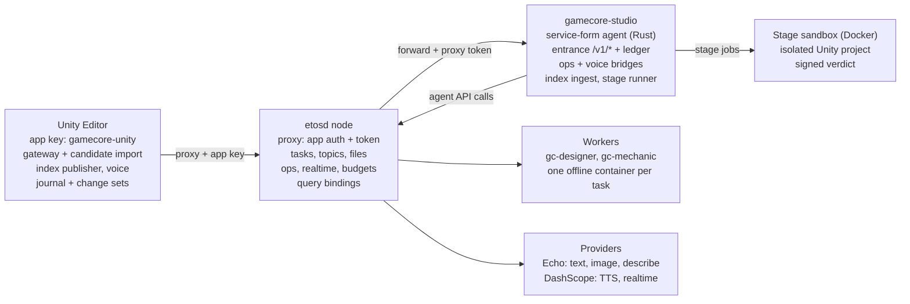

# 02. The gamecore-studio agent

`gamecore-studio` is an installed ETOS agent in service form: a Rust process the node supervises, with two text workers, modality ops and an app binding, whose entrance is an HTTP service behind the node proxy rather than an actor graph (SADR-053). The actor-form entrance that ETOS built-ins such as `agents/discuss` use is the open owner decision O61.

## Manifest (`studio/etos/agent/agent.toml`)

| Field | Value | Why |
| --- | --- | --- |
| grants | `logger, query, changes, tasks, files, topics, ops, providers, realtime, proxy, services` | No `actors` grant: the companion opens tasks for named workers instead of running an actor graph. |
| providers | `studio-voice` | The only provider the agent may use for realtime audio. |
| process | `bin/gamecore-studio`, restart always, `RUST_LOG=info` | The node injects `ETOS_URL`, `ETOS_KEY_FILE`, `ETOS_AGENT`, `ETOS_STATE_DIR`; the process inherits the node's provider keys and never logs or forwards them. |
| workers | `gc-designer`, `gc-mechanic`, model `echo/gpt-6-sol`, instructions `workers/<name>.md` | The preferred `default` alias (`echo/claude-opus-5-5`) is unusable while Echo returns 401 on it. |
| image / network | set at `etos worker create`: `localhost/<worker>:current`, network `offline` | Not in the manifest; `etos` refuses an empty allowlist, so workers are fully offline. |
| budget | none declared; node default `agent_budget_usd = 10.0` | `release()` refuses activation if the registered worker budget differs from the manifest. |

## Release lifecycle (`studio/etos/install-state.py`, `studio/etos/install.sh`)

1. `install.sh` renders `etos.toml`, `models.toml` and `ops.toml` from templates, applies prices, writes `providers.env`, installs the systemd user unit, builds the worker images and creates the workers.
2. `register auto` records the Unity project under `[stage.projects]` as `sha256(productGUID + path)`; an id can never be remapped to a different path.
3. `release()` copies the binary, manifest and worker files into an immutable directory named `<version>-<sha256 of checksums>[:16]`, then runs `etos agent install --link` the first time, `etos agent upgrade --link` when the registration (including worker instruction files) changed, or `etos agent restart` otherwise; it swaps the `current` symlink atomically, waits up to 30 s for state `ready`, and rolls back to the previous release on failure.
4. The app is installed and paired once (`etos app pair gamecore-unity --approve`), writing the app key outside the repository.

## Runtime topology

Four processes cooperate on the host: the Unity Editor (client), the companion (agent process on a loopback port it registers with `PUT /agent/endpoint`), `etosd` (proxy, tasks, topics, files, ops, realtime, query), and the provider endpoints the node calls (Echo for text, image and describe; DashScope for TTS and realtime). Workers run in per-task offline containers started by the node.

The Editor speaks only to the proxy with its app key; the node forwards to the companion and stamps a proxy token; the companion alone calls the agent API, starts worker tasks, prices provider ops and runs stage jobs.

Sources: `studio/etos/agent/agent.toml:10-47`, `studio/etos/install-state.py:44-257`, `studio/etos/install.sh:113-244`, `studio/agent/src/app.rs:208-277`, `docs/studio/02-architecture.md` SADR-053.
