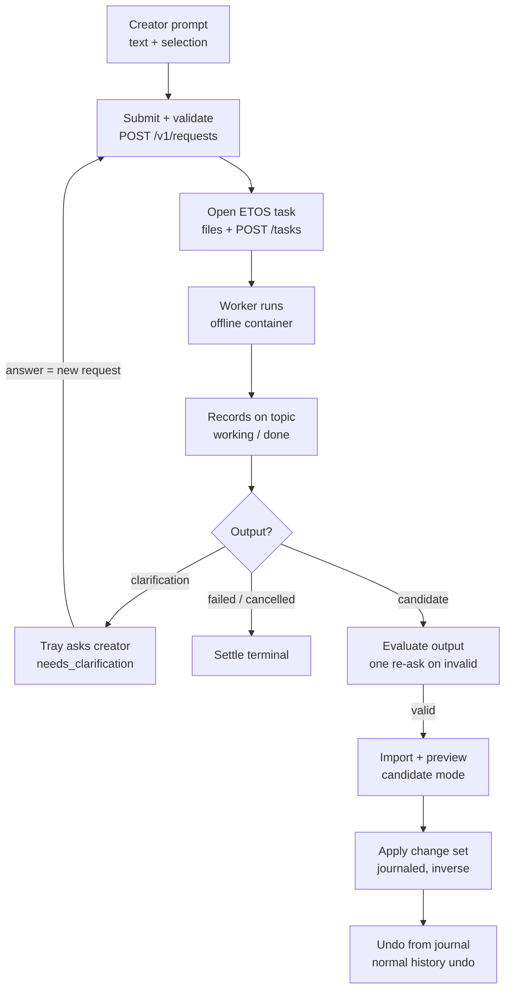

# 04. Request lifecycle

One creator prompt becomes exactly one ETOS task, and the task's change-set id is the idempotency key end to end.

1. **Submit.** The Unity gateway builds a request (intent, selection, bounded scene-context attachment, index slice, tool catalog with its revision) and posts `POST /v1/requests`. A `stale_context` answer means the companion's catalog digest differs; the client resends with the full catalog.
2. **Validate and store.** The companion checks the `cs_` ULID, the worker name, the schemas, the catalog digest and the attachments (at most 8, 16 MiB each, 64 MiB total), computes a request digest (canonical JSON without the catalog, attachments reduced to name and sha256), and inserts the request idempotently; the same id with a different digest is `ledger_conflict`.
3. **Open the task.** It uploads `request.md`, `selection.json`, `index-slice.json`, `tool-catalog.json` and attachments through `POST /files`, then `POST /tasks` with `id = changeSetId`, the worker, the topic `#agent/gamecore-studio/cs-<ulid>` and the file refs. The task id is persisted before anything else; an open that times out (180 s) is re-opened under the same id later.
4. **Worker selection.** The client chooses: mode `mechanism` (or the `mechanism.propose` tool) routes to `gc-mechanic`; everything else to `gc-designer`. The companion rejects worker names outside its manifest.
5. **Follow.** The companion long-polls the topic from its saved cursor (20 s waits, 100 records): `working` becomes a progress event, `waiting` a budget stop (never retried), `failed` a failure or a cancellation, `done` the finish. While the topic is quiet it polls `GET /tasks/{id}` and settles `unresolved` after repeated unknowns.
6. **Candidate.** Output refs are fetched and evaluated: the ChangeSet JSON is validated in candidate mode, artifacts are stored content-addressed with digest checks, and one transaction writes candidate plus settlement and emits a `candidate` event with `/v1/candidates/{id}`; an invalid output becomes `candidate_invalid` with diagnostics.
7. **Clarification.** A worker that cannot proceed writes `/outputs/clarification.json` with a question; the companion settles the request as `needs_clarification` (terminal) and the tray shows the question. The creator's answer is a **new** request carrying the parent change-set id on the Unity side only; the companion's own parent concept is the re-ask, one `<cs>.r1` task on topic `cs-<ulid>-r1` with `diagnostics.json` attached after a `candidate_invalid`.
8. **Preview, apply, undo.** These never touch ETOS: the candidate is imported through `ValidationMode.Candidate`, staged by the change-set engine, previewed, applied as one journaled change set with a durable inverse, and undone from the journal.
9. **Cancel.** `POST /v1/requests/{id}/cancel` settles locally when no task is open yet, otherwise calls `POST /tasks/{id}/cancel` and takes the state from the node's answer.
10. **Events and reconnect.** Every state change is appended to the ledger `events` table and streamed over the `/v1/events?after=<cursor>` WebSocket in batches of 500, filtered per owner (`[app, project]`), with a 20 s ping. The client persists the last handled cursor under `Library/GameCoreStudio/` and reconnects with backoff and a fresh ticket; a domain reload replays `GET /v1/requests?after=` so an in-flight task returns to the tray without resubmission. On companion restart every non-terminal request is followed again from its cursor; `unresolved` requests are abandoned after 3 resumes or 24 h.

Event types: `request`, `task_progress`, `candidate`, `candidate_invalid`, `clarification`, `voice_session`, `voice_transcript`, `stage`, `asset`.

A clarification ends the task and loops back as a new request; an invalid output gets one re-ask inside the evaluate step; only a validated candidate reaches the Editor's import, preview and journaled apply.

Sources: `Packages/com.gamecore.studio.etos/Editor/EtosAgentGateway.cs:38-40,175-232,331-398,624-628,707`, `Editor/AgentRequestBuilder.cs:186-187`, `Client/EventStream.cs:136-211`, `studio/agent/src/desk.rs:204-225,341-514,519-537,698-801,887-1117,1143-1232,1263-1326,1382-1473,1475-1596`, `studio/agent/src/api.rs:555-600`, `studio/agent/src/model.rs:575-664,773`, `Packages/com.gamecore.studio.ui/Editor/Tasks/TaskTrayView.cs:98-137`.
