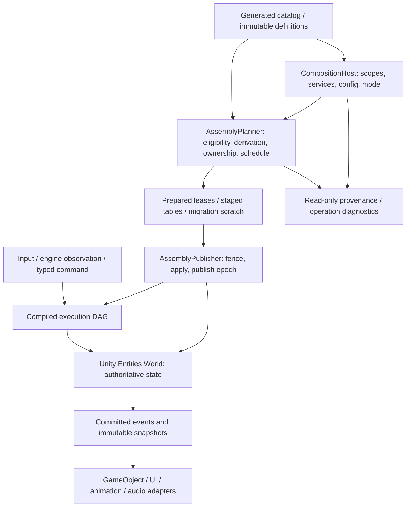

# Architecture and boundaries

This is an implementation map of [P-001–P-003](00-core-protocols.md#p-001), not a second protocol. The core product behavior is automatic composition: a scope-level installation changes compatible descendants through reusable descriptions. The hot simulation loop executes already compiled ECS bindings and schedules.

## 1. Responsibility flow

Composition is managed, change-driven work. Preparation can wait for assets while the old epoch runs. Publication pauses one world at a boundary. Normal execution directly updates owned ECS state or uses typed domain requests with declared dependencies. Presentation observes a committed image; it is not a second gameplay database.

| Layer / assembly | Owns | Integration seam |
|---|---|---|
| `GameCore.Contracts` | Stable IDs, versioned DTOs, operation/result shapes, wire schemas | No Unity types, reflection-driven factories, or ECS facade. |
| `GameCore.Composition` | Scope/install graph, service resolver, lifecycle controller, resource ledger | Proposes immutable snapshots and dependency closures. |
| `GameCore.Derivation` | Finite rule evaluation, contribution composition, provenance/indexes | Pure catalog + snapshot → contribution delta. |
| `GameCore.Planning` | Validated `ChangePlan`, semantic stage DAG, state dispositions | Uses layout keys, not generic entity access methods. |
| `GameCore.Unity.Runtime` | Unity `World`, Entity mapping, ECS assembly apply, concrete systems/groups/jobs | Implements the single concrete execution path. |
| `GameCore.Unity.Adapters` | PlayerLoop, input, assets, GameObject mapping, physics/animation/audio | Explicit ingress/authority/output contracts. |
| `GameCore.Content.Compiler` | Manifest/schema validation, serializers, factories, closed generic roots | Build-time output consumed by the player. |
| `GameCore.Rules.*` | Pure domain calculations where useful | Inputs/outputs use stable values; no ECS query wrappers. |
| `GameCore.Gameplay.*` | Domain schemas, Unity systems, stage/owner/request policies | Cards, narrative, traversal and optional combinations. |

The logical layer split does not imply a public universal ECS interface. `AssemblyPlanner` produces concrete layout keys and generated handlers understood by the Unity bridge. Unity systems freely use native Entities APIs. Pure protocol fixture models are test oracles, not another supported runtime backend.

## 2. Separate structures

| Structure | Question answered | Example |
|---|---|---|
| Scope tree | Which declarations and lifetimes apply here? | Chapter → market → targets. |
| Installation dependency DAG | Which services are required for activation? | Narrative package needs definition repository. |
| Execution DAG | Which data must precede which computation? | Card selection → table settlement → projection. |
| ECS relationships | Which runtime objects refer to one another? | Card belongs to hand; gate references quest key. |
| Transform hierarchy | How is a view positioned? | Animated child under a visual root. |
| World/network graph | Which sessions exchange serialized input? | Client observations or external service result. |

A card target can own multiple visual GameObjects and auxiliary ECS entities without gaining multiple plugin scopes. Reparenting a view does nothing to scope inheritance. Moving a scope does not teleport its targets. Cross-world transfer is serialization/recreation rather than pointer sharing ([P-025](00-core-protocols.md#p-025)).

## 3. Four levels of rules

| Level | Examples | May gameplay packages change it? |
|---|---|---|
| Kernel invariant | No stale-handle access, one authoritative owner, atomic observation at publication | No. |
| Scheduling mechanism | Named stages, access declarations, job dependencies, deferred structural playback | Add declarations through the protocol, not unsafe bypasses. |
| Plugin semantic policy | Arbitration, reducer meaning, state transfer, resource transaction validity | Yes, versioned per contract/package. |
| Reference-template policy | Card scoring, narrative fact persistence, traversal step duration/checkpoints | Yes; examples do not become defaults for all games. |

The kernel does not decide whether two trades commute, whether a quest reward survives chapter unload, or whether a collision wins against a movement request. A domain package makes that decision and expresses the needed ownership/buffer/stage graph. It can use one owner to atomically settle several entities. This is ordinary domain code, not a generic transaction runtime.

## 4. State placement

Definitions and configurations are immutable managed/generated content, copied into Burst-friendly blobs where needed. Current scores, quest progress, inventories, positions owned by simulation, and dormant persistent state live in ECS. Composition indexes store metadata and support/provenance, not gameplay values. Snapshot copies are immutable historical observations, tagged and bounded; they cannot be submitted as writable handles. Physics owned by Unity remains external authority, with ECS storing stamped observations and desired inputs rather than a competing position model ([P-034](00-core-protocols.md#p-034)).

A `StateOwner` is a logical grant, not necessarily one system instance. Several systems can operate under it with explicit dependencies; multiple independent plugins submit requests to its ports. System instances are world-level batching machinery and do not scale one-to-one with installations or targets.

## 5. Changes from the old design

| Previous emphasis | Replacement and reason |
|---|---|
| Arch candidate, backend-independent query ambitions | One real Unity Entities integration; portability is confined to contracts/content/pure rules where justified. |
| Fixed combat/action/effect phase table | Plugin-defined execution DAG; demand-driven games run zero idle simulation steps. |
| ActorCoordinator/VitalityResolver as core authorities | Registered `OwnerId` and access/port contracts; those coordinators can be optional domain implementations. |
| Conservative imports required for each child | Automatic reusable eligibility and indexed inheritance as the primary configuration. |
| Root damage waves and speculative/ROB analogy | Bounded domain buffers and explicit owner commit; no universal speculation. |
| Combat-first validation/performance assumptions | Three genuinely different families and composition-scale fixtures; no assumed production entity count. |
| “One backend now” while designing for several | V1 rejects Arch/C++/universal ECS work; engineering effort goes into safe dynamic composition and player validation. |

Preserved ideas are proven needs rather than old protocol compatibility: provenance, explicit state authority, epochs, finite queues, safe teardown, and honest limits on rollback.

## 6. Reuse beyond Unity

| Artifact | Godot / Unreal reuse expectation |
|---|---|
| Protocol semantics, stable identifiers, schema descriptions, content rules | Reuse the specification and serialized data where asset references have adapters. |
| Pure C# rules and composition/planning code | Potential direct use in a compatible C# host; Unreal may require a language port or explicit interop. Neither is implemented in V1. |
| Unity `IComponentData`, queries, system groups, Jobs/Burst code and Entity maps | Rewrite for the host execution/storage model; do not promise unchanged high-performance code. |
| Unity prefabs, SubScenes, baking output, ScriptableObjects, animation/physics semantics | Re-author/convert assets and rebuild adapters; serialized content IDs alone do not preserve behavior. |
| PlayerLoop, Unity service/lifecycle integration and IL2CPP build pipeline | Host-specific replacement. |

No additional interfaces are added merely to make the right column seem smaller. [Implementation work](09-implementation-guide.md) delivers only the left-hand design on Unity.
