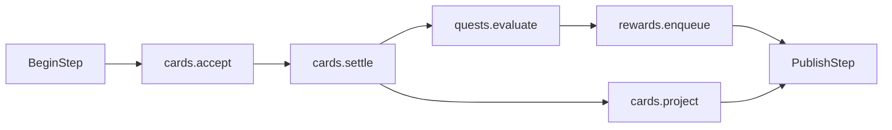

# Runtime state and execution

This document maps [P-034–P-045](00-core-protocols.md#p-034) to runtime structures. Every gameplay stage mentioned below belongs to a plugin. The kernel provides only step boundaries and execution mechanisms.

## 1. Runtime records

Each world owns a Unity `World`, stable-ID-to-Entity map, installed catalog, committed composition snapshot, binding tables, compiled stage graph, command ledger/queue, event/snapshot store, and resource/job ledgers. `GameCore.Unity.Runtime` owns this bundle through one `WorldHost`.

| ECS record | Purpose | Write authority |
|---|---|---|
| `TargetIdentity` | Stable TargetId and handle generation mapping | Assembly publisher / target lifecycle. |
| `ScopeMembership` | Compact scope binding index and last-changed membership epoch | Assembly publisher; the stamp need not equal the latest world epoch. |
| Generated `CapabilityBinding` data | Effective config/blob index and active owner/partition | Assembly publisher; gameplay systems read. |
| Plugin-owned components/buffers | Cards, facts, positions, queues, or other domain state | Declared OwnerId systems. |
| `DormantState`/active binding marker | Retained state excluded from active execution | Assembly publisher under slot policy. |
| Engine observation component | Timestamped read-only physical/input observation | Designated adapter stage. |

These are roles, not a requirement for a fat universal entity base type. Many bindings share blobs. Auxiliary recipe entities can have only the required domain components and an owner reference. Every externally addressed target has the stable identity/handle route. Definition repositories and service objects do not hold alternate mutable scores or quest dictionaries.

## 2. World pump and temporal models

```text
Host pump:
  drain stamped async completions and control proposals
  publish ready composition plans at an idle/end-step boundary
  admit host inputs into bounded command queue
  choose work from world's temporal model
  for each admitted logical step:
    seal input prefix and capture epoch
    run compiled stage DAG with dependency handles
    complete required output dependencies; validate drains
    publish events + immutable observation; advance step ID
  update presentation from latest published image
```

This is pseudocode. In a Unity player the pump and main-thread stages execute on the main thread; pure preparation and rule jobs can execute elsewhere. A pending resource download does not suspend the old running composition. A ready plan never applies midway through a logical step.

CommandDriven's default is one admitted command or wake per step. A turn game's atomic multi-player submission is one explicit domain batch envelope, not all commands that happen to arrive in the same rendered frame. A narrative scene can remain at step 17 for minutes while rendering dialogue; loading a plugin can advance its assembly epoch without producing step 18. A fixed-step game chooses its duration and catch-up budget in world configuration. Time debt stays visible and retained; long pauses do not inject unbounded catch-up work on resume.

Local clocks live in plugin state when authoritative. For example a quest can advance `StoryDay` only through an `AdvanceDay` command. A traversal package can count fixed simulation duration. A presentation animation can use unscaled host time without implying simulation advancement. A delayed external response submits a command after token validation; it does not infer elapsed domain time.

## 3. Compiling independently authored stages

1. Expand active catalog stage/system declarations and coalesce identical shared contracts.
2. Resolve required/optional namespaced edges by exact contract version, then expand each stage's explicitly ordered system entries into an inner DAG. Coalesced systems still need semantic edges for overlapping access; stage membership alone gives no order.
3. Add producer→consumer buffer edges and deferred-structural-playback nodes.
4. Validate state ownership and generated partition assignments.
5. For every overlapping access pair, require a directed path or proven disjoint partitions; report `AmbiguousOrder` otherwise.
6. Topologically sort with stable IDs for ready nodes; emit a trace plus a runtime execution table.

A plugin should depend on a declared data port/stage contract, not a string guessed from another package's implementation class name. Optional dependencies are deliberate: if a quest package optionally listens to a card result stage, its fallback is a declared empty stream, not an accidental reordering. A required dependency on an absent stage rejects assembly. Conflicting third-party packages can be joined by a small explicit integration package that declares a compatible port mapping and ordering. V1 does not auto-invent a semantic bridge.



This is one combined package plan, not a universal stage list. Cards settlement and projection have declared access; the quest evaluation reads a produced receipt. A receipt within the step is tentative with respect to world publication. It becomes an external committed event only if the whole step commits. Another world can contain neither package and have a completely different graph.

## 4. Direct writes, requests, and multi-entity work

| Situation | Execution path |
|---|---|
| One system computes owned state | Direct component write in its declared stage/job. |
| Several systems share an owner | Explicit ordering or generated disjoint partitions; no arbitrary competing writes. |
| Another owner wants a change | Typed request/command to the state's owner port. |
| Many producers supply candidates | Producer-local buffers, canonical merge/order, one consumer authority. |
| One decision touches several entities | Domain owner validates versions/resources, computes a bounded write set, applies once, emits receipt. |
| Add/remove ordinary domain components/entities | Stage-local structural buffer at an explicit playback boundary. |
| Create a new externally addressable assembly target | Submit O-12 spawn for a composition boundary; derive complete membership/capabilities first. |

A table owner can validate that two players still own the cards they offered before exchanging them. It produces no success event if validation fails. The kernel does not supply a general cross-owner transaction manager. A cross-family reward is a durable domain outbox plus an idempotent destination command, and any compensation is an explicit game policy.

Domain version checks supplement the memory dependency graph: Jobs safety can ensure no concurrent invalid memory access, but cannot decide whether a stale trade is economically valid. A single owner can make two systems ordered and still choose a poor gameplay arbitration policy; the kernel checks the contract, while package tests check that policy.

## 5. Buffers and consumption

Generated buffer descriptors include capacity, order key, producer/consumer IDs, expiry, overflow, and cancel/rebind disposition. Job producers write to bounded lanes; the consumer merges by a semantic key such as admitted request sequence and stable target ID. Lane/worker index is not a tie breaker. FixedStep commands keep their sealed host order; repeatable tests supply that admitted order explicitly.

`Stage` buffers are recycled after consumption/dependencies; `Step` buffers are drained before commit; `NextStep` buffers persist in bounded authoritative storage with schema and stable reference validation. A deferred command whose target is removed receives a terminal cancelled/rejected result. It is not silently lost when a native list is cleared. Presentation queues can drop old frames if the port explicitly chooses that policy, while commands that transfer ownership cannot.

## 6. Jobs, synchronization, and publication

The concrete [Unity mapping](04-unity-integration.md) carries `JobHandle`s through component dependencies and explicit native-resource dependencies. A producer remains a lifetime owner until its handle completes. Structural playback waits for its producers and blocks only affected successors where possible. A read-only independent branch can overlap other jobs.

A consistent snapshot needs all authoritative writes it reads complete. V1 completes outstanding step work at the world publication boundary, builds/copies the immutable output image, and exposes one pointer/token. This is a deliberate per-step output synchronization point, not a global barrier before every system. Composition publication additionally drains all old-epoch users, including adapters, before changing layouts or binding tables. Do not use fire-and-forget tasks with Entity or native container captures.

Operation status is not a gameplay snapshot. Observers can see that a plan is Prepared while the world still reports the old epoch. Retained images and event pages carry tokens; expired cursors return explicit errors. A subscriber that calls the host from a publication notification queues a later operation and cannot reenter live application or execution.

## 7. Failure boundaries

Expected domain validation failures produce rejected results and can commit a normal step. Unanticipated exceptions before live mutation can abort the pending operation. After state/structural mutation, an exception faults the world and leaves its previous immutable snapshot as the only safe observation. An ECS command buffer is neither an atomic gameplay batch nor an undo journal.

Faulted storage is torn down only after tracked users finish. Recovery restores a checkpoint into a new session. Event delivery to an external system may already have succeeded; exactly-once processing requires that adapter's durable outbox/idempotency scheme. Pure command replay should use recorded observation inputs for Unity physics instead of claiming the physics solver is bitwise deterministic.

Executable acceptance is defined by [TEST-011](08-validation-and-performance.md#test-011), [TEST-012](08-validation-and-performance.md#test-012), [TEST-013](08-validation-and-performance.md#test-013), [TEST-014](08-validation-and-performance.md#test-014), and [TEST-022](08-validation-and-performance.md#test-022).
