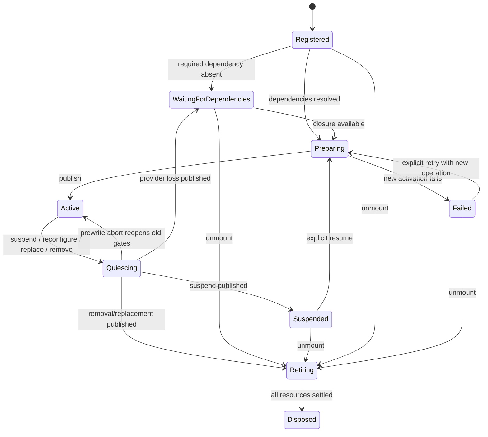

# Lifecycle and recovery implementation

Source of truth: [P-027–P-033](00-core-protocols.md#p-027), [P-035](00-core-protocols.md#p-035), [P-046–P-054](00-core-protocols.md#p-046), and [operation catalogue](00-core-protocols.md#10-operation-catalogue). The diagrams below explain those transitions without creating new states.

## 1. Installation state machine



Reconfiguration prepares a candidate activation alongside the old Active activation. The old activation stays active until the boundary, then retires while the new one becomes Active. `ActivationEpoch` changes at that authority boundary; the installation generation remains unchanged until unmount/remount. A failed candidate has its own attempt record; it does not mark the old usable Active activation Failed. An installation with missing services can be published Waiting without gameplay contributions. Dependency availability retries it automatically, while explicit suspension stays suspended until resume.

`Quiescing` is an internal transitional state with the old committed assembly still visible. `Retiring` follows an already published removal/replacement; subsequent cleanup errors cannot roll back the new epoch. Diagnostic operation state therefore records both publication outcome and cleanup outcome.

## 2. Mount and reconfigure sequence

```text
caller -> WorldHost: proposal(operation ID, expected revision, input hash)
WorldHost -> ledger: deduplicate and reserve result
planner -> immutable snapshot: validate declarations, derive affected closure
resources -> staged ledger: acquire assets/bindings behind closed gates
driver: finish current step, stop admitting the next
publisher: fence all old users, revalidate base revision
migrators: copy required state to scratch, transform and validate
publisher: apply structural/state changes, install schedule and bindings
publisher: prepare closed gates, result record, complete immutable snapshot
publisher: nonthrowing commit switches epoch/image/active gate table together
retirement: reverse-dependency cleanup of old leases
caller <- result: Published or PublishedWithCleanupErrors
```

Data downloads and factory preparation can complete asynchronously. Every continuation posts a stamped completion to the control lane. It checks the token again at dispatch; checking only when the request was issued is insufficient. Register a disposer immediately upon acquisition, including partially successful acquisition paths. Prepared subscriptions route to an inert gate, not directly to gameplay handlers.

A pure migration runs after the fence on copied slot state. It can reject if gameplay progressed beyond its precondition while resources loaded. That rejection occurs before live writes, so the old assembly can resume. Large migrations are explicitly bounded; the host can plan them while the world is paused. No plugin lifecycle callback gets a writable EntityManager as an escape hatch.

## 3. State policy examples

| Change | Slot policy | Observable result |
|---|---|---|
| Inherited card selection limit changes | `Preserve` + replace config | Current hand/score remains; next command validates new limit. |
| Chapter bindings retract | `RemoveDerived` on gate binding; quest facts owned elsewhere | Gate binding removed, previously committed facts retained. |
| Only quest executor unmounts | `PreserveDormant` on its quest-state slot | Data persists in ECS/checkpoints, excluded from active query routes. |
| Owner package upgrade changes schema | Registered `Migrate(old,new)` | Scratch conversion validates before replacing live storage. |
| Explicitly restart a match | Manifest-supported `Reset` with proposal reason | Fresh state initialized; prior external events remain historical facts. |
| Provider replacement transfers authority | Named compatible `TransferTo` + migration | Old writer loses grant, new writer gains it at the same publication. |

Dormancy is visible in snapshots and diagnostics; a command targeting a dormant route is terminally rejected. An owner package that cannot represent a valid dormant state must choose another explicit policy, such as transfer. The framework does not silently preserve runnable data without an executor, nor silently delete durable game progress to make unmount convenient.

## 4. In-flight work and cancellation

| Work kind | Quiesce/unmount behavior | Safe release point |
|---|---|---|
| Already scheduled job | Let complete; record all dependent handles | After its final handle completes. |
| Current logical step | Commit normally or fault | At resulting boundary. |
| Queued old-route command | Cancel with RouteRetired, unless port explicitly supports compatible stable-ID rebind | After result/ledger update; payload arena then released. |
| Prepared async asset load | Cancel cooperatively, then reject stale completion | Release received lease when completion arrives. |
| Managed subscription/callback | Close activation gate before disconnecting | Once callbacks settle; failed disconnect remains inert/quarantined. |
| Read-only snapshot lease | Retain immutable snapshot under bounded pool | Reader releases lease; new reads backpressure if necessary. |
| Native container used by adapter | Track external reader fence alongside ECS jobs | After all declared readers complete. |

Cancellation changes desired work, not native lifetime. A timeout cannot prove that a job has stopped. `TooLate` means the caller waits for the true terminal result; it does not trigger a compensating gameplay transaction. Shutdown joins an in-progress stop attempt. It does not free buffers because an arbitrary number of seconds elapsed.

At least one test holds a job fence while unmount begins, confirms that buffers remain valid and the world does not apply new layouts, then releases it and verifies cleanup. Late callback tests reuse the same stable plugin ID with a new generation to catch incomplete token validation.

## 5. Failure matrix

| Injection point | Published assembly | World/result | Recovery |
|---|---|---|---|
| Catalog, eligibility, ownership, stage validation | Old | Rejected with conflict/provenance | Edit input, new operation ID. |
| Asset acquisition / staging allocation | Old | Rejected; staged cleanup or quarantine | Bounded retry of transient error. |
| Base revision changed while preparing | Newer competing publication | StalePlan; no apply | Replan against current revision as new attempt. |
| Migration on scratch fails | Old | Rejected MigrationRequired/validation error | Correct migration or explicit permitted reset. |
| Job fence has not completed | Old | Pending, TeardownBlocked metric | Wait safely; external termination only if unrecoverable. |
| Structural apply throws after first live write | Last committed snapshot only | Faulted ApplyFault; admission closed | Recreate from checkpoint/definitions. |
| Snapshot allocation/publication fails after writes | Last committed snapshot only | Faulted, no success event | Recreate; no half-step retry. |
| Old resource disposer throws after publication | New | PublishedWithCleanupErrors | Attempt independent cleanup; quarantine retained leases. |
| Unexpected plugin exception during a step | Last committed snapshot only | Faulted if authoritative writes may have occurred | Diagnose/recreate; do not infer safe rollback. |

A failure to send a diagnostic should use a preallocated emergency sink and must not reopen admission. Runtime logging is not a transaction participant. Fatal process/native failures are outside in-process recovery guarantees; durable checkpoint/outbox storage limits the damage when used.

## 6. Teardown resource graph

Prepare dependencies in topological order, record lease acquisition sequence within each instance, and retire consumers before providers. Close all affected ingress first. After publication, drain independent cleanup even when one disposer throws. Resource records use an atomic disposed/retained state so duplicate late completion and normal teardown cannot release the same reference twice.

Shared asset references are leases, not shared ownership of each plugin's lifetime. Removing one user releases exactly one lease. The asset adapter controls physical unload after references and native users finish. Tests inspect reference and retained-resource counts; they do not assume a Unity asset package returns every byte to the operating system immediately.

An instance becomes Disposed only when all its required resources are settled. A published removal can leave a Retiring instance in a quarantine registry without leaving it in the active installation graph. This registry is bounded and observable; exhaustion rejects further resource acquisition or faults/stops according to host policy rather than dropping the references.

## 7. Checkpoint and restore

Capture at a committed boundary; copy authoritative active/dormant slots and composition state under the fence, then serialize off the hot lane. Use a temporary file, checksum, and atomic file replacement for a local checkpoint adapter; an object-storage adapter uses its own durable publication protocol. The snapshot token records which state was captured. Command inclusion is explicit; the default sample adapter rejects unexecuted external commands with `CheckpointBoundary` before capture while preserving declared authoritative next-step queues.

Restore first validates catalog/schema versions and directed migration paths. Build an unexposed world with a fresh WorldId, reconstruct scope/target stable IDs, rederive capabilities, allocate recipes, restore owner slots, repair stable references, restore clocks/RNG/outbox cursors, then publish. Authority and effective capability mismatches reject restoration rather than rewriting saved state behind the caller's back. Physics engine internal solver state is not a portable checkpoint contract; an adapter restores declared authoritative pose/velocity or observation policy and records any restabilization limits.

Recovery of a Faulted world uses this same new-world procedure. The old world can remain quarantined if a native user is still alive; it is never resumed. External effects require durable outbox/receiver deduplication to avoid duplicate delivery. See [TEST-015](08-validation-and-performance.md#test-015), [TEST-016](08-validation-and-performance.md#test-016), and [TEST-017](08-validation-and-performance.md#test-017).
