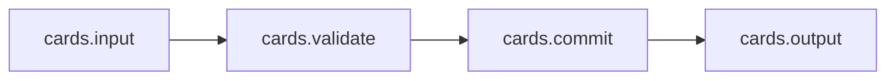
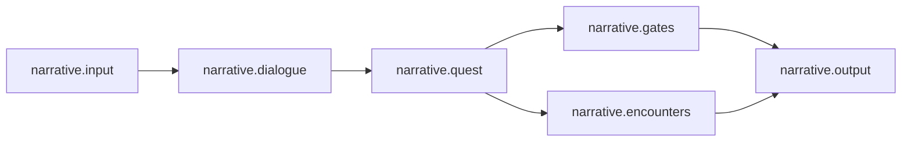

# Reference compositions

Status: executable design fixtures for V1; the tests described here have not yet been implemented or run. [Core Protocols](00-core-protocols.md) owns protocol semantics. This document defines sample gameplay packages and their expected observable behavior; its gameplay rules are not additional kernel requirements.

Read alongside [composition and propagation](02-composition-and-propagation.md), [runtime and execution](03-runtime-and-execution.md), [Unity integration](04-unity-integration.md), and [validation](08-validation-and-performance.md). Each fixture must run in a Unity Entities world. Pure C# rule tests supplement, rather than replace, those executions.

Protocol links used by these fixtures: [genre boundaries, P-001](00-core-protocols.md#p-001); [modes, P-013–P-014](00-core-protocols.md#p-013); [eligibility/composition, P-015–P-026](00-core-protocols.md#p-015); [publication and state, P-027–P-034](00-core-protocols.md#p-027); [time/execution, P-036–P-045](00-core-protocols.md#p-036); [lifetime/recovery, P-046–P-050](00-core-protocols.md#p-046); and [required genre validation, P-059](00-core-protocols.md#p-059). These references determine behavior whenever fixture prose is abbreviated.

## 1. What the fixtures must establish

| Fixture | Progression | State transition policy | Principal assembly change |
|---|---|---|---|
| Card market | One `CommandDriven` step for an admitted command or explicit atomic batch envelope | A table coordinator validates and commits a bounded multi-entity draft | Inherited scoring contributions change future set settlement |
| Chapter quest | `CommandDriven`; advance only for an admitted command or registered `WakeRequest` | A quest owner commits durable facts; dialogue and gate owners derive their state through explicit messages | Chapter bindings appear on compatible characters, gates, and encounters |
| Traversal challenge | `FixedStep`, configured to 20 ms for this fixture | Motion jobs directly update their owned components; a checkpoint owner arbitrates sensor observations | Inherited acceleration modifiers affect future integration |

None requires a kernel actor type, health component, action state machine, combat wave, animation stage, or physics stage. The fixed-step fixture uses optional gameplay motion and sensor packages. The card fixture has no positions; the narrative fixture has no fixed-rate timer. A plugin scope describes composition membership, not an ECS parent component or a GameObject Transform.

All diagrams below are composition trees. Square brackets name plugin instances mounted at that scope; indented target names identify membership. A recipe declaration applies to every instance of that recipe, including instances created after a provider mounts. There is no additional per-instance capability consent in `Automatic` mode.

For readability, labels such as `cards.input` abbreviate catalog names such as `org.gamecore.samples.cards.input`. Manifests use their registered stable `StageId`/contract IDs; these short labels never serve as runtime identities. An owner-local receipt inside a step is a tentative outcome available only through its declared internal buffer. It becomes a `CommittedEvent` for observers only at successful `PublishStep`; a later stage failure faults the step and publishes none of its tentative events ([P-044–P-045](00-core-protocols.md#p-044)).

Derived configuration is immutable assembly data. It never becomes a second copy of mutable authoritative gameplay state. Fixture code addresses a runtime state slot by `TargetId + OwnerId + slot`; an inherited provider's identity is provenance, not the identity of that gameplay state slot.

## 2. Card market: command-driven set collection

### 2.1 Composition and reusable eligibility

Players exchange cards with a shared market and submit a three-card set to score. There is no attack, hit query, health pool, or action timeline.

```text
Match [CardTableRuntime, CardRuleLibrary]
├── TableArea
│   └── table-1 : MarketTableRecipe
├── LeagueA [FestivalScoring, optional]
│   ├── SeatA
│   │   └── seat-a : CardSeatRecipe
│   ├── SeatB
│   │   └── seat-b : CardSeatRecipe
│   └── Practice [CapabilityIsolation: cards.SetBonus]
│       └── practice-seat : CardSeatRecipe
├── LeagueB [QuietScoring, optional]
│   └── SeatC
│       └── seat-c : CardSeatRecipe
└── Spectators
    └── scoreboard : ScoreboardViewRecipe
```

`CardSeatRecipe` declares `cards.SetScoringTarget/v1` and the `CardTableRuntime` state slots. `MarketTableRecipe` declares `cards.MarketTarget/v1`. `ScoreboardViewRecipe` has neither contract. These are reusable recipe/type declarations, not imports of `FestivalScoring`.

`FestivalScoring` emits `cards.SetBonus` with value `+2` to compatible targets in its scope subtree. `QuietScoring` emits `+1`. `cards.SetBonus` uses `Additive`, storing one provenance record per source and reducing the effective integer bonus. A nested festival with `+3` produces `+5` where both providers match. Retraction removes only the departing source's `+2` or `+3` entry.

The sample base score is 10 points per valid set. A mutable `SeatScore.Total` changes only when `CardTableRuntime` accepts `SubmitSet`; mounting a scoring provider never awards points by itself. The current effective scoring configuration is pinned for the logical step. A later assembly publication affects later submissions.

`CardRuleLibrary` exports its definition lookup service. `CardTableRuntime` declares its service dependency once in its manifest. Eligibility of each seat does not require each seat to import that service. This keeps service lookup, derived scoring configuration, and the gameplay act of awarding points distinct.

### 2.2 ECS data and ownership

The names below describe schemas, not compilable C# declarations; [contracts](05-contracts-and-data-model.md) defines their representation conventions.

| Schema | Runtime placement and sole gameplay owner | Purpose |
|---|---|---|
| `TableState { ActiveSeat, TurnNumber, Version }` | Table entity; `CardTableRuntime` | Turn validation and a bounded commit version |
| `MarketEntry[]`, `DeckEntry[]` | Table buffers; `CardTableRuntime` | Card identity and location; one authoritative assignment per card |
| `SeatHand[]`, `SeatScore { Total }` | Seat entities; `CardTableRuntime` | Cards held and accumulated score |
| `EffectiveSetBonus { Value }` | Derived target binding; assembly bridge | Immutable sum of active contributions; gameplay systems read it |
| `CardCommand`, `CardDecision` | Bounded step buffers | Requested operation versus accepted/rejected result |
| `SetCommitted` | Committed event output | Table/seat IDs, consumed card IDs, score delta, request ID, step, epoch |

Card entities are not mandatory: this fixture stores card IDs in table and hand buffers. The table entity and seat entities span several scopes. One `CardTableRuntime` instance therefore owns multiple ECS entities, and a scoring plugin may contribute to many seat entities without owning any of them.

### 2.3 Execution plan and settlement



| Plugin stage | Access and dependency | Sample policy |
|---|---|---|
| `cards.input` | Writes `CardCommand`; hands its sealed buffer to `cards.validate` | Consumes admitted command envelopes using the current world/session and stable target IDs |
| `cards.validate` | Reads table/hand/score/config; creates a bounded draft | Orders candidates by `(TurnNumber, SeatOrdinal, IssuerSequence, CommandId)`; rejects wrong-turn and duplicate-card submissions |
| `cards.commit` | Sole writes to table, affected hand, and score; consumes validated draft | Rechecks table version, reserves output capacity, then writes all accepted changes before observation is allowed |
| `cards.output` | Reads completed owner state and decisions | Prepares a coherent snapshot and `SetCommitted` output for `PublishStep`; no score prediction becomes authority |

The input batch and total per-step work are bounded by this package. Ordinary commands use one envelope per step; a simultaneous contest uses an explicitly declared `CardInputBatch` envelope containing the bounded candidate set, as allowed by [P-037](00-core-protocols.md#p-037). Waiting for a player produces no empty simulation steps. A host render frame may refresh the UI without advancing `LogicalStepId`.

Example: seat A owns cards `{c1,c2,c3}`, its score is 4, and the active bonus is `+2`. `SubmitSet(c1,c2,c3)` removes exactly those cards, advances the turn, and changes the score to 16 in the same commit stage. If any card has moved, the table version is stale, or the output reservation fails, this command produces a rejection with no card or score changes. The implementation is a domain coordinator with a small draft; it does not claim that ECB playback or ECS component writes supply database transactions.

Two commands cannot both consume the same card. Their stable input order and table version decide acceptance. A worker's completion timing does not.

### 2.4 Before/after assembly operations

Each operation uses the common change-plan/publication protocol. The table describes the last published state before and the first published state after; no gameplay step observes intermediate structures.

| Operation | Before | After successful publication |
|---|---|---|
| Mount `FestivalScoring` at `LeagueA` | Seats A/B have bonus 0 and existing totals 4/8 | Both have bonus `+2`; totals remain 4/8; their next valid sets award 12 |
| Spawn seat D below `LeagueA` | Recipe available; provider already active | D obtains the same `+2` derived contribution before its first executable step, without a local import |
| Reconfigure festival bonus from `+2` to `+4` | A has already scored under the old revision | The same source contribution now resolves to `+4`; existing total is preserved; later sets award 14 |
| Unmount `FestivalScoring` | A has total 16 after a committed set, bonus `+2` | Derived bonus entry is removed; total stays 16; the next set awards 10 |
| Reparent `SeatA` from `LeagueA` to `LeagueB` | A has bonus `+2`, hand `{c4,c5}`, score 16 | A has bonus `+1`; same `TargetId`, hand, score, and table membership; no card ownership transfer is implied by scope movement |
| `Automatic` → `Conservative` | A/B derive `+2`; only A has an explicit opt-in naming the festival provider and capability | A retains `+2`; B loses it; both retain hands and score |
| `Conservative` → `Automatic` | Only A opted in | All eligible non-isolated descendants, including B and future D, derive `+2` |

For the mode rows, `FestivalScoring` declares `ExportToDescendants`; the fixture uses A's complete target opt-in to test the conservative path. B intentionally has no import or opt-in. The scoreboard is still ineligible. Practice seat is eligible and below the festival provider, but its isolation boundary still blocks that contribution in either mode; a full target opt-in does not bypass it.

An optional `cards.DrawPolicy` slot is `Exclusive`. Mounting two applicable policies without a declared winner fails validation. Switching to `Automatic` can expose such a conflict on a previously unselected seat; the mode switch then leaves the entire old mode and assembly published. No policy is silently selected by installation time. An explicit winner override is a new reviewable configuration change, not a repair performed secretly by the runtime.

`CardTableRuntime` is the state executor. Ordinary removal of a scoring provider uses `RemoveDerived` for its configuration and retains unrelated state. The table executor declares `PreserveDormant` on last-support loss with a registered scratch-migration precondition that the match is closed. Removing it during a live match therefore rejects before live writes; the caller must first complete a `CloseMatch` command or explicitly select a declared compatible `TransferTo` owner. Keeping scores alive while silently stopping required turn processing is not a supported removal path.

## 3. Chapter quest: bindings and persistent facts

### 3.1 Composition and reusable eligibility

```text
StoryWorld [QuestLedger, DialogueRuntime, GateRuntime, EncounterRuntime]
├── ChapterOne [ChapterNarrative]
│   ├── Village
│   │   ├── npc-mara : VillagerRecipe
│   │   ├── gate-east : QuestGateRecipe
│   │   └── crowd-prop : DecorativeCrowdRecipe
│   ├── Grove
│   │   └── encounter-oak : QuestEncounterRecipe
│   └── Museum [CapabilityIsolation: *]
│       └── npc-display : VillagerRecipe
└── ChapterTwo [ChapterNarrative]
    └── Harbor
        └── npc-sailor : VillagerRecipe
```

| Reusable eligibility | Chapter contribution | Composition and state policy |
|---|---|---|
| `VillagerRecipe` → `narrative.ConversationTarget/v1` | `DialogueBinding` with chapter-specific graph and text definitions | `Replace`; nearest applicable chapter at equal explicit priority wins by protocol precedence |
| `QuestGateRecipe` → `narrative.GateTarget/v1` | `GateConditionBinding` requiring a fact key | `Replace`; gate owner evaluates the selected binding |
| `QuestEncounterRecipe` → `narrative.EncounterTarget/v1` | `EncounterHookBinding` | `Ordered`; `BeginScene` precedes `OfferChoice` through declared hook edges |
| `DecorativeCrowdRecipe` | None | Ineligible; no inference from its name, mesh, or nearby NPCs |

Mounting `ChapterNarrative` connects all eligible existing descendants, and recipes ensure future descendants match automatically. `Museum` deliberately proves that compatible target type and physical proximity do not bypass scope isolation. Chapter One cannot derive bindings into the sibling Chapter Two.

`QuestLedger` stores durable facts at the world level. Both chapter plugin instances explicitly depend on its exported service; the two chapter instances do not each create a competing copy of the quest ledger. Capability derivation binds content and behavior. Completing a quest remains a gameplay operation performed by `QuestLedger`.

### 3.2 ECS data and command-driven execution

| Schema | Owner | Meaning |
|---|---|---|
| `QuestFact[] { Key, Value, Version }` | `QuestLedger`, world entity | Durable authoritative facts; chapter unload does not erase them |
| `ConversationState { NodeId, SessionId, Status }` | `DialogueRuntime`, target entity | Current conversation; independent of UI or voice playback |
| `GateState { IsOpen, EvaluatedFactVersion }` | `GateRuntime`, target entity | Gate decision derived from the last accepted condition evaluation |
| `EncounterState { SessionId, Status }` | `EncounterRuntime`, target entity | Encounter lifecycle, separate from any actor or combat concept |
| `DialogueBinding`, `GateConditionBinding`, `EncounterHookBinding` | Assembly bridge | Immutable selected definitions and provenance |
| `ChoiceCommand`, `QuestMutationRequest`, `GateEvaluationRequest` | Declared producer/consumer buffers | Uncommitted requests; not facts |
| `ChoiceCommitted`, `QuestFactCommitted`, `GateChanged` | Respective state owner | Committed outcomes for snapshot/event consumers |



`narrative.dialogue` validates a choice and may submit a `QuestMutationRequest`. `narrative.quest` alone writes facts. `narrative.gates` consumes the sealed fact-change output and updates affected gates. `narrative.encounters` consumes its declared request buffer. The quest-to-gate edge makes the fact available to the gate owner in that logical step; it does not require a global barrier between unrelated work. No callback can observe the new fact and the old gate as a published coherent snapshot.

For this fixture, a valid choice sets `chapter1.bridgePermit = true`. The gate stage consumes the owner-local tentative fact receipt; successful step publication exposes the fact and open gate together. The ledger deduplicates mutation requests by their admitted command identity. Dialogue is not itself permitted to write `GateState` or the ledger buffer.

No admitted command and no registered `WakeRequest` means no new logical step. A narration audio asset finishing its load does not advance a quest or the logical clock. If content explicitly models a timed narrative event, that package must declare a host-time wakeup translated into an admitted command or registered `WakeRequest`, its cancellation policy, and its resulting logical step. A hidden 60 Hz narrative loop is not a substitute.

### 3.3 Before/after assembly operations

| Operation | Before | After successful publication |
|---|---|---|
| Mount chapter plugin | Mara and gate east exist with compatible recipes but no chapter binding | Mara receives Chapter One dialogue; gate east receives the permit condition; crowd prop remains unchanged |
| Spawn a villager under `Village` | Chapter plugin active | New villager receives Chapter One dialogue before execution, without instance-specific imports |
| Unmount chapter plugin | Permit fact is true; Mara has a conversation in progress | A registered state disposition closes the session at publication, derived bindings retract, permit fact remains true |
| Reparent `Village` under `ChapterTwo` | Mara points to Chapter One graph; gate east points to Chapter One condition | New bindings select Chapter Two definitions; stable target IDs and quest ledger persist; no historical Chapter One fact is renamed or deleted |
| `Automatic` → `Conservative` | All compatible chapter descendants inherit bindings; only the gate has complete target opt-ins for its bindings | Gate retains its binding; Mara and encounter oak lose theirs; durable facts remain |
| `Conservative` → `Automatic` | Only explicitly opted-in gate participates | Eligible Mara and encounter oak regain bindings; museum target stays isolated |

The chapter provider exports capabilities for conservative use; only the rows' explicitly opted-in targets take them in that mode. Reparenting and a selected graph change cannot reinterpret an old conversation node ID in a new graph. This package registers a `CloseConversation` migration that is validated in scratch state after quiescence and applied at publication: it closes the old session and initializes an idle session under the new graph. It does not reset unrelated quest facts, and a managed lifecycle callback cannot write `ConversationState` directly. If a session cannot yet close, the change is deferred or rejected before live mutation. This is a declared package transition under [P-029/P-032](00-core-protocols.md#p-029), not a kernel rule to reset state on reparent.

An unbound gate uses this sample's explicit `PreserveDormant` policy: preserve `GateState` in ECS, disable its binding-dependent evaluator and interaction, and render the last state as non-interactive. Rebinding runs a registered pure `RebindGate` migration over fenced copies of the gate and current ledger facts before the gate is republished as interactive; it needs no empty gameplay step. The migration declares those read slots, validates the new condition, and stages the new gate decision under the gate owner's slot policy. No consumer may treat dormant data as a live gate decision. A different game can choose a different declared policy without changing the protocol.

Voice/UI resources are managed leases owned by their activation. An old chapter's delayed asset completion carries its `ActivationEpoch`; after unload it cannot resume a session or overwrite a new binding. It releases its own resource lease. The completed permit fact is a gameplay effect and is unaffected by that resource cleanup.

## 4. Traversal challenge: fixed-step motion and observations

### 4.1 Composition and reusable eligibility

This is a real-time action fixture: the player runs and jumps through checkpoint volumes. It uses motion, input, and spatial observations but has no health, attack phases, or universal effect resolver.

```text
CourseWorld [TraversalRuntime, CheckpointRuntime, InputAdapter, CourseSensorAdapter]
├── Valley [Tailwind, optional]
│   ├── Runners
│   │   └── runner-a : RunnerRecipe
│   ├── checkpoint-1 : CheckpointRecipe
│   └── Showcase [CapabilityIsolation: traversal.Acceleration]
│       └── runner-display : RunnerRecipe
└── Ridge [Headwind, optional]
    └── Runners
```

`RunnerRecipe` declares `traversal.AccelerationTarget/v1`. A runner's baseline acceleration comes from its own definition; `Tailwind` contributes `(+2, 0, 0)` m/s² and `Headwind` contributes `(-1, 0, 0)` m/s² to the `Additive` `traversal.Acceleration` slot. Two applicable modifiers add in canonical contribution order using this package's stated numeric representation. `CheckpointRecipe` declares only its sensor contract, so it cannot receive runner acceleration.

The optional modifiers do not own pose or velocity. Their retraction removes their configuration contribution, not displacement or speed already produced. Presentation transforms follow committed pose snapshots.

### 4.2 ECS data, scheduling, and authority

| Schema | Sole owner | Access and purpose |
|---|---|---|
| `MovementInput { Horizontal, JumpPressed }` | `InputAdapter` sampling stage | Immutable step input after capture |
| `KinematicPose`, `Velocity`, `JumpState` | `TraversalRuntime` | Direct writes in the simulation jobs for disjoint runners |
| `EffectiveAcceleration` | Assembly bridge | Read-only effective derived configuration |
| `CheckpointDefinition` | Definition catalog | Stable checkpoint ID and volume recipe |
| `CheckpointObservation[]` | `CourseSensorAdapter` | Sealed spatial observations, not a progress mutation |
| `RunProgress { LastCheckpoint, Count }` | `CheckpointRuntime` | Deduplicated ordered progress |
| `CheckpointPassed` | `CheckpointRuntime` | Committed output; one per accepted crossing identity |


`traversal.integrate` schedules Burst-compatible jobs that write their owned pose and velocity directly. It consumes a pinned input/config snapshot for each 20 ms step. Structural changes are deferred to the declared structural playback boundary; changing a velocity value does not require a global command queue.

`traversal.sense` waits for the pose jobs because its observations depend on their result. In the minimal fixture it tests simple checkpoint volumes from pure data. The Unity scene adapter variant performs the declared host spatial query after pose synchronization. It uses stable target IDs and explicitly handles a full query buffer as possible truncation. The adapter never writes `RunProgress`.

The fixture selects Core-owned kinematic motion. If a separate package uses Unity rigidbody simulation, its physics adapter becomes the sole physical authority for the corresponding state and publishes observations; it cannot share write ownership with this kinematic system. Such a package contributes its own execution stages and conflicts with the kinematic ownership declaration unless targets are disjoint. This choice is local to that assembly.

`CheckpointRuntime` rejects duplicate `(runner, checkpoint, crossingSequence)` observations and requires the next checkpoint in the course definition. It then writes progress and emits `CheckpointPassed`. Multiple trigger callbacks do not produce repeated awards. The kernel neither understands checkpoint order nor inserts a combat arbitration stage.

The sample's fixed-step policy accumulates host time, processes at most four simulation steps in one host update, and retains excess backlog for subsequent updates. Reaching the configured maximum retained backlog pauses advancement with a diagnostic rather than silently discarding authoritative time. This is fixture configuration; other time policies must be explicit. Rendering interpolates snapshots without advancing simulation. Floating-point and host physics observations do not imply cross-platform bitwise replay.

### 4.3 Before/after assembly operations

| Operation | Before | After successful publication |
|---|---|---|
| Mount `Tailwind` in `Valley` | Runner's additional x acceleration is 0; pose and velocity are `(p, v)` | Additional x acceleration is `+2`; `(p, v)` stays unchanged until the next step |
| Spawn runner B in `Valley/Runners` | Modifier already active | B begins with the same additional `+2`; checkpoint remains ineligible |
| Unmount `Tailwind` | Runner acquired speed during prior steps and passed checkpoint 1 | Future additional x acceleration returns to 0; velocity, pose, and committed progress remain |
| Reparent runner subtree into `Ridge` | Additional x acceleration is `+2`; runner is airborne | Additional x acceleration is `-1`; same pose, velocity, jump state, and progress continue |
| `Automatic` → `Conservative` | All eligible runners inherit; only runner A has a complete target opt-in | A retains the modifier; B loses it; neither is teleported or has velocity reset |
| `Conservative` → `Automatic` | Only A participates | B receives the applicable modifier and future runners inherit; showcase stays isolated |

The provider exports the capability for the conservative fixture. A one-step numeric assertion uses zero baseline horizontal acceleration and zero horizontal input: from x velocity `1.00`, Tailwind yields `1.04` after one 20 ms step; after a fenced reparent, Headwind yields `1.02` after the next step, within the specified float tolerance. Scope movement does not move the Transform. The test separately asserts that scope reparenting changes no pose at publication.

If motion jobs are running when reparent or unmount is requested, the plan can prepare but cannot publish or free its old native configuration until their fence completes. A late sensor callback from an old activation is rejected; it cannot append to a reclaimed buffer. An assembly application failure stops the world according to the core failure contract; the fixture does not pretend that already-integrated motion can be rolled back.

## 5. Cross-family composition: a chapter with a card reward

One `CommandDriven` world contains the chapter quest packages, card table packages, and a small `NarrativeCardRewards` bridge plugin. There are no special hybrid-game kernel types.

```text
FestivalWorld [QuestLedger, DialogueRuntime, GateRuntime, CardTableRuntime]
└── FestivalChapter [ChapterNarrative, FestivalScoring, NarrativeCardRewards]
    ├── Village
    │   └── npc-mara : VillagerRecipe
    └── CardTent
        ├── table-1 : MarketTableRecipe
        └── seat-a : CardSeatRecipe
```

The two providers naturally select different descendants: chapter conversation rules match Mara, and scoring rules match seat A. A target recipe may declare both contracts when the content actually needs both; merely sharing a scope does not make a market table conversational. The bridge explicitly depends on the committed quest output and the card command endpoint. It does not obtain permission to write the table's components.

1. In step 12, `narrative.quest` writes fact `festival.helpedMara = true` under its owner-local commit policy and seals a tentative `QuestTransitionReceipt`. Its stable domain identity is `(LedgerTargetId, FactKey, FactVersion)`; it is not yet an externally committed event.
2. An explicitly ordered `rewards.enqueue` stage consumes that receipt and writes an ECS outbox item keyed by `(QuestTransitionReceiptId, RewardDefinitionRevision)` with `RewardId` derived from that pair. Successful `PublishStep` exposes the fact, its event, and the pending reward together. A later step failure publishes none of them and requires checkpoint recovery.
3. A managed `rewards.dispatch` observer reads the committed outbox snapshot and submits `GrantCards(RewardId, seat-a, [reward-card])` through the ordinary `SubmitCommand` operation. With no intervening command, the host admits it for step 13. This admitted command advances the world without further human input; the observer never writes ECS state or advances the world by itself.
4. `CardTableRuntime` validates seat capacity and card definition, reserves output space, then applies the grant and its durable reward receipt under its owner-local commit policy. Its explicit `GrantCards` rule admits this system-generated reward independently of the player's turn and does not advance that turn. The ordered `rewards.ack` stage consumes the tentative result and marks the outbox complete; successful `PublishStep` exposes grant and acknowledgement together.

The outbox and completed reward IDs are ECS state owned by their respective gameplay packages and included in checkpoints. A duplicate source receipt or retry uses the same durable `RewardId` and returns the existing result without granting another card, even though a restored world has a new session identity. Operation retries obey [P-050](00-core-protocols.md#p-050): the same attempt retains its operation ID, while a fresh attempt after rejection uses a new operation ID and the same domain reward ID. This sample implements an at-least-once delivery/idempotent grant workflow, not a universal transaction engine. The fact commit and card grant are separate outcomes.

If the seat temporarily cannot accept the card, the outbox retains a pending item and reports why. The sample policy retries only upon a relevant seat-state change or explicit retry command, not every render frame. An invalid reward definition is a terminal rejected outcome requiring content repair. The durable outbox prevents source event retention limits from silently losing an admitted reward.

`NarrativeCardRewards` declares `PreserveDormant` for its completed outbox, with a scratch-migration precondition that no pending work remains; alternatively an explicitly selected compatible `TransferTo` owner may take the outbox. Unmounting with pending work therefore rejects until it drains or transfers. Unmounting `FestivalScoring` does not undo an issued card or a score. A committed fact may remain true while its pending reward is not yet granted; output makes those separate statuses visible. There is no cross-family write to `SeatScore` hidden inside a narrative callback.

The combined execution graph is the union of the two plugins' stage graphs and explicit bridge dataflow. Its extra edges are `narrative.quest → rewards.enqueue → rewards.ack → narrative.output` and `cards.commit → rewards.ack → cards.output`. Enqueue and acknowledgement share one outbox owner and have explicit write ordering. They consume tentative owner-local receipts; `rewards.dispatch` is a managed post-publication observer, not an execution stage. No same-step edge leads from `cards.output` back to `narrative.input`. The next-step command admission breaks feedback. Missing command endpoints, duplicate state owners, or a same-step cycle fail assembly validation with their declaring plugin IDs.

## 6. Concrete conformance fixtures

These are acceptance specifications, not a claim of executed tests. The validation harness must run each relevant case against incremental assembly and a clean full recomputation, comparing canonical derived contributions, owners, selected bindings, schedules, and gameplay outcomes independently of Unity entity indices or chunk order.

| Test ID | Given / action | Required observable result |
|---|---|---|
| `REF-C01` | Create A/B, mount festival, then create D | All three eligible seats receive `+2`; no per-instance import is written; ineligible scoreboard and eligible isolated practice seat receive none |
| `REF-C02` | Score from 4 with one valid three-card set and `+2` | Score becomes 16, all three cards leave the hand, one receipt appears; duplicate request changes nothing |
| `REF-C03` | Two requests contend for one card or second draft has stale table version | At most one accepted use; no half-applied card/score mutation |
| `REF-C04` | Mount nested `+3`, retract ancestor `+2` | Effective bonus changes from 5 to 3; remaining provenance and prior totals survive |
| `REF-C05` | Move seat A to `QuietScoring`; toggle both modes | Correct `+1`/opt-in result; same state slot, hand and score; no unrelated seat diff |
| `REF-C06` | Automatic mode introduces unresolved exclusive draw policies | Entire plan rejected; old mode, epoch, bindings and gameplay state remain published |
| `REF-N01` | Mount chapter on existing recipes, then spawn a villager | Existing/new compatible targets bind; prop, isolated museum, and sibling chapter do not |
| `REF-N02` | Commit bridge permit choice | Ledger fact and open gate appear in one coherent snapshot; duplicate mutation emits no duplicate fact transition |
| `REF-N03` | Unmount chapter and deliver its delayed voice completion | Bindings retract, session closes, quest fact remains, stale completion accepts no gameplay result and frees only its own lease |
| `REF-N04` | Move Village to Chapter Two | Bindings change; no old node ID is interpreted in the new graph; all unrelated ledger facts persist |
| `REF-N05` | Remove/reintroduce a gate binding through mode switch | Gate is dormant and non-interactive while unbound; rebind evaluates current facts before active output |
| `REF-N06` | Leave a command-driven world idle for 300 host updates | `LogicalStepId` and gameplay state remain unchanged; no empty 60 Hz schedule or tree traversal |
| `REF-A01` | Mount Tailwind, integrate once, move to Ridge, integrate once | Velocity sequence `1.00 → 1.04 → 1.02` within fixture tolerance; publication itself changes no pose/velocity |
| `REF-A02` | Unmount modifier after checkpoint passage | Acceleration contribution disappears; progress, pose, velocity and receipt survive |
| `REF-A03` | Reparent while an integration job is deliberately held | Old assembly remains visible until the fence; no native data freed early; one new epoch publishes afterwards |
| `REF-A04` | Repeat a crossing observation and deliver an old activation callback | One progress increment; duplicate/stale diagnostics; no write into released output |
| `REF-A05` | Enable kinematic and rigidbody owners for overlapping targets | Validation rejects ownership conflict; no double simulation or write-order workaround |
| `REF-A06` | Compare equal admitted inputs at 30/60/144 host updates per second | Equal logical-step counts and same-host pure-motion state within declared comparison policy; host query results are separately recorded |
| `REF-X01` | Repeat a quest transition receipt, repeat a committed outbox observation, and restart from a checkpoint with pending work | Exactly one card grant for the same reward ID; no duplicate authoritative ledger |
| `REF-X02` | Remove reward bridge with pending work | Removal rejects or executes a declared compatible transfer; no lost pending reward |
| `REF-X03` | Register same-step card→narrative feedback forming a cycle | Assembly validation reports the cycle; next-step message variant validates |
| `REF-X04` | Inject an exception after `rewards.enqueue` but before `PublishStep` | World faults; no tentative fact/reward event becomes externally visible; last committed snapshot stays readable |
| `REF-P01` | Prepare spawn under epoch E; publish mode/provider change before spawn | Spawn rederives against current assembly before execution; stale derived bindings never publish |
| `REF-P02` | Apply explicit exclusion and isolation to otherwise eligible targets in both modes | Both modes honor both blockers; explanations identify the blocker and originating rule |
| `REF-P03` | Register capability production with invalid stratum or target-creation side effect | Validation rejects it; valid finite derivation terminates within the configured plan budget |
| `REF-P04` | Inject apply failure after a structural operation | World becomes `Faulted`; no coherent success snapshot or incremented live schedule is reported |
| `REF-P05` | Keep all three worlds stable between actual invalidations | Runtime traversal counters are zero; hot systems consume compiled bindings and indexed ECS queries |

For every successful operation, also record the operation ID, old/new `CompositionRevision` and `AssemblyEpoch`, affected target IDs, provenance additions/removals, state disposition, and resulting `SnapshotToken`. Compare request retry results to ensure retries do not remount plugins, advance epochs twice, or duplicate gameplay events.

## 7. Remaining genre-assumption audit

| Potential hidden assumption | Evidence that removes it | Remaining package-specific policy |
|---|---|---|
| Every target is an actor | Cards may be IDs in buffers; ledger/table entities have no pose | A runner uses an optional motion schema |
| Every world runs fixed ticks | Card and narrative worlds stay idle without commands/work | Traversal selects a 20 ms fixed step and its own backlog policy |
| All state transitions use one action FSM | Card draft commit, quest facts, gate evaluation, and motion have distinct owners | Each package defines its own transition legality |
| All work passes through a universal effect queue | Motion jobs write owned state directly; quest requests and card drafts are different buffers | Cross-owner changes use declared requests or package coordinators |
| Root-wave combat order is universal | No fixture requires damage waves | A future combat package must name and test its own reaction ordering |
| Physics or animation stages are always present | Card/narrative schedules contain neither; minimal traversal sensors use data | Unity physics/animation adapters add stages only when mounted |
| Scope movement is Transform movement | Seat/runner scope moves preserve runtime position or card location | Explicit gameplay commands separately transfer ownership or teleport |
| Removal reverses past gameplay | Scores, facts, progress, and granted cards remain committed | Session closure and dormancy are declared lifecycle policies |
| Automatic inheritance requires local manual wiring | Existing and future recipe instances bind with no import in Automatic mode | Conservative mode exercises explicit target opt-in |
| Inheritance grants a write capability to any matching plugin | Modifiers contribute immutable config; state owners remain unchanged | Owner transfers require explicit compatible migration |
| One plugin corresponds to one entity or a hierarchy | Card table owner spans multiple entities; one chapter binds many targets | Target membership is still unambiguous in the composition tree |
| Multiplayer, deterministic lockstep, or rollback is implicit | Fixtures assume one local authority and compare only declared deterministic subsets | Those product requirements need additional explicit protocols |

The intentionally retained kernel assumptions are stable identity, one published assembly, declared ownership, finite derivation, acyclic within-step execution, synchronized publication, and observable failure. None determines what a card, quest, checkpoint, attack, or economic transaction means. The protocol is eligible to freeze only after the card and narrative executable slices pass, then the traversal and cross-family cases confirm that the same mechanisms extend without adding mandatory genre schemas.
