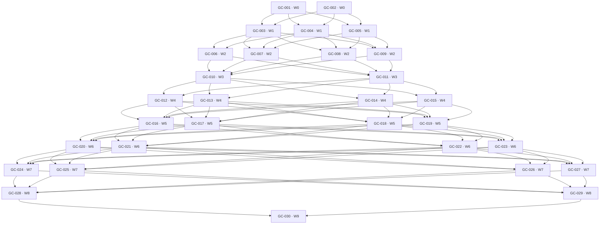

# Implementation guide

This is the required V1 build plan for the [normative protocol](00-core-protocols.md), not a calendar roadmap. All 30 tasks are required. The early small scenes are risk-reducing vertical slices; they do not reduce final V1 scope. No implementation tasks or Unity suites are claimed complete by this documentation delivery.

GC-002 freezes a compiled test-only reference seam assembly and API snapshots for shared 05 contracts in W0. W1 peers compile against that surface with isolated collaborator fixtures while GC-003 supplies compatible production contracts; the W1 gate substitutes all real modules. A surface change reopens the W0 interface gate.

Task dependencies below are artifact prerequisites, not suggestions. A task starts only when its dependencies **and its wave entry gate** pass. A wave exits only after all tasks in it complete and its real integrated demonstration passes. Tasks in a wave can work in parallel only through the frozen contracts from the preceding wave; seam fixtures make independent module development possible, but never replace the real integration gate. Later work cannot conceal an unfinished prerequisite.

The [traceability registry](traceability.json) records the same task IDs, waves, dependencies, requirement sections and suites. Literal `Wave: N; Depends: ...` metadata is checked by [the validator](../../tools/validate_game_core_docs.py). Each task's listed tests must jointly cover every requirement it implements. A suite referenced early means its applicable executable subset; later tasks close the remaining cases, and GC-028 runs every required case. A task cannot claim the full suite passes from its subset.

## Planned repository artifacts and shared-file rules

Paths below are proposed implementation outputs, not files claimed to exist today. `Packages/com.gamecore.*` denotes local Unity packages exposing the assemblies named in [architecture](01-architecture.md); `unity/GameCore.Validation` is the exact-toolchain qualification project; `tests/` contains pure fixtures and Unity/player harnesses; `artifacts/` holds versioned result indexes and externally retained large logs. Test-only managed models are oracles, not a second supported ECS.

`GameCore.Contracts` and generated schema/factory ownership belong to GC-003, bootstrap/PlayerLoop to GC-005, live publication to GC-008, and their successors maintain those areas. Gameplay tasks add catalogs and domain assemblies through these seams. A task that discovers a shared-contract change raises it against 00/05, updates all affected generated consumers, and reruns the dependent gate; it does not introduce a private divergent interface. Concurrency statements describe permissible work, not assumed team size.

Complexity is relative implementation surface; uncertainty names the experiment that could change the design. No calendar or staffing estimates are implied. Automatic propagation and IL2CPP risks are tested before the framework broadens; card and narrative execution precede provisional generic execution freeze; action plus cross-family integration precede V1 conformance freeze.

## Dependency-ordered waves

### Wave 0 — Toolchain and contract risk

**Entry:** Only this documentation set and a licensed/installed candidate toolchain are required. No runtime prerequisite is assumed.

**Tasks:** [GC-001](#gc-001), [GC-002](#gc-002).

**Integration / exit gate:** GC-001 player probe runs successfully with an exact lock; GC-002 pure fixtures, compiled shared reference seams/API snapshots and documentation checker run. Baseline or public-seam failures change the explicit decision before dependent modules begin.

### Wave 1 — Shared seams and one owned world

**Entry:** W0 gate passes; ID/version and build assumptions are explicit.

**Tasks:** [GC-003](#gc-003), [GC-004](#gc-004), [GC-005](#gc-005).

**Integration / exit gate:** Integrate catalog/DTOs, control host and actual Unity world driver. Create two worlds, admit one operation and execute a guarded fixture stage; prove a thrown postwrite exception stops the next stage and publication.

### Wave 2 — Automatic assembly and generic execution

**Entry:** W1 shared contracts, generated keys, control admission and world dispatch are integrated.

**Tasks:** [GC-006](#gc-006), [GC-007](#gc-007), [GC-008](#gc-008), [GC-009](#gc-009).

**Integration / exit gate:** Use all real W2 outputs together: mount a provider, derive a compatible target, publish its real Entities layout and compiled schedule, execute one bounded command, observe one consistent result, spawn a future target, and run the player smoke path. Independent seam fixtures do not substitute for this integration.

### Wave 3 — Two genuinely different running compositions

**Entry:** W2 end-to-end automatic assembly gate passes.

**Tasks:** [GC-010](#gc-010), [GC-011](#gc-011).

**Integration / exit gate:** Run narrative and cards with the same kernel. Show zero idle command steps, automatic existing/future targets, a narrative state change and a card domain transfer. Both Unity-world fixtures must pass before provisional generic execution review.

### Wave 4 — Dynamic composition and early player contract gate

**Entry:** W3 proves narrative and card slices; all public seams remain subject to correction.

**Tasks:** [GC-012](#gc-012), [GC-013](#gc-013), [GC-014](#gc-014), [GC-015](#gc-015).

**Integration / exit gate:** Run both families in IL2CPP, then integrate indexed move/mode changes, service-closure lifecycle and slot policies. Demonstrate both mode directions, a subtree move preserving state, suspend/resume and provider loss/unload. Provisional generic execution freeze requires GC-012; dynamic composition is still awaiting later stress/fault completion.

### Wave 5 — Failure, persistence and host boundaries

**Entry:** W4 live transitions and early player gate pass.

**Tasks:** [GC-016](#gc-016), [GC-017](#gc-017), [GC-018](#gc-018), [GC-019](#gc-019).

**Integration / exit gate:** Join retained observation, deterministic faults, checkpoint restore and common adapters in one actual world. Show prewrite rejection, postwrite fail-stop, new-session restore, read-only snapshots and stale asset callback rejection.

### Wave 6 — Complete reference mechanisms and stress evidence

**Entry:** W5 recovery/adapter boundary is integrated and safe.

**Tasks:** [GC-020](#gc-020), [GC-021](#gc-021), [GC-022](#gc-022), [GC-023](#gc-023).

**Integration / exit gate:** Integrate the fixed-step action reference, durable reward delivery, unload stress and replay/cost counters. Demonstrate that optional physics/animation are absent from cards/narrative. Complete 1,000-cycle teardown and repeatability fixtures before broader qualification.

### Wave 7 — Cross-template, player, recovery and measured budgets

**Entry:** W6 mechanisms are integrated on one revision; no known unsafe lifetime defect remains.

**Tasks:** [GC-024](#gc-024), [GC-025](#gc-025), [GC-026](#gc-026), [GC-027](#gc-027).

**Integration / exit gate:** All reference transition tables and cross-template flow pass; complete IL2CPP/headless catalog coverage runs; faulted checkpoint/outbox recovery passes; benchmark data and budget decisions are recorded. Production fixes require affected gates rerun on the new revision.

### Wave 8 — Full conformance and reproducibility

**Entry:** W7 gates pass on a recorded source/catalog/lock revision.

**Tasks:** [GC-028](#gc-028), [GC-029](#gc-029).

**Integration / exit gate:** Every P requirement and O operation has passing executable evidence; clean-checkout build/run and documentation commands reproduce the declared profile. No NotRun or Blocked required case is waived.

### Wave 9 — Required V1 completion

**Entry:** GC-028 and GC-029 pass against the same accepted revision.

**Tasks:** [GC-030](#gc-030).

**Integration / exit gate:** GC-030 records V1-complete status with exact supported profile and current evidence. Otherwise the status remains incomplete; no automatic external distribution occurs.

## Task-to-wave matrix

This matrix and the DAG include every task and every direct dependency. An empty dependency set does not waive its wave entry gate.

| Task | Wave | Direct prerequisites |
| --- | ---: | --- |
| [GC-001](#gc-001) | 0 | none |
| [GC-002](#gc-002) | 0 | none |
| [GC-003](#gc-003) | 1 | GC-001, GC-002 |
| [GC-004](#gc-004) | 1 | GC-001, GC-002 |
| [GC-005](#gc-005) | 1 | GC-001, GC-002 |
| [GC-006](#gc-006) | 2 | GC-003, GC-004 |
| [GC-007](#gc-007) | 2 | GC-003, GC-004, GC-005 |
| [GC-008](#gc-008) | 2 | GC-003, GC-004, GC-005 |
| [GC-009](#gc-009) | 2 | GC-003, GC-004, GC-005 |
| [GC-010](#gc-010) | 3 | GC-006, GC-007, GC-008, GC-009 |
| [GC-011](#gc-011) | 3 | GC-006, GC-007, GC-008, GC-009 |
| [GC-012](#gc-012) | 4 | GC-010, GC-011 |
| [GC-013](#gc-013) | 4 | GC-010, GC-011 |
| [GC-014](#gc-014) | 4 | GC-010, GC-011 |
| [GC-015](#gc-015) | 4 | GC-010, GC-011 |
| [GC-016](#gc-016) | 5 | GC-012, GC-013, GC-014, GC-015 |
| [GC-017](#gc-017) | 5 | GC-012, GC-013, GC-014, GC-015 |
| [GC-018](#gc-018) | 5 | GC-012, GC-013, GC-014, GC-015 |
| [GC-019](#gc-019) | 5 | GC-012, GC-013, GC-014, GC-015 |
| [GC-020](#gc-020) | 6 | GC-016, GC-017, GC-018, GC-019 |
| [GC-021](#gc-021) | 6 | GC-016, GC-017, GC-018, GC-019 |
| [GC-022](#gc-022) | 6 | GC-016, GC-017, GC-018, GC-019 |
| [GC-023](#gc-023) | 6 | GC-016, GC-017, GC-018, GC-019 |
| [GC-024](#gc-024) | 7 | GC-020, GC-021, GC-022, GC-023 |
| [GC-025](#gc-025) | 7 | GC-020, GC-021, GC-022, GC-023 |
| [GC-026](#gc-026) | 7 | GC-020, GC-021, GC-022, GC-023 |
| [GC-027](#gc-027) | 7 | GC-020, GC-021, GC-022, GC-023 |
| [GC-028](#gc-028) | 8 | GC-024, GC-025, GC-026, GC-027 |
| [GC-029](#gc-029) | 8 | GC-024, GC-025, GC-026, GC-027 |
| [GC-030](#gc-030) | 9 | GC-028, GC-029 |

## Task dependency DAG

The graph is the exact direct-dependency graph from the registry. Wave integration gates add the explicit whole-wave conditions above.

## Task contracts

### GC-001

**Qualify the exact Unity and IL2CPP toolchain**

Wave: 0; Depends: none

**Objective / capability:** Prove the selected compiler/package/player route before building the framework.

**Normative sections:** [P-009](00-core-protocols.md#p-009), [P-054](00-core-protocols.md#p-054), [P-058](00-core-protocols.md#p-058), [P-060](00-core-protocols.md#p-060).

**Concrete work:** Create the validation Unity project from 04; resolve and commit exact manifest/lock; generate one registration and closed generic handler; query an entity, execute a Burst job, round-trip a small record, and late-mount a linked inactive fixture plugin in an IL2CPP player with High stripping.

**Expected files / assemblies / artifacts:** `unity/GameCore.Validation/`, `Packages/manifest.json`, `packages-lock.json`, generated AOT probe, `artifacts/toolchain/` build and execution logs.

**Public interfaces / integration points:** Build-time catalog factory keys; generated closed generic roots; the qualification executable only.

**Tests and observable acceptance:** [TEST-001](08-validation-and-performance.md#test-001), [TEST-020](08-validation-and-performance.md#test-020). The standalone executable performs all probes and exits with structured success. Missing generated registration produces an explicit negative result. Record native compiler, SDK, architecture and stripping settings; successful Editor execution alone fails this gate.

**Definition of done:** The lock and reproducible build command are committed; the player was run on the selected target; any selected-baseline failure is resolved by a documented replacement baseline before W1.

**Non-goals:** No production runtime, asset pipeline, additional ECS, or product-platform support claim.

**Parallel work / shared-file conflicts:** Parallel with GC-002. Owns the validation project and package lock; GC-002 owns pure fixtures and does not edit them.

**Relative complexity / uncertainty:** Medium complexity; high toolchain/AOT uncertainty until the first player runs.

### GC-002

**Make protocol identity and conformance fixtures executable**

Wave: 0; Depends: none

**Objective / capability:** Establish an independent contract oracle, frozen compile-time seams and an executable documentation gate.

**Normative sections:** [P-001](00-core-protocols.md#p-001), [P-004](00-core-protocols.md#p-004), [P-005](00-core-protocols.md#p-005), [P-008](00-core-protocols.md#p-008), [P-055](00-core-protocols.md#p-055), [P-057](00-core-protocols.md#p-057), [P-060](00-core-protocols.md#p-060).

**Concrete work:** Translate identity, stale-reference, canonical ordering and version cases into pure C# fixture data; define assertion/result formats and source-of-truth rules. Generate and compile a test-only reference seam assembly/API snapshot for all shared 05 contract types: DTOs, interfaces, catalog keys, plan/owner/stage/buffer descriptors, host dispatch and observer seams. Provide deterministic test stubs where execution needs a collaborator. Run the documentation validator and its negative fixtures. This package contains no ECS/world runtime implementation. Any public seam change reopens this W0 interface gate before dependent modules compile.

**Expected files / assemblies / artifacts:** `tests/GameCore.ProtocolFixtures/`, `tests/GameCore.ReferenceSeams/`, compiled reference/API snapshots and test stubs, canonical fixture JSON, `tools/validate_game_core_docs.py` maintenance, `artifacts/protocol-fixtures/`.

**Public interfaces / integration points:** Stable-ID byte order; all shared 05 compile-time contract/API seams; fixture result schema; requirement/test IDs.

**Tests and observable acceptance:** [TEST-002](08-validation-and-performance.md#test-002), [TEST-021](08-validation-and-performance.md#test-021), [TEST-022](08-validation-and-performance.md#test-022), [TEST-024](08-validation-and-performance.md#test-024). World/generation collision, overflow and shuffled-order fixtures distinguish valid from invalid outcomes; documentation check passes. The oracle is explicitly marked test-only and imports no Unity gameplay assembly.

**Definition of done:** Fixtures and reference-seam consumers compile and run deterministically; the entire shared compile-time surface and ID/version interpretation are frozen for W1. GC-003 must replace the test reference with production contracts without a surface drift; no runtime conformance is claimed from this model.

**Non-goals:** No live ECS execution, general-purpose ECS abstraction, or implementation of all 26 operations.

**Parallel work / shared-file conflicts:** Parallel with GC-001, separate files. Protocol edits affect all tasks and must be reviewed before the wave exits.

**Relative complexity / uncertainty:** Medium complexity; medium uncertainty in translating specification corner cases and freezing the compile-time seams.

### GC-003

**Implement stable contracts and generated catalog validation**

Wave: 1; Depends: GC-001, GC-002

**Objective / capability:** Provide the shared typed seams that let later subsystems compile independently.

**Normative sections:** [P-004](00-core-protocols.md#p-004), [P-005](00-core-protocols.md#p-005), [P-006](00-core-protocols.md#p-006), [P-009](00-core-protocols.md#p-009), [P-027](00-core-protocols.md#p-027), [P-039](00-core-protocols.md#p-039), [P-042](00-core-protocols.md#p-042), [P-043](00-core-protocols.md#p-043), [P-054](00-core-protocols.md#p-054), [P-055](00-core-protocols.md#p-055), [P-058](00-core-protocols.md#p-058).

**Concrete work:** Implement the representative contracts in 05: IDs/epochs, immutable manifests, plans, owner/slot/access descriptors, stage and buffer contracts, result envelopes and catalog fingerprints. Generate stable factories, serializers and explicit generic roots; validate duplicate/unknown/unsupported declarations. Adapt the pure fixtures to the real contracts.

**Expected files / assemblies / artifacts:** `Packages/com.gamecore.contracts/Runtime/`, `Packages/com.gamecore.content.compiler/Editor/`, generated catalog/AOT-root files and contract tests.

**Public interfaces / integration points:** `PluginManifest`, `ChangePlan`, `TargetHandle`, command/result DTOs, stage/slot descriptors and generated catalog keys.

**Tests and observable acceptance:** [TEST-001](08-validation-and-performance.md#test-001), [TEST-002](08-validation-and-performance.md#test-002), [TEST-003](08-validation-and-performance.md#test-003), [TEST-009](08-validation-and-performance.md#test-009), [TEST-012](08-validation-and-performance.md#test-012), [TEST-013](08-validation-and-performance.md#test-013), [TEST-017](08-validation-and-performance.md#test-017), [TEST-020](08-validation-and-performance.md#test-020). Duplicate IDs, unknown schemas and unsupported required features reject. Generated output is reproducible and the W0 IL2CPP probe now consumes production contract types. Runtime contracts reference neither Unity types nor a second-backend facade.

**Definition of done:** All shared DTO layouts and interface ownership are documented; generated output has one owner and is reproducible; contract tests and the updated probe pass.

**Non-goals:** No full planner, service resolver, gameplay schemas or runtime reflection construction.

**Parallel work / shared-file conflicts:** Parallel with GC-004/GC-005 against the compiled W0 reference seams; owns production contract/compiler files. API snapshot compatibility is enforced. Proposed seam changes reopen the W0 interface gate and update all consumers before integration.

**Relative complexity / uncertainty:** Medium complexity; medium AOT/schema evolution uncertainty.

### GC-004

**Implement scopes, services and serialized control admission**

Wave: 1; Depends: GC-001, GC-002

**Objective / capability:** Admit composition changes with deterministic service visibility and explicit lifecycle status.

**Normative sections:** [P-007](00-core-protocols.md#p-007), [P-009](00-core-protocols.md#p-009), [P-010](00-core-protocols.md#p-010), [P-011](00-core-protocols.md#p-011), [P-012](00-core-protocols.md#p-012), [P-013](00-core-protocols.md#p-013), [P-020](00-core-protocols.md#p-020), [P-046](00-core-protocols.md#p-046), [P-050](00-core-protocols.md#p-050), [P-051](00-core-protocols.md#p-051), [P-052](00-core-protocols.md#p-052).

**Concrete work:** Implement root scope membership, manifest install records, private/export/import/isolation service resolution, required dependency closure and immutable config patches. Add the control lane, expected revision checks, operation ledger, capacity/expiry, cancellation cutoffs and inert managed resource gates. Store Automatic as the default mode and Conservative grant data; later derivation consumes the same data.

**Expected files / assemblies / artifacts:** `Packages/com.gamecore.composition/Runtime/Scopes/`, `Services/`, `Operations/`, `Lifecycle/` and pure resolver/control tests.

**Public interfaces / integration points:** `CompositionHost`, scope/install snapshots, epoch-bound service bindings, operation result/status records.

**Tests and observable acceptance:** [TEST-002](08-validation-and-performance.md#test-002), [TEST-003](08-validation-and-performance.md#test-003), [TEST-004](08-validation-and-performance.md#test-004), [TEST-006](08-validation-and-performance.md#test-006), [TEST-008](08-validation-and-performance.md#test-008), [TEST-009](08-validation-and-performance.md#test-009), [TEST-015](08-validation-and-performance.md#test-015), [TEST-016](08-validation-and-performance.md#test-016). Sibling/isolation/provider-conflict tests pass; a missing provider yields a waiting installation. Same ID/hash retries coalesce, conflicting reuse rejects, expired results cannot reexecute, and callback gates remain inert before publication.

**Definition of done:** Control-lane state and resource ownership are inspectable in tests; all admitted edits produce immutable proposals; no live ECS writes occur here.

**Non-goals:** No per-frame service lookup, automatic derivation algorithm, arbitrary runtime code loading or live teardown apply.

**Parallel work / shared-file conflicts:** Parallel with GC-003/GC-005 using the compiled W0 reference seams and test-only collaborator stubs. Owns composition files; public-surface changes reopen the W0 interface gate; no independent catalog generator edits.

**Relative complexity / uncertainty:** Medium complexity; medium ledger/visibility edge-case uncertainty.

### GC-005

**Implement owned Unity worlds and guarded execution dispatch**

Wave: 1; Depends: GC-001, GC-002

**Objective / capability:** Create a real Unity execution host with one update path and an enforceable failure boundary.

**Normative sections:** [P-002](00-core-protocols.md#p-002), [P-005](00-core-protocols.md#p-005), [P-031](00-core-protocols.md#p-031), [P-035](00-core-protocols.md#p-035), [P-036](00-core-protocols.md#p-036), [P-041](00-core-protocols.md#p-041), [P-044](00-core-protocols.md#p-044), [P-047](00-core-protocols.md#p-047), [P-048](00-core-protocols.md#p-048), [P-058](00-core-protocols.md#p-058).

**Concrete work:** Implement custom bootstrap, per-world ownership, PlayerLoop registration/removal, paused/idle pumping, tracked job handles and managed system dispatch from 04. Use generated guarded dispatch through an override that does not call stock gameplay group dispatch. A tiny fixture directly registers a command-driven stage and a fixed-step stage.

**Expected files / assemblies / artifacts:** `Packages/com.gamecore.unity.runtime/Runtime/WorldHost.cs`, `Execution/GuardedDispatch.cs`, `Packages/com.gamecore.unity.adapters/Runtime/PlayerLoop/` and Unity-world tests.

**Public interfaces / integration points:** `WorldHost`, `ExecutionDriver`, generated managed/unmanaged system dispatch, world/job resource ledger.

**Tests and observable acceptance:** [TEST-009](08-validation-and-performance.md#test-009), [TEST-011](08-validation-and-performance.md#test-011), [TEST-013](08-validation-and-performance.md#test-013), [TEST-016](08-validation-and-performance.md#test-016), [TEST-018](08-validation-and-performance.md#test-018). Two worlds advance independently, command-driven idle is zero steps, and no system double-updates. A managed system writes then throws: the next system does not run, the world faults, no step or snapshot publishes, and pending jobs remain tracked until safe teardown.

**Definition of done:** Bootstrap ownership and exception propagation are proven in actual Entities worlds and a standalone probe; domain-reload cleanup has an executable smoke case.

**Non-goals:** No full stage compiler, recovery from native process crashes, required physics loop or arbitrary cancellation of native jobs.

**Parallel work / shared-file conflicts:** Parallel with GC-003/GC-004 against compiled W0 dispatch/operation seams and a tiny generated test registration. Owns bootstrap/PlayerLoop; other tasks add systems through catalogs, never edit the loop.

**Relative complexity / uncertainty:** Medium complexity; high Unity exception/loop integration uncertainty, resolved by the explicit throwing-system test.

### GC-006

**Implement finite Automatic derivation and contribution policies**

Wave: 2; Depends: GC-003, GC-004

**Objective / capability:** Prove automatic eligible-descendant assembly as a central runtime capability.

**Normative sections:** [P-013](00-core-protocols.md#p-013), [P-015](00-core-protocols.md#p-015), [P-016](00-core-protocols.md#p-016), [P-017](00-core-protocols.md#p-017), [P-018](00-core-protocols.md#p-018), [P-019](00-core-protocols.md#p-019), [P-020](00-core-protocols.md#p-020), [P-021](00-core-protocols.md#p-021), [P-022](00-core-protocols.md#p-022), [P-026](00-core-protocols.md#p-026), [P-028](00-core-protocols.md#p-028).

**Concrete work:** Implement descriptor matching, scope reach, mode grant predicate, exclusions/isolation, 32-stratum validation, bounded output slots and canonical reducers for all five policies. Build complete provenance including excluded/losing candidates. Begin with an indexed snapshot input and full-reference derivation oracle; optimize invalidation in GC-013.

**Expected files / assemblies / artifacts:** `Packages/com.gamecore.derivation/Runtime/`, policy/stratum fixtures and reusable narrative/card descriptors.

**Public interfaces / integration points:** Capability contracts/rules, contribution identity/support sets, `PropagationBudget`, explain records.

**Tests and observable acceptance:** [TEST-004](08-validation-and-performance.md#test-004), [TEST-005](08-validation-and-performance.md#test-005), [TEST-006](08-validation-and-performance.md#test-006), [TEST-007](08-validation-and-performance.md#test-007), [TEST-008](08-validation-and-performance.md#test-008), [TEST-009](08-validation-and-performance.md#test-009). Existing and future compatible targets derive without imports in Automatic; insertion permutations produce identical output. Exclusive/incompatible conflicts, same-stratum reads and quota overflow reject the whole proposal without a partial closure.

**Definition of done:** Both mode predicates and every policy work in the oracle and runtime derivation module; all output carries provenance and bounded cost counters.

**Non-goals:** No live gameplay callbacks in derivation, target-generating rules or per-target DI objects.

**Parallel work / shared-file conflicts:** Parallel with GC-007/GC-008/GC-009 using GC-003 plan contracts. Owns derivation files; GC-008 consumes immutable deltas, not internal indexes.

**Relative complexity / uncertainty:** Medium complexity; high composition correctness uncertainty, reduced by exhaustive small fixtures.

### GC-007

**Implement state authority and bounded request contracts**

Wave: 2; Depends: GC-003, GC-004, GC-005

**Objective / capability:** Give direct writes and cross-owner requests an enforceable authority model.

**Normative sections:** [P-007](00-core-protocols.md#p-007), [P-032](00-core-protocols.md#p-032), [P-033](00-core-protocols.md#p-033), [P-034](00-core-protocols.md#p-034), [P-037](00-core-protocols.md#p-037), [P-041](00-core-protocols.md#p-041), [P-042](00-core-protocols.md#p-042), [P-043](00-core-protocols.md#p-043), [P-044](00-core-protocols.md#p-044), [P-045](00-core-protocols.md#p-045).

**Concrete work:** Validate one logical owner per domain, generated mutually exclusive partitions, field-to-component ownership and support sets. Implement generated command routing, dedup/result integration, bounded stage/step/next-step buffers, canonical merge and capacity/backpressure. Provide a minimal committed event/snapshot output implementation for early slices.

**Expected files / assemblies / artifacts:** `Packages/com.gamecore.planning/Runtime/Ownership/`, `Packages/com.gamecore.unity.runtime/Runtime/Messages/`, generated ports and Unity buffer tests.

**Public interfaces / integration points:** `OwnerId`, slot/partition layout, `CommandEnvelope`, `RequestResult`, buffer descriptors, initial snapshot/event store.

**Tests and observable acceptance:** [TEST-009](08-validation-and-performance.md#test-009), [TEST-010](08-validation-and-performance.md#test-010), [TEST-013](08-validation-and-performance.md#test-013), [TEST-014](08-validation-and-performance.md#test-014). Two undeclared writers reject; valid partitions execute safely; a direct owner update needs no global queue. Overflow rejects before mutation, reliable buffers cannot vanish at commit, and admission acceptance is distinguishable from gameplay commitment.

**Definition of done:** Actual Unity-world request/drain tests pass with the minimal output path and fixed valid execution fixtures; slot policies are validated even before all migration executors exist.

**Non-goals:** No generic transaction engine, implicit cross-owner mutations, full retained observation service or domain-specific arbitration rules.

**Parallel work / shared-file conflicts:** Parallel with GC-006/GC-008/GC-009. Owns ownership/ports; assembly apply and stage compiler use the published descriptors. W2 gate replaces seam fixtures with all real outputs.

**Relative complexity / uncertainty:** Medium complexity; medium native-buffer and domain-authority uncertainty.

### GC-008

**Publish a derived assembly into an Entities world**

Wave: 2; Depends: GC-003, GC-004, GC-005

**Objective / capability:** Join composition and ECS through one real prepare/apply/publication path.

**Normative sections:** [P-002](00-core-protocols.md#p-002), [P-006](00-core-protocols.md#p-006), [P-024](00-core-protocols.md#p-024), [P-027](00-core-protocols.md#p-027), [P-028](00-core-protocols.md#p-028), [P-029](00-core-protocols.md#p-029), [P-030](00-core-protocols.md#p-030), [P-031](00-core-protocols.md#p-031), [P-032](00-core-protocols.md#p-032), [P-033](00-core-protocols.md#p-033), [P-050](00-core-protocols.md#p-050), [P-051](00-core-protocols.md#p-051).

**Concrete work:** Implement plan state transitions, expected-revision recheck, inert acquisitions, bounded migration scratch, world-wide composition fence, structural apply and atomic binding/schedule/snapshot publication. Implement generated minimal spawn/despawn recipes and stable target mappings. Use one known ownership/stage descriptor fixture for independent tests, then integrate the actual W2 validators/compiler at the exit gate.

**Expected files / assemblies / artifacts:** `Packages/com.gamecore.planning/Runtime/Plans/`, `Packages/com.gamecore.unity.runtime/Runtime/Assembly/`, target registry and runtime recipe tests.

**Public interfaces / integration points:** `ChangePlan`, `AssemblyPlanner`, `AssemblyPublisher`, `SpawnRecipe`, composition result/token.

**Tests and observable acceptance:** [TEST-002](08-validation-and-performance.md#test-002), [TEST-009](08-validation-and-performance.md#test-009), [TEST-010](08-validation-and-performance.md#test-010), [TEST-016](08-validation-and-performance.md#test-016), [TEST-020](08-validation-and-performance.md#test-020). A prepared mount changes multiple actual Entities targets in one visible epoch; an observer sees old or new. Stale plans and prewrite migration failure preserve old state; injected failure after the first write faults without publishing or resuming. Future spawned targets appear fully assembled.

**Definition of done:** Independent real Entities publication, target creation and fault-boundary tests pass against the frozen valid owner/stage descriptor fixtures. The combined real derivation/compiler/player path is an additional W2 exit condition, not a hidden prerequisite of this task.

**Non-goals:** No in-memory undo journal, partial per-target publication or full state-migration library.

**Parallel work / shared-file conflicts:** Parallel with GC-006/GC-007/GC-009 only through GC-003 contracts and seam fixtures. Owns apply/target registry; one integrator merges W2 real outputs before the gate.

**Relative complexity / uncertainty:** High complexity; high native failure/lifetime uncertainty, with deliberately small initial layouts.

### GC-009

**Compile execution DAGs and both temporal drivers**

Wave: 2; Depends: GC-003, GC-004, GC-005

**Objective / capability:** Run independent gameplay stage contributions without universal phases.

**Normative sections:** [P-008](00-core-protocols.md#p-008), [P-035](00-core-protocols.md#p-035), [P-036](00-core-protocols.md#p-036), [P-037](00-core-protocols.md#p-037), [P-038](00-core-protocols.md#p-038), [P-039](00-core-protocols.md#p-039), [P-040](00-core-protocols.md#p-040), [P-041](00-core-protocols.md#p-041), [P-043](00-core-protocols.md#p-043), [P-044](00-core-protocols.md#p-044).

**Concrete work:** Compile required/optional stage edges, buffer dependencies, owner access and structural playback into a stable DAG; within each stage also validate its system-level access/dependency graph, never infer order from registration. Carry component and non-component native resource dependencies into Unity dispatch. Implement command admission cutoffs, fixed-step debt/catch-up and registered plugin clocks/wakes.

**Expected files / assemblies / artifacts:** `Packages/com.gamecore.planning/Runtime/Scheduling/`, `Packages/com.gamecore.unity.runtime/Runtime/Time/`, scheduler/world execution fixtures.

**Public interfaces / integration points:** Stage contracts, compiled schedule, `ExecutionDriver`, clock settings, wake and input seal records.

**Tests and observable acceptance:** [TEST-011](08-validation-and-performance.md#test-011), [TEST-012](08-validation-and-performance.md#test-012), [TEST-013](08-validation-and-performance.md#test-013), [TEST-022](08-validation-and-performance.md#test-022). Conflicting unordered access and cycles reject with edge witnesses; disjoint work overlaps safely. An idle command world stays still, fixed-step debt is retained, and no schedule requires combat/physics/animation. Actual jobs complete before dependent reads/playback.

**Definition of done:** Both temporal models and real jobs run through GC-005 guarded dispatch using frozen valid ownership/buffer fixtures. The W2 gate separately proves integration with the real ownership validator and assembly publisher.

**Non-goals:** No fixed kernel tick rate, physics determinism claim or scheduling order inferred from plugin installation timing.

**Parallel work / shared-file conflicts:** Parallel with GC-006/GC-007/GC-008. Owns schedule/time modules; declares the same buffer contracts as GC-007, reviewed at W2 integration.

**Relative complexity / uncertainty:** Medium complexity; high scheduling/Unity handle completeness uncertainty.

### GC-010

**Deliver the narrative Automatic vertical slice**

Wave: 3; Depends: GC-006, GC-007, GC-008, GC-009

**Objective / capability:** Demonstrate a running chapter plugin that wires compatible descendants automatically.

**Normative sections:** [P-001](00-core-protocols.md#p-001), [P-003](00-core-protocols.md#p-003), [P-013](00-core-protocols.md#p-013), [P-015](00-core-protocols.md#p-015), [P-024](00-core-protocols.md#p-024), [P-026](00-core-protocols.md#p-026), [P-034](00-core-protocols.md#p-034), [P-036](00-core-protocols.md#p-036), [P-042](00-core-protocols.md#p-042), [P-044](00-core-protocols.md#p-044), [P-046](00-core-protocols.md#p-046), [P-056](00-core-protocols.md#p-056), [P-059](00-core-protocols.md#p-059).

**Concrete work:** Implement the narrative package and exact fixtures from 07: characters/gates/encounters, chapter rules, fact state owner, command stages and output. Mount at a chapter, create a future target and observe a gate decision through a committed snapshot; use reusable descriptors with no per-instance capability imports.

**Expected files / assemblies / artifacts:** `Packages/com.gamecore.rules.narrative/`, `Packages/com.gamecore.gameplay.narrative/`, narrative test scene and canonical trace.

**Public interfaces / integration points:** Narrative-owned state/ports/stages; shared mount/spawn/advance/observe operations.

**Tests and observable acceptance:** [TEST-004](08-validation-and-performance.md#test-004), [TEST-013](08-validation-and-performance.md#test-013), [TEST-015](08-validation-and-performance.md#test-015), [TEST-021](08-validation-and-performance.md#test-021). The scene and Unity-world test show existing/future descendants gaining the binding, then a typed command changes the authoritative gate outcome. Ten idle seconds advance zero steps. No actor, vitality or physics schema is present.

**Definition of done:** A reproducible end-to-end Unity run links catalog, propagation, publisher, ECS owner, command and snapshot; the reference assertions pass for this initial path.

**Non-goals:** No narrative editor, dialogue UI, complete game content or future-frame composition scan.

**Parallel work / shared-file conflicts:** Parallel with GC-011. Owns only narrative/rule fixture files; kernel fixes are submitted to the owning module and reviewed for both genres.

**Relative complexity / uncertainty:** Small-to-medium complexity; medium risk of exposing hidden action-game assumptions.

### GC-011

**Deliver the card-game Automatic vertical slice**

Wave: 3; Depends: GC-006, GC-007, GC-008, GC-009

**Objective / capability:** Exercise the same runtime with command/turn semantics and multi-target domain decisions.

**Normative sections:** [P-001](00-core-protocols.md#p-001), [P-003](00-core-protocols.md#p-003), [P-013](00-core-protocols.md#p-013), [P-015](00-core-protocols.md#p-015), [P-024](00-core-protocols.md#p-024), [P-034](00-core-protocols.md#p-034), [P-036](00-core-protocols.md#p-036), [P-037](00-core-protocols.md#p-037), [P-042](00-core-protocols.md#p-042), [P-043](00-core-protocols.md#p-043), [P-044](00-core-protocols.md#p-044), [P-056](00-core-protocols.md#p-056), [P-059](00-core-protocols.md#p-059).

**Concrete work:** Implement the card reference package from 07: table-owned state, card descriptors, inherited rule modifier, command batch, ordered settlement and integer rule functions. Compute a bounded transfer write set under the table owner; spawn a compatible card after mounting the modifier.

**Expected files / assemblies / artifacts:** `Packages/com.gamecore.rules.cards/`, `Packages/com.gamecore.gameplay.cards/`, card fixture scene and pure rule tests.

**Public interfaces / integration points:** Card-owned commands/state/stages; existing generic owner/buffer/recipe contracts.

**Tests and observable acceptance:** [TEST-004](08-validation-and-performance.md#test-004), [TEST-013](08-validation-and-performance.md#test-013), [TEST-021](08-validation-and-performance.md#test-021). A transfer either commits both sides or rejects with unchanged resources; duplicate commands do not transfer twice. The inherited modifier reaches existing/future cards automatically and no idle 60 Hz loop runs.

**Definition of done:** The running Unity composition uses the same kernel binaries as GC-010; pure-rule and actual-world assertions both pass.

**Non-goals:** No kernel TurnState, universal fairness policy, deck-building UX or general transaction manager.

**Parallel work / shared-file conflicts:** Parallel with GC-010, separate gameplay assemblies and fixtures. Both use existing contracts; proposed generic changes require the W4 freeze review.

**Relative complexity / uncertainty:** Medium complexity; medium uncertainty in separating domain atomicity from ECB playback.

### GC-012

**Freeze the provisional generic execution contract in a player**

Wave: 4; Depends: GC-010, GC-011

**Objective / capability:** Accept generic execution only after two distinct game families and early IL2CPP composition run.

**Normative sections:** [P-001](00-core-protocols.md#p-001), [P-009](00-core-protocols.md#p-009), [P-024](00-core-protocols.md#p-024), [P-034](00-core-protocols.md#p-034), [P-036](00-core-protocols.md#p-036), [P-055](00-core-protocols.md#p-055), [P-056](00-core-protocols.md#p-056), [P-057](00-core-protocols.md#p-057), [P-058](00-core-protocols.md#p-058), [P-059](00-core-protocols.md#p-059), [P-060](00-core-protocols.md#p-060).

**Concrete work:** Build the narrative and card slices into one IL2CPP player with generated inactive plugin entries. Mount/spawn/execute/observe each, compare with Editor/world fixture outputs, and audit all generic contracts for required genre-specific types. Correct 00/05 and regenerated catalogs where the fixtures reveal a missing mechanism.

**Expected files / assemblies / artifacts:** Combined validation player, `artifacts/gates/w4-generic-profile/`, protocol/catalog compatibility report.

**Public interfaces / integration points:** Protocol 1.0 candidate profile; catalog factories, generic roots and public runtime seams.

**Tests and observable acceptance:** [TEST-001](08-validation-and-performance.md#test-001), [TEST-011](08-validation-and-performance.md#test-011), [TEST-013](08-validation-and-performance.md#test-013), [TEST-020](08-validation-and-performance.md#test-020), [TEST-021](08-validation-and-performance.md#test-021), [TEST-024](08-validation-and-performance.md#test-024). Both families run in the standalone player without manual descendant wiring, mandatory action types or unknown factories. A complete required operation/requirement inventory identifies later unimplemented V1 capabilities explicitly.

**Definition of done:** Provisional generic execution profile is recorded; remaining V1 capabilities remain open tasks and do not become optional. Build evidence includes late mounting and stripping.

**Non-goals:** No final conformance freeze or support claim for untested product targets.

**Parallel work / shared-file conflicts:** Parallel with GC-013/GC-014/GC-015 using the W3 integrated revision. Owns gate fixture/report; contract changes serialize through source-of-truth review before W4 exit.

**Relative complexity / uncertainty:** Small integration scope; high uncertainty until both families run in IL2CPP.

### GC-013

**Complete incremental invalidation, reparenting and live mode changes**

Wave: 4; Depends: GC-010, GC-011

**Objective / capability:** Make automatic composition scale with changes and correctly retract inherited behavior.

**Normative sections:** [P-010](00-core-protocols.md#p-010), [P-013](00-core-protocols.md#p-013), [P-014](00-core-protocols.md#p-014), [P-015](00-core-protocols.md#p-015), [P-016](00-core-protocols.md#p-016), [P-017](00-core-protocols.md#p-017), [P-022](00-core-protocols.md#p-022), [P-023](00-core-protocols.md#p-023), [P-024](00-core-protocols.md#p-024), [P-025](00-core-protocols.md#p-025), [P-026](00-core-protocols.md#p-026), [P-027](00-core-protocols.md#p-027), [P-028](00-core-protocols.md#p-028).

**Concrete work:** Implement ancestry/membership, descriptor, provider/contribution, reverse-capability and service-consumer indexes; diff old/new provider closure on moves. Add atomic world mode switching, exclusions/isolation edits and stale recipe rederivation. Preserve provenance/support exactly.

**Expected files / assemblies / artifacts:** `GameCore.Derivation` index/invalidation modules, `GameCore.Composition` scope/mode proposal handlers, oracle/property traces.

**Public interfaces / integration points:** Existing scope/mode operations, `PropagationBudget`, inheritance fingerprints and contribution deltas.

**Tests and observable acceptance:** [TEST-004](08-validation-and-performance.md#test-004), [TEST-005](08-validation-and-performance.md#test-005), [TEST-006](08-validation-and-performance.md#test-006), [TEST-007](08-validation-and-performance.md#test-007), [TEST-008](08-validation-and-performance.md#test-008), [TEST-009](08-validation-and-performance.md#test-009), [TEST-020](08-validation-and-performance.md#test-020). Run 50 seeds × 500 operations against the full-recompute oracle. Existing/future targets follow the published mode; isolated branches remain unchanged; a conflict preserves old membership/mode. Local edits do not enumerate untouched sibling target sets.

**Definition of done:** Reparent and both mode-switch directions pass in both early genres, with no per-instance imports added in Automatic.

**Non-goals:** No cross-world pointer transfer, speculative partial propagation or unrestricted recursive rules.

**Parallel work / shared-file conflicts:** Parallel with GC-012/GC-014/GC-015. Owns indexes and scope/mode handlers; shared plan DTOs remain fixed; lifecycle passes invalidation deltas through this seam.

**Relative complexity / uncertainty:** High complexity; high index soundness uncertainty, addressed by randomized differential tests.

### GC-014

**Complete live lifecycle and required-service closure**

Wave: 4; Depends: GC-010, GC-011

**Objective / capability:** Support activation, reconfiguration, replacement, suspend/resume and unload without stale authority.

**Normative sections:** [P-003](00-core-protocols.md#p-003), [P-007](00-core-protocols.md#p-007), [P-011](00-core-protocols.md#p-011), [P-012](00-core-protocols.md#p-012), [P-025](00-core-protocols.md#p-025), [P-035](00-core-protocols.md#p-035), [P-046](00-core-protocols.md#p-046), [P-047](00-core-protocols.md#p-047), [P-048](00-core-protocols.md#p-048), [P-050](00-core-protocols.md#p-050), [P-051](00-core-protocols.md#p-051).

**Concrete work:** Implement all installation transitions over the control/publication path. Stage replacements while old activation runs; close ingress, settle steps, fence users, retract dependency closure and dispose reverse-order resources. Keep waiting consumers observable and reactivate them when providers return; track quarantine.

**Expected files / assemblies / artifacts:** `GameCore.Composition/Lifecycle/`, resource/disposer ledger, service-closure integration fixtures.

**Public interfaces / integration points:** Activation tokens, lifecycle operations/results, resource lease records and callback gates.

**Tests and observable acceptance:** [TEST-002](08-validation-and-performance.md#test-002), [TEST-003](08-validation-and-performance.md#test-003), [TEST-008](08-validation-and-performance.md#test-008), [TEST-015](08-validation-and-performance.md#test-015), [TEST-016](08-validation-and-performance.md#test-016), [TEST-018](08-validation-and-performance.md#test-018). Removing a required provider makes consumers wait in the same publication; compatible return resumes them. Suspension retracts active behavior, late completions cannot resurrect it, and a blocked job prevents buffer release. Repeated operations obey the ledger.

**Definition of done:** All lifecycle transitions and invalid transitions are covered in actual world tests; basic unload is working before dynamic composition can be called complete.

**Non-goals:** No arbitrary executable-code unload, timeout-based free or undo of committed gameplay.

**Parallel work / shared-file conflicts:** Parallel with GC-012/GC-013/GC-015. Owns lifecycle/leases, not state migration implementations; requests slot dispositions through the frozen plan contract.

**Relative complexity / uncertainty:** High complexity; high reentrancy/native lifetime uncertainty.

### GC-015

**Implement state retention, migration and explicit reset**

Wave: 4; Depends: GC-010, GC-011

**Objective / capability:** Preserve runtime state across composition changes instead of reconstructing from defaults.

**Normative sections:** [P-017](00-core-protocols.md#p-017), [P-020](00-core-protocols.md#p-020), [P-025](00-core-protocols.md#p-025), [P-029](00-core-protocols.md#p-029), [P-032](00-core-protocols.md#p-032), [P-033](00-core-protocols.md#p-033), [P-034](00-core-protocols.md#p-034), [P-054](00-core-protocols.md#p-054).

**Concrete work:** Implement Preserve, PreserveDormant, RemoveDerived and TransferTo executors, owner transfer validation, per-slot generated layouts and pure migration-in-scratch. Add explicit reset reason/policy checks. Test shared-component support and compatible provider replacement.

**Expected files / assemblies / artifacts:** `GameCore.Planning/StatePolicies/`, generated slot layouts, `GameCore.Unity.Runtime/StateMigration/`, migration fixtures.

**Public interfaces / integration points:** State-slot dispositions, schema migration registry, ownership maps and apply scratch.

**Tests and observable acceptance:** [TEST-005](08-validation-and-performance.md#test-005), [TEST-009](08-validation-and-performance.md#test-009), [TEST-010](08-validation-and-performance.md#test-010), [TEST-013](08-validation-and-performance.md#test-013), [TEST-017](08-validation-and-performance.md#test-017). Non-default counters survive tuning/reparent; removing one support preserves other support. Last-support loss follows its exact policy; dormant state has no writer but is retained. Failed migration before writes keeps old assembly; undeclared reset rejects.

**Definition of done:** Each slot policy runs in Unity and both genres retain unrelated state through live changes. Migration bounds and ownership transfer are observable.

**Non-goals:** No automatic inference of migrations or engine-asset conversion.

**Parallel work / shared-file conflicts:** Parallel with GC-012/GC-013/GC-014. Owns migration/layout executors; lifecycle consumes their declared result instead of editing state directly.

**Relative complexity / uncertainty:** Medium complexity; high schema/ownership transfer edge-case uncertainty.

### GC-016

**Complete immutable observation, provenance and diagnostics**

Wave: 5; Depends: GC-012, GC-013, GC-014, GC-015

**Objective / capability:** Make published state and operation outcomes safely inspectable under retention limits.

**Normative sections:** [P-007](00-core-protocols.md#p-007), [P-026](00-core-protocols.md#p-026), [P-044](00-core-protocols.md#p-044), [P-045](00-core-protocols.md#p-045), [P-050](00-core-protocols.md#p-050), [P-051](00-core-protocols.md#p-051), [P-052](00-core-protocols.md#p-052).

**Concrete work:** Extend the initial snapshot/event implementation with bounded leases, retention/backpressure, cursor expiry and resynchronization. Implement reconstructable compact provenance, staged-operation status, structured diagnostic payloads and delayed-consumer delivery deduplication.

**Expected files / assemblies / artifacts:** `GameCore.Unity.Runtime/Observation/`, `GameCore.Composition/Diagnostics/`, provenance snapshot tests.

**Public interfaces / integration points:** `SnapshotToken`, event cursors, Explain/Observe/status operations and diagnostic schema.

**Tests and observable acceptance:** [TEST-002](08-validation-and-performance.md#test-002), [TEST-008](08-validation-and-performance.md#test-008), [TEST-009](08-validation-and-performance.md#test-009), [TEST-014](08-validation-and-performance.md#test-014), [TEST-016](08-validation-and-performance.md#test-016), [TEST-023](08-validation-and-performance.md#test-023). Concurrent readers see complete epoch/step images; a pinned image is never overwritten. Cursor expiry and snapshot backpressure are explicit; every effective capability explains winners, losers and exclusions. Diagnostic formatting cannot alter precedence.

**Definition of done:** Retention and stale-cursor tests pass with actual published images; no writable component reference escapes inspection.

**Non-goals:** No workbench UI, live mutable debug handles or durable exactly-once external delivery.

**Parallel work / shared-file conflicts:** Parallel with GC-017/GC-018/GC-019. Owns observation storage; checkpoint reads its committed boundary through a frozen lease interface.

**Relative complexity / uncertainty:** Medium complexity; medium bounded-retention/memory-pressure uncertainty.

### GC-017

**Inject failure at every apply and cancellation boundary**

Wave: 5; Depends: GC-012, GC-013, GC-014, GC-015

**Objective / capability:** Prove failure isolation and fail-stop behavior before broad gameplay integration.

**Normative sections:** [P-002](00-core-protocols.md#p-002), [P-027](00-core-protocols.md#p-027), [P-028](00-core-protocols.md#p-028), [P-029](00-core-protocols.md#p-029), [P-030](00-core-protocols.md#p-030), [P-031](00-core-protocols.md#p-031), [P-035](00-core-protocols.md#p-035), [P-047](00-core-protocols.md#p-047), [P-048](00-core-protocols.md#p-048), [P-049](00-core-protocols.md#p-049), [P-050](00-core-protocols.md#p-050), [P-051](00-core-protocols.md#p-051), [P-052](00-core-protocols.md#p-052).

**Concrete work:** Add deterministic test latches around validation, acquisition, fencing, migration, first live write, structural playback, gate installation and cleanup. Race cancellation against the serialized cutoff. Recover from initial definitions into a new world; checkpoint-based recovery follows GC-018/GC-027.

**Expected files / assemblies / artifacts:** Unity fault-injection fixtures, guarded dispatch regressions, `artifacts/faults/` traces and recovery-from-initial-definition test.

**Public interfaces / integration points:** Existing operation result, world fault record, teardown/quarantine and recovery entry points.

**Tests and observable acceptance:** [TEST-009](08-validation-and-performance.md#test-009), [TEST-016](08-validation-and-performance.md#test-016), [TEST-018](08-validation-and-performance.md#test-018). Prewrite failures preserve the old published assembly; postwrite failures stop subsequent execution and retain only the last good snapshot. Too-late cancellation never claims rollback; managed stage exceptions cannot be swallowed by stock group dispatch.

**Definition of done:** Every named 08 fault boundary has a passing deterministic case and no unsafe release. Current supported recovery source is explicitly initial definitions until checkpoint work integrates.

**Non-goals:** No native crash containment, arbitrary history replay or memory undo journal.

**Parallel work / shared-file conflicts:** Parallel with GC-016/GC-018/GC-019. Owns fault fixtures/hooks; production behavior changes stay in owning modules, reviewed before W5 exit.

**Relative complexity / uncertainty:** Medium implementation complexity; high fault-path uncertainty requiring complete boundary coverage.

### GC-018

**Implement checkpoint capture, restore and directed schema migration**

Wave: 5; Depends: GC-012, GC-013, GC-014, GC-015

**Objective / capability:** Recreate a complete compatible world using stable data and an unexposed restore target.

**Normative sections:** [P-004](00-core-protocols.md#p-004), [P-005](00-core-protocols.md#p-005), [P-032](00-core-protocols.md#p-032), [P-049](00-core-protocols.md#p-049), [P-053](00-core-protocols.md#p-053), [P-054](00-core-protocols.md#p-054), [P-055](00-core-protocols.md#p-055).

**Concrete work:** Implement committed-boundary capture, queued-command include/reject cutoff, generated bounded serializers, stable reference tables, active/dormant state, clocks/RNG and catalog fingerprints. Validate unique directed migration paths and restore into a new world before exposing it.

**Expected files / assemblies / artifacts:** `GameCore.Contracts/Serialization/`, generated serializers, `GameCore.Unity.Runtime/Persistence/`, versioned checkpoint fixtures.

**Public interfaces / integration points:** Capture/Restore operations, checkpoint header/queue policy, schema migration registry and reference repair.

**Tests and observable acceptance:** [TEST-002](08-validation-and-performance.md#test-002), [TEST-010](08-validation-and-performance.md#test-010), [TEST-017](08-validation-and-performance.md#test-017), [TEST-022](08-validation-and-performance.md#test-022). Round-trip with different native entity indices preserves canonical state and mode/import/exclusion data. Unknown required schema/content, ambiguous migration and corrupt references reject without exposing a partial world. Old callbacks cannot target the new session.

**Definition of done:** Actual Unity-world save/recreate/restore passes for both early genres, including dormant slots, using the existing committed boundary and controlled fixture failures. Joining the expanded observation/fault modules is the separate W5 integration gate.

**Non-goals:** No cross-engine asset portability, automatic external-effect replay or bit-identical physics state.

**Parallel work / shared-file conflicts:** Parallel with GC-016/GC-017/GC-019. Owns persistence code and serialization fixtures; generated serializer changes go through the compiler owner.

**Relative complexity / uncertainty:** High complexity; high schema/reference-repair uncertainty.

### GC-019

**Implement common input, asset and presentation adapters**

Wave: 5; Depends: GC-012, GC-013, GC-014, GC-015

**Objective / capability:** Connect host resources and views while maintaining one authority per state domain.

**Normative sections:** [P-002](00-core-protocols.md#p-002), [P-007](00-core-protocols.md#p-007), [P-024](00-core-protocols.md#p-024), [P-034](00-core-protocols.md#p-034), [P-038](00-core-protocols.md#p-038), [P-041](00-core-protocols.md#p-041), [P-045](00-core-protocols.md#p-045), [P-047](00-core-protocols.md#p-047), [P-048](00-core-protocols.md#p-048).

**Concrete work:** Implement stamped typed input ingress, asynchronous asset leases, GameObject/Transform view registry and committed-output presentation. Distinguish scope parent from Transform parent. Create an external physical-authority descriptor and adapter seam without requiring physics for card/narrative worlds.

**Expected files / assemblies / artifacts:** `Packages/com.gamecore.unity.adapters/Runtime/Input/`, `Assets/`, `Views/`, engine-observation DTOs and adapter fixtures.

**Public interfaces / integration points:** Input command ports, async work tokens, asset leases, stable target-view maps and external authority declarations.

**Tests and observable acceptance:** [TEST-002](08-validation-and-performance.md#test-002), [TEST-015](08-validation-and-performance.md#test-015), [TEST-018](08-validation-and-performance.md#test-018), [TEST-019](08-validation-and-performance.md#test-019), [TEST-020](08-validation-and-performance.md#test-020). Late asset/input completions cannot write retired worlds; view destruction leaves gameplay state intact; reparenting a Transform does not move composition. Adapter/service mirrors are never separately authoritative.

**Definition of done:** Card/narrative outputs can be presented from snapshots and run headless without those views; all adapter leases participate in lifecycle tests.

**Non-goals:** No mandatory presentation, full physics/animation integration, editor panels or Addressables dependency unless selected explicitly.

**Parallel work / shared-file conflicts:** Parallel with GC-016/GC-017/GC-018. Owns adapters; cannot edit PlayerLoop ownership or introduce another update path.

**Relative complexity / uncertainty:** Medium complexity; medium host-resource cleanup uncertainty.

### GC-020

**Implement the real-time action reference and optional engine stages**

Wave: 6; Depends: GC-016, GC-017, GC-018, GC-019

**Objective / capability:** Prove fixed-step gameplay and optional physics/animation/audio fit the same kernel.

**Normative sections:** [P-001](00-core-protocols.md#p-001), [P-002](00-core-protocols.md#p-002), [P-034](00-core-protocols.md#p-034), [P-035](00-core-protocols.md#p-035), [P-036](00-core-protocols.md#p-036), [P-038](00-core-protocols.md#p-038), [P-039](00-core-protocols.md#p-039), [P-040](00-core-protocols.md#p-040), [P-041](00-core-protocols.md#p-041), [P-044](00-core-protocols.md#p-044), [P-045](00-core-protocols.md#p-045), [P-056](00-core-protocols.md#p-056), [P-058](00-core-protocols.md#p-058), [P-059](00-core-protocols.md#p-059).

**Concrete work:** Implement the exact action/traversal reference from 07 and its owner/stage policies. Add optional local PhysicsScene stepping, kinematic or explicitly Unity-owned pose mode, committed animation/audio output and stamped physics observations. Keep all domain-specific arbitration in the gameplay package.

**Expected files / assemblies / artifacts:** `Packages/com.gamecore.gameplay.traversal/`, `GameCore.Unity.Adapters/Physics/Animation/Audio/`, fixed-step reference scene and observation traces.

**Public interfaces / integration points:** Action-owned schemas/ports/stages; selected motion authority; existing fixed-step driver and committed output.

**Tests and observable acceptance:** [TEST-011](08-validation-and-performance.md#test-011), [TEST-012](08-validation-and-performance.md#test-012), [TEST-013](08-validation-and-performance.md#test-013), [TEST-018](08-validation-and-performance.md#test-018), [TEST-019](08-validation-and-performance.md#test-019), [TEST-021](08-validation-and-performance.md#test-021). The example runs at its configured fixed duration with one physical simulation per admitted step when installed. Cards/narrative still contain no action/physics phase. 30/60/144 Hz presentation does not double-advance authority; observation replay separates rule repeatability from native physics.

**Definition of done:** Action existing/future descendant, mount/unmount, reparent and mode fixtures pass in Unity using existing generic contracts.

**Non-goals:** No universal combat protocol, cross-platform physics lockstep or production animation authoring suite.

**Parallel work / shared-file conflicts:** Parallel with GC-021/GC-022/GC-023. Owns action and optional adapter modules; input/assets/view contracts stay unchanged.

**Relative complexity / uncertainty:** High complexity; high engine timing/authority uncertainty, bounded by the small reference scene.

### GC-021

**Implement durable outbox and destination idempotency seams**

Wave: 6; Depends: GC-016, GC-017, GC-018, GC-019

**Objective / capability:** Support cross-family/external committed delivery without pretending in-memory events are durable exactly once.

**Normative sections:** [P-003](00-core-protocols.md#p-003), [P-042](00-core-protocols.md#p-042), [P-043](00-core-protocols.md#p-043), [P-044](00-core-protocols.md#p-044), [P-045](00-core-protocols.md#p-045), [P-049](00-core-protocols.md#p-049), [P-050](00-core-protocols.md#p-050), [P-053](00-core-protocols.md#p-053), [P-054](00-core-protocols.md#p-054).

**Concrete work:** Implement versioned bounded outbox records, destination command idempotency keys, acknowledgment/cursor retention and checkpoint integration. Provide a file-backed test adapter and a reward integration package; define explicit compensation or rejection behavior for unsupported destination state.

**Expected files / assemblies / artifacts:** `GameCore.Unity.Runtime/Delivery/`, `GameCore.Gameplay.Integration/RewardOutbox/`, durable adapter fixtures and crash markers.

**Public interfaces / integration points:** Committed event identities, external idempotency keys, outbox/checkpoint fields and destination command ports.

**Tests and observable acceptance:** [TEST-013](08-validation-and-performance.md#test-013), [TEST-014](08-validation-and-performance.md#test-014), [TEST-015](08-validation-and-performance.md#test-015), [TEST-016](08-validation-and-performance.md#test-016), [TEST-017](08-validation-and-performance.md#test-017). Redelivery after acknowledgment loss applies the destination mutation once; source unload does not erase committed delivery obligation. Capacity exhaustion is explicit and cannot silently drop a reward; volatile delivery is clearly distinguishable from configured durable delivery.

**Definition of done:** Persistence boundaries and checkpoint/outbox consistency are covered by deterministic crash-point tests; no new universal gameplay Effect API exists.

**Non-goals:** No payment/email/network service integration, distributed transaction coordinator or universal compensation rules.

**Parallel work / shared-file conflicts:** Parallel with GC-020/GC-022/GC-023. Owns delivery/integration package; persistence format edits review against GC-018 schema versions.

**Relative complexity / uncertainty:** Medium complexity; high durability/idempotency uncertainty.

### GC-022

**Complete unload stress, callback and Play Mode lifecycle proof**

Wave: 6; Depends: GC-016, GC-017, GC-018, GC-019

**Objective / capability:** Make dynamic composition completion conditional on safe repeated teardown.

**Normative sections:** [P-003](00-core-protocols.md#p-003), [P-007](00-core-protocols.md#p-007), [P-012](00-core-protocols.md#p-012), [P-035](00-core-protocols.md#p-035), [P-046](00-core-protocols.md#p-046), [P-047](00-core-protocols.md#p-047), [P-048](00-core-protocols.md#p-048), [P-049](00-core-protocols.md#p-049), [P-050](00-core-protocols.md#p-050), [P-058](00-core-protocols.md#p-058), [P-060](00-core-protocols.md#p-060).

**Concrete work:** Run 1,000 mount/unmount cycles, 100 delayed completions, stalled jobs, throwing disposers and required-provider churn. Exercise domain reload on/off plus scene reload settings, stop/recreate and headless cleanup. Trace every acquisition to retirement or quarantine.

**Expected files / assemblies / artifacts:** Lifecycle stress fixtures, native/managed resource reports, Play Mode matrix and standalone lifecycle logs.

**Public interfaces / integration points:** Existing resource ledger, world stop/recovery, callback gates and loop registration.

**Tests and observable acceptance:** [TEST-001](08-validation-and-performance.md#test-001), [TEST-015](08-validation-and-performance.md#test-015), [TEST-016](08-validation-and-performance.md#test-016), [TEST-018](08-validation-and-performance.md#test-018), [TEST-023](08-validation-and-performance.md#test-023). Lease/system/callback/view counts return to baseline after bounded retention; no stale result writes authority. Stalled jobs retain reachable buffers; independent cleanup continues after a disposer error. Loop nodes/subscriptions do not accumulate.

**Definition of done:** Unload/failure suite passes in Editor worlds and the standalone target; resource policy explains any bounded caches/quarantine explicitly.

**Non-goals:** No unsafe forced job cancellation or resource reclamation justified only by elapsed timeout.

**Parallel work / shared-file conflicts:** Parallel with GC-020/GC-021/GC-023. Owns stress fixtures and reports, shares no production files unless a reproduced defect is assigned to its owner.

**Relative complexity / uncertainty:** Medium test scope; high latent lifetime/reentrancy uncertainty.

### GC-023

**Add replay, differential propagation and complete cost instrumentation**

Wave: 6; Depends: GC-016, GC-017, GC-018, GC-019

**Objective / capability:** Expose ordering drift and accidental control-plane work in the simulation hot path.

**Normative sections:** [P-007](00-core-protocols.md#p-007), [P-008](00-core-protocols.md#p-008), [P-018](00-core-protocols.md#p-018), [P-022](00-core-protocols.md#p-022), [P-023](00-core-protocols.md#p-023), [P-026](00-core-protocols.md#p-026), [P-037](00-core-protocols.md#p-037), [P-039](00-core-protocols.md#p-039), [P-040](00-core-protocols.md#p-040), [P-041](00-core-protocols.md#p-041), [P-043](00-core-protocols.md#p-043), [P-044](00-core-protocols.md#p-044), [P-045](00-core-protocols.md#p-045), [P-048](00-core-protocols.md#p-048), [P-052](00-core-protocols.md#p-052), [P-053](00-core-protocols.md#p-053), [P-060](00-core-protocols.md#p-060).

**Concrete work:** Implement canonical state/event hashing and traces with stable IDs, admitted input order and recorded observations. Run the 10,000-step integer fixture across supported worker counts. Instrument all 08 counters and differential propagation tests with reproducible failing seeds.

**Expected files / assemblies / artifacts:** `tests/GameCore.Replay/`, fixture generator, telemetry counters and raw benchmark trace format.

**Public interfaces / integration points:** Canonical state schema, recorded input/observation traces, provenance serialization and numeric telemetry.

**Tests and observable acceptance:** [TEST-007](08-validation-and-performance.md#test-007), [TEST-008](08-validation-and-performance.md#test-008), [TEST-012](08-validation-and-performance.md#test-012), [TEST-014](08-validation-and-performance.md#test-014), [TEST-022](08-validation-and-performance.md#test-022), [TEST-023](08-validation-and-performance.md#test-023). Replays match under shuffled producer scheduling; engine observation replay is separated from native-physics comparison. Unchanged composition yields zero control-tree visits/string service resolutions. Memory counters distinguish leases/events/cache/quarantine.

**Definition of done:** Counter instrumentation is cheap and disabled/retained explicitly by build config; trace data can diagnose ordering and cost regressions without changing semantics.

**Non-goals:** No universal cross-platform determinism claim, binary chunk hashing or performance claim before measured runs.

**Parallel work / shared-file conflicts:** Parallel with GC-020/GC-021/GC-022. Owns replay/telemetry fixtures; each runtime owner exposes counters through a fixed compact schema.

**Relative complexity / uncertainty:** Medium complexity; medium trace completeness/measurement overhead uncertainty.

### GC-024

**Validate all genre transitions and the cross-template composition**

Wave: 7; Depends: GC-020, GC-021, GC-022, GC-023

**Objective / capability:** Demonstrate every required composition transition and combination with shared kernel binaries.

**Normative sections:** [P-001](00-core-protocols.md#p-001), [P-003](00-core-protocols.md#p-003), [P-013](00-core-protocols.md#p-013), [P-014](00-core-protocols.md#p-014), [P-016](00-core-protocols.md#p-016), [P-025](00-core-protocols.md#p-025), [P-032](00-core-protocols.md#p-032), [P-034](00-core-protocols.md#p-034), [P-036](00-core-protocols.md#p-036), [P-042](00-core-protocols.md#p-042), [P-043](00-core-protocols.md#p-043), [P-044](00-core-protocols.md#p-044), [P-045](00-core-protocols.md#p-045), [P-056](00-core-protocols.md#p-056), [P-057](00-core-protocols.md#p-057), [P-059](00-core-protocols.md#p-059).

**Concrete work:** Execute all before/after tables from 07 for cards, narrative and action, including future descendants, exclusion, move, provider loss, suspend/unload and both mode directions. Run the narrative-to-card reward combination through the durable/idempotent seam. Audit assembly references for gameplay-to-kernel dependency inversion.

**Expected files / assemblies / artifacts:** `tests/GameCore.ReferenceConformance/`, normalized traces for every 07 table, final genre audit.

**Public interfaces / integration points:** Existing package-defined policies; no new kernel gameplay schemas.

**Tests and observable acceptance:** [TEST-006](08-validation-and-performance.md#test-006), [TEST-008](08-validation-and-performance.md#test-008), [TEST-010](08-validation-and-performance.md#test-010), [TEST-013](08-validation-and-performance.md#test-013), [TEST-014](08-validation-and-performance.md#test-014), [TEST-021](08-validation-and-performance.md#test-021). All documented states match after each transition; cross-template delivery commits once and preserves unrelated state. Kernel assemblies depend on no example package, actor, quest or card type.

**Definition of done:** Any exposed generic gap is resolved in 00/05/tests before acceptance, and all three families pass with the same built kernel.

**Non-goals:** No complete commercial game, template UI or silent example-specific special cases in the kernel.

**Parallel work / shared-file conflicts:** Parallel with GC-025/GC-026/GC-027 on the W6 revision. Owns reference-conformance fixtures; contract changes require a new integrated baseline for all W7 tests.

**Relative complexity / uncertainty:** Medium complexity; medium emergent composition uncertainty.

### GC-025

**Qualify the complete standalone IL2CPP and headless profile**

Wave: 7; Depends: GC-020, GC-021, GC-022, GC-023

**Objective / capability:** Ensure all required dynamically mounted code survives shipping-style compilation and stripping.

**Normative sections:** [P-002](00-core-protocols.md#p-002), [P-005](00-core-protocols.md#p-005), [P-009](00-core-protocols.md#p-009), [P-024](00-core-protocols.md#p-024), [P-035](00-core-protocols.md#p-035), [P-041](00-core-protocols.md#p-041), [P-047](00-core-protocols.md#p-047), [P-048](00-core-protocols.md#p-048), [P-054](00-core-protocols.md#p-054), [P-055](00-core-protocols.md#p-055), [P-058](00-core-protocols.md#p-058), [P-060](00-core-protocols.md#p-060).

**Concrete work:** Build the complete selected target with locked dependencies, Burst and High managed stripping. Exercise every generated factory/serializer/closed generic root, bake/runtime recipe parity, inactive plugin late mount, stop/restart and headless reference execution. Compare generated registration fingerprints across builds.

**Expected files / assemblies / artifacts:** Final baseline player, headless run configuration, catalog reachability manifest, build logs and test result artifacts.

**Public interfaces / integration points:** Build pipeline, generated registration/serializer roots and player entry point.

**Tests and observable acceptance:** [TEST-001](08-validation-and-performance.md#test-001), [TEST-017](08-validation-and-performance.md#test-017), [TEST-018](08-validation-and-performance.md#test-018), [TEST-020](08-validation-and-performance.md#test-020). Every mandatory catalog entry executes in the player, including code absent from startup scenes. Headless actual Entities behavior matches the applicable pure-rule/canonical fixtures. Unsupported target platforms remain explicitly unqualified.

**Definition of done:** Reproducible build/run commands and exact environment are captured; no required runtime path relies on Editor/JIT/reflection-only reachability.

**Non-goals:** No unrequested platform certification, new ECS backend or unsupported dynamic code download.

**Parallel work / shared-file conflicts:** Parallel with GC-024/GC-026/GC-027; owns build artifacts/config. No version bumps during the wave without rerunning affected evidence.

**Relative complexity / uncertainty:** Medium scope; high AOT/stripping uncertainty until execution completes.

### GC-026

**Measure and tune propagation, execution and memory budgets**

Wave: 7; Depends: GC-020, GC-021, GC-022, GC-023

**Objective / capability:** Validate architecture costs on named hardware using explicit provisional targets.

**Normative sections:** [P-007](00-core-protocols.md#p-007), [P-022](00-core-protocols.md#p-022), [P-023](00-core-protocols.md#p-023), [P-026](00-core-protocols.md#p-026), [P-034](00-core-protocols.md#p-034), [P-043](00-core-protocols.md#p-043), [P-048](00-core-protocols.md#p-048), [P-052](00-core-protocols.md#p-052), [P-060](00-core-protocols.md#p-060).

**Concrete work:** Run 08 generated 1,000-scope/10,000-target fixtures, update sizes, mode switches, future spawns, idle worlds and repeated unloads. Collect five 120-second runs after warmup, per-change repetitions and allocation/memory categories. Optimize measured hotspots without changing semantic outcomes.

**Expected files / assemblies / artifacts:** `artifacts/performance/`, raw samples, benchmark runner, profiler traces and budget decision record.

**Public interfaces / integration points:** Telemetry schema, propagation budgets and existing runtime hot paths.

**Tests and observable acceptance:** [TEST-008](08-validation-and-performance.md#test-008), [TEST-013](08-validation-and-performance.md#test-013), [TEST-023](08-validation-and-performance.md#test-023). Zero stable control-tree scans/string service lookups and no duplicated authoritative state are correctness gates. Report p50/p95/p99/max, prepare/wait/apply/end-to-end timing and thread-complete allocations; provisional numerical misses have measured causes and an explicit accepted revision or fix.

**Definition of done:** All measurements name hardware/build/config; no unresolved hard correctness bound is waived as a performance tradeoff. Replays/property tests still pass after any optimization.

**Non-goals:** No unsupported production scale guarantee, average-FPS-only claim or silent target truncation.

**Parallel work / shared-file conflicts:** Parallel with GC-024/GC-025/GC-027 on the fixed W6 build. Performance fixes cannot race the player qualifier; publish a new revision and rerun affected gates.

**Relative complexity / uncertainty:** Medium-to-high complexity; high workload/hardware uncertainty, not a calendar estimate.

### GC-027

**Prove checkpoint and durable-delivery recovery under faults**

Wave: 7; Depends: GC-020, GC-021, GC-022, GC-023

**Objective / capability:** Close the recovery path using real authoritative state, pending input and delivery obligations.

**Normative sections:** [P-004](00-core-protocols.md#p-004), [P-005](00-core-protocols.md#p-005), [P-031](00-core-protocols.md#p-031), [P-032](00-core-protocols.md#p-032), [P-045](00-core-protocols.md#p-045), [P-047](00-core-protocols.md#p-047), [P-048](00-core-protocols.md#p-048), [P-049](00-core-protocols.md#p-049), [P-050](00-core-protocols.md#p-050), [P-053](00-core-protocols.md#p-053), [P-054](00-core-protocols.md#p-054), [P-055](00-core-protocols.md#p-055).

**Concrete work:** Inject failures at capture copy/file publication, restore reference repair, postwrite apply, outbox append/delivery/ack and restart. Restore cards/narrative/action-compatible checkpoint data into a new world with different native handles; declare physical-observation limitations.

**Expected files / assemblies / artifacts:** `tests/GameCore.Recovery/`, versioned checkpoint fixtures, crash/restart transcripts and outbox consistency reports.

**Public interfaces / integration points:** Capture/Restore/Recover operations, schema migrations, input cutoff and outbox/dedup state.

**Tests and observable acceptance:** [TEST-002](08-validation-and-performance.md#test-002), [TEST-010](08-validation-and-performance.md#test-010), [TEST-014](08-validation-and-performance.md#test-014), [TEST-016](08-validation-and-performance.md#test-016), [TEST-017](08-validation-and-performance.md#test-017). The failed old world never resumes; a verified checkpoint produces a new session with active/dormant state, pending-command disposition and delivery cursor intact. Replayed external delivery does not duplicate the test destination effect; incompatible content leaves the new world unexposed.

**Definition of done:** All fault points have a permitted observable result and no hidden external replay; recovery behavior and data-loss boundary are documented from executed evidence.

**Non-goals:** No arbitrary historical rollback, native crash continuation or bit-identical Unity physics continuation.

**Parallel work / shared-file conflicts:** Parallel with GC-024/GC-025/GC-026. Owns recovery fixtures; schema format changes require new versions and rerun of standalone serialization coverage.

**Relative complexity / uncertainty:** High validation scope; high cross-boundary durability uncertainty.

### GC-028

**Run full protocol conformance and freeze V1 semantics**

Wave: 8; Depends: GC-024, GC-025, GC-026, GC-027

**Objective / capability:** Accept the normative protocol only when every requirement and operation has executable evidence.

**Normative sections:** [P-001](00-core-protocols.md#p-001), [P-002](00-core-protocols.md#p-002), [P-003](00-core-protocols.md#p-003), [P-004](00-core-protocols.md#p-004), [P-005](00-core-protocols.md#p-005), [P-006](00-core-protocols.md#p-006), [P-007](00-core-protocols.md#p-007), [P-008](00-core-protocols.md#p-008), [P-009](00-core-protocols.md#p-009), [P-010](00-core-protocols.md#p-010), [P-011](00-core-protocols.md#p-011), [P-012](00-core-protocols.md#p-012), [P-013](00-core-protocols.md#p-013), [P-014](00-core-protocols.md#p-014), [P-015](00-core-protocols.md#p-015), [P-016](00-core-protocols.md#p-016), [P-017](00-core-protocols.md#p-017), [P-018](00-core-protocols.md#p-018), [P-019](00-core-protocols.md#p-019), [P-020](00-core-protocols.md#p-020), [P-021](00-core-protocols.md#p-021), [P-022](00-core-protocols.md#p-022), [P-023](00-core-protocols.md#p-023), [P-024](00-core-protocols.md#p-024), [P-025](00-core-protocols.md#p-025), [P-026](00-core-protocols.md#p-026), [P-027](00-core-protocols.md#p-027), [P-028](00-core-protocols.md#p-028), [P-029](00-core-protocols.md#p-029), [P-030](00-core-protocols.md#p-030), [P-031](00-core-protocols.md#p-031), [P-032](00-core-protocols.md#p-032), [P-033](00-core-protocols.md#p-033), [P-034](00-core-protocols.md#p-034), [P-035](00-core-protocols.md#p-035), [P-036](00-core-protocols.md#p-036), [P-037](00-core-protocols.md#p-037), [P-038](00-core-protocols.md#p-038), [P-039](00-core-protocols.md#p-039), [P-040](00-core-protocols.md#p-040), [P-041](00-core-protocols.md#p-041), [P-042](00-core-protocols.md#p-042), [P-043](00-core-protocols.md#p-043), [P-044](00-core-protocols.md#p-044), [P-045](00-core-protocols.md#p-045), [P-046](00-core-protocols.md#p-046), [P-047](00-core-protocols.md#p-047), [P-048](00-core-protocols.md#p-048), [P-049](00-core-protocols.md#p-049), [P-050](00-core-protocols.md#p-050), [P-051](00-core-protocols.md#p-051), [P-052](00-core-protocols.md#p-052), [P-053](00-core-protocols.md#p-053), [P-054](00-core-protocols.md#p-054), [P-055](00-core-protocols.md#p-055), [P-056](00-core-protocols.md#p-056), [P-057](00-core-protocols.md#p-057), [P-058](00-core-protocols.md#p-058), [P-059](00-core-protocols.md#p-059), [P-060](00-core-protocols.md#p-060).

**Concrete work:** Run the complete 24-suite matrix on the W7 integrated revision. Audit each O-01 through O-26 pre/postcondition, ordering, failure, retry and cancellation probe against actual tests. Review all 60 requirements and the three-family audit; resolve contradictions in 00 and regenerate dependent artifacts.

**Expected files / assemblies / artifacts:** `artifacts/conformance/`, per-requirement/operation evidence index, final protocol/catalog compatibility report.

**Public interfaces / integration points:** All protocol operations and public contracts; version 1.0 conformance claim.

**Tests and observable acceptance:** [TEST-001](08-validation-and-performance.md#test-001), [TEST-002](08-validation-and-performance.md#test-002), [TEST-003](08-validation-and-performance.md#test-003), [TEST-004](08-validation-and-performance.md#test-004), [TEST-005](08-validation-and-performance.md#test-005), [TEST-006](08-validation-and-performance.md#test-006), [TEST-007](08-validation-and-performance.md#test-007), [TEST-008](08-validation-and-performance.md#test-008), [TEST-009](08-validation-and-performance.md#test-009), [TEST-010](08-validation-and-performance.md#test-010), [TEST-011](08-validation-and-performance.md#test-011), [TEST-012](08-validation-and-performance.md#test-012), [TEST-013](08-validation-and-performance.md#test-013), [TEST-014](08-validation-and-performance.md#test-014), [TEST-015](08-validation-and-performance.md#test-015), [TEST-016](08-validation-and-performance.md#test-016), [TEST-017](08-validation-and-performance.md#test-017), [TEST-018](08-validation-and-performance.md#test-018), [TEST-019](08-validation-and-performance.md#test-019), [TEST-020](08-validation-and-performance.md#test-020), [TEST-021](08-validation-and-performance.md#test-021), [TEST-022](08-validation-and-performance.md#test-022), [TEST-023](08-validation-and-performance.md#test-023), [TEST-024](08-validation-and-performance.md#test-024). Every required case is Pass with build/fixture/log links; NotRun/Blocked/Fail cannot satisfy a requirement. No mandatory generic path imports a gameplay package. Validator, player, fault/unload, recovery and no-traversal gates all pass.

**Definition of done:** The full evidence index is complete and reviewed; any semantic changes have updated versions/tests/mappings. Only then mark the design implemented and conforming.

**Non-goals:** No acceptance by documentation coverage alone or deferral of inconvenient required V1 behavior.

**Parallel work / shared-file conflicts:** Parallel with GC-029 on the fixed W7 revision, separate evidence/documentation files. A production change invalidates affected suite evidence in both tasks.

**Relative complexity / uncertainty:** Medium integration scope; uncertainty is the remaining failures, not estimated elapsed time.

### GC-029

**Package a reproducible implementation and operator contract**

Wave: 8; Depends: GC-024, GC-025, GC-026, GC-027

**Objective / capability:** Make the implemented runtime buildable, diagnosable and accurately scoped by another engineer.

**Normative sections:** [P-001](00-core-protocols.md#p-001), [P-009](00-core-protocols.md#p-009), [P-051](00-core-protocols.md#p-051), [P-055](00-core-protocols.md#p-055), [P-056](00-core-protocols.md#p-056), [P-057](00-core-protocols.md#p-057), [P-058](00-core-protocols.md#p-058), [P-059](00-core-protocols.md#p-059), [P-060](00-core-protocols.md#p-060).

**Concrete work:** Publish local package metadata, clean-checkout build/test commands, headless startup/shutdown instructions, catalog generation steps and failure/recovery runbooks. Reconcile actual API/file names with 05/09, lockfiles and the evidence registry. Keep required/deferred scope explicit.

**Expected files / assemblies / artifacts:** Package manifests/assembly references, repository build scripts, updated docs and reproducibility transcript.

**Public interfaces / integration points:** Package entry points, build configuration, operation diagnostics and supported profile.

**Tests and observable acceptance:** [TEST-001](08-validation-and-performance.md#test-001), [TEST-021](08-validation-and-performance.md#test-021), [TEST-024](08-validation-and-performance.md#test-024). A clean checkout reproduces catalog output and runs the specified baseline commands. Local links/anchors/IDs/dependencies/waves pass; docs do not claim support for untested platforms or future engines.

**Definition of done:** Every public operation has an accurate usage/lifetime contract, failure codes are actionable and maintenance commands are executable.

**Non-goals:** No editor workbench, AI workflows, marketing portability claims or unsupported calendar estimates.

**Parallel work / shared-file conflicts:** Parallel with GC-028; owns packaging/runbooks and metadata, not conformance decisions. Shared protocol edits are reviewed together.

**Relative complexity / uncertainty:** Small-to-medium complexity; low uncertainty after W7, with clean-checkout drift as the main risk.

### GC-030

**Record the required V1 completion gate**

Wave: 9; Depends: GC-028, GC-029

**Objective / capability:** Produce one auditable V1 completion decision with the actual supported build profile.

**Normative sections:** [P-001](00-core-protocols.md#p-001), [P-055](00-core-protocols.md#p-055), [P-056](00-core-protocols.md#p-056), [P-057](00-core-protocols.md#p-057), [P-058](00-core-protocols.md#p-058), [P-059](00-core-protocols.md#p-059), [P-060](00-core-protocols.md#p-060).

**Concrete work:** Check both prior tasks refer to the same source/catalog/package-lock revision. Reconcile outstanding defects and deferred features, archive final evidence, and set implementation status only after all required gates pass. Record the exact profile and provisional budgets accepted by measurement.

**Expected files / assemblies / artifacts:** `artifacts/release-readiness/`, final supported-profile/evidence manifest and updated implementation status.

**Public interfaces / integration points:** Protocol compatibility declaration and distribution metadata.

**Tests and observable acceptance:** [TEST-001](08-validation-and-performance.md#test-001), [TEST-021](08-validation-and-performance.md#test-021), [TEST-023](08-validation-and-performance.md#test-023), [TEST-024](08-validation-and-performance.md#test-024). No unresolved required P requirement or operation case remains; all selected-target build/runtime evidence is current. Deferred items are outside V1 by the stated scope, never reclassified required capabilities.

**Definition of done:** The implementation can be declared V1-complete with source, artifacts and limitations traceable to executed evidence.

**Non-goals:** No automatic publishing to a package registry, commercial launch, extra platform claim or future backend implementation.

**Parallel work / shared-file conflicts:** Sequential final integration gate after GC-028 and GC-029; no parallel production edits on the accepted revision.

**Relative complexity / uncertainty:** Small complexity; completion is conditional on evidence, not a scheduled date.

## Required V1 and deferred work

Required V1 includes both propagation modes, automatic existing/future descendants, all composition policies, finite derivation and indexes, state ownership, both temporal models, plugin stages, all lifecycle transitions, stale-work rejection, safe unload/fail-stop, checkpoint/schema migration, consistent observation, the three reference families and their combination, generated precompiled mounting, IL2CPP/stripping, and measured bounded operation. None is a discretionary follow-up to the early slice.

Deferred because they add a large independent mechanism outside these requirements: another engine/ECS backend, universal query abstraction, arbitrary executable-code download or hot replacement, untrusted plugin sandboxing, cross-world/distributed transactions, generic speculative execution/undo, historical rollback/netcode lockstep, exact cross-engine physics/animation parity, and workbench/editor/AI UX. No empty mandatory interfaces are created for them. Ordinary adapters, gameplay extension points, checkpoint recovery and safe dynamic mounting remain required.

Product platform and load targets beyond the exact qualification profile remain explicit unknowns in [decisions](10-decisions-and-open-questions.md). They do not justify claiming support without a built and executed player or replacing the mandatory correctness gates with assumed performance needs.

## Gate failure and evidence discipline

A failed baseline probe changes the exact baseline through its recorded decision, while keeping C# + Unity Entities + IL2CPP as the selected V1 architecture. A failed genre fixture changes the normative mechanism or package policy before freeze. A fault/unload failure blocks dynamic-composition completion. A numerical budget miss requires a measured fix or justified revised provisional target; a stale-reference/ownership/partial-publication violation cannot be waived by changing a performance number.

Each gate stores source/catalog/lock hashes, commands, native compiler/platform/backend/stripping settings, fixture versions, suite results and raw artifact locations. Requirement and operation evidence is updated against the accepted revision. Run `rtk proxy python3 tools/validate_game_core_docs.py --self-test` and `rtk proxy python3 tools/validate_game_core_docs.py` for mechanical documentation validation; those commands execute no Unity or gameplay tests. Never turn a planned test into a Pass without running it.
