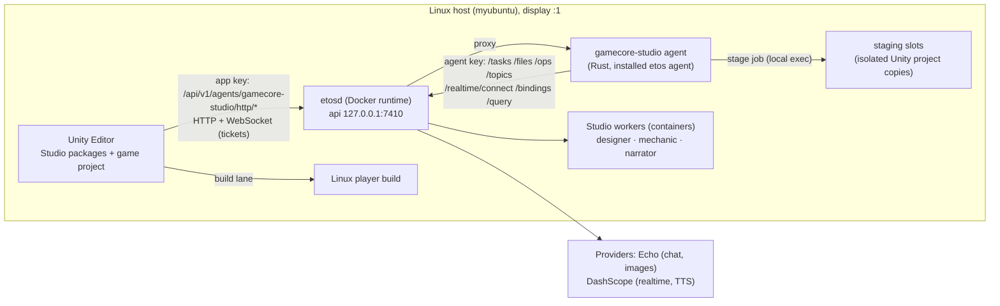

# GameCore Studio: architecture and decision records

**Status:** accepted for implementation on 2026-10-04 by the orchestrating architect (Fable), under the owner's
mandate. Supersedes the paused draft in [archive/](archive/2026-09-28-studio-design-draft.md) where they differ;
the owner's binding decisions D1, D2, D6, D7, D8 from that draft are kept (see SADR-001). The kernel's normative
source stays [`docs/game-core/00-core-protocols.md`](../game-core/00-core-protocols.md); this document adds a
product layer on top of it and names the bounded kernel changes it needs (SADR-010..014). Code citations are at
game_core `2a325b9` and etos `6c2c3f4`.

Contents: 1 Product shape · 2 Ownership boundaries A–E · 3 Repository layout · 4 Processes and data flow ·
5 Commit boundaries and recovery · 6 Identity map · 7 Play/edit/preview semantics · 8 Decision records.

## 1. Product shape

GameCore Studio is a set of Unity Editor packages plus one companion process:

- **Studio viewport** (an `EditorWindow`) that renders the game's own camera, in Edit Mode (authored world, no
  simulation) and in Play Mode (the real GameCore world). It has two interaction modes, *Play* (input goes to the
  game) and *Select* (input goes to picking: click, hover, box select, point-at-location). A prompt bar, a voice
  button with live transcript, a task tray, a candidate strip (previews, compare, apply, reject) and a contextual
  control panel sit on the viewport. Nonvisual views (relationships, dialogue/quest graph, world flow, data tables,
  changes/history) are separate dockable windows over the same semantic index.
- **Semantic model**: a traceable projection of Unity scenes, Prefabs, definition assets and GameCore identities,
  exported to agents and published to the etos Resource Graph. It never becomes a second source of truth.
- **Edit engine**: typed change sets, one apply path used by inspectors, gizmos, graph views and agents.
- **Companion agent** (`gamecore-studio`, Rust, an *installed etos agent*): the only process that holds an etos agent
  key. It runs etos tasks on Studio workers, calls media ops, fetches artifacts with digests, bridges realtime voice
  and publishes the semantic index to the Resource Graph. Unity reaches it through etos's proxied agent route with
  a paired app key.
- **Plugin library**: twelve capability groups as GameCore gameplay packages (rules + ECS + manifests + definitions)
  with Unity presentation/adapter counterparts and authoring metadata.
- **Reference game** "Hollowmere" and a **clean-project proof**, both ordinary Unity projects outside `unity/`.

The two-speed contract (D2) holds: nothing in the viewport waits on a model; agent work arrives asynchronously as
candidates.

## 2. Ownership boundaries

| Boundary | Owner package(s) | Owns | Must not |
|---|---|---|---|
| **A. Creator-facing editor** | `com.gamecore.studio.ui`, `com.gamecore.studio.views` | Viewport, picking UX, prompts, voice UI, previews, contextual controls, change review, history UI, graph/table views | Mutate assets or world state except through C's tools; hold etos credentials; pump the world |
| **B. Authoring and semantic model** | `com.gamecore.studio.core` (Unity-free `GameCore.Studio.Model` + Unity `GameCore.Studio.Authoring`), `com.gamecore.gameplay.entities` (authoring identity) | `AuthoringRef`, semantic index, capability manifest, definition↔asset↔target mapping, content stamps | Store game state; become authoritative for anything Unity assets or GameCore already own |
| **C. Edit execution** | `com.gamecore.studio.core` (`GameCore.Studio.Edit`) | Change sets, tool registry, preconditions, staging, validation, apply, partial failure, journal, undo/redo, artifact retention, conflict detection, apply queue | Call models; talk to etos; write live ECS state directly |
| **D. ETOS adapter** | `studio/agent` (Rust companion), `com.gamecore.studio.etos` (C# client) | Pairing config, task desk, context packing, RG publication, artifact fetch/verify, voice bridge, provider error pass-through | Reimplement scheduling, credentials, task persistence or provider orchestration; fabricate outcomes; cache model outputs as "retry" |
| **E. GameCore runtime** | `com.gamecore.*` kernel + `com.gamecore.unity.app` (new application root) + gameplay packages' runtime halves | Simulation, commands, composition publication, snapshots, world lifecycle, checkpoints | Be bypassed: Studio and agents reach the world only through composition edits, spawn/despawn requests and typed commands |

Manual and agent edits converge in C. A inspectors are generated from B's metadata and call C's tools.

## 3. Repository layout (new and changed paths)

```
game_core/
  Packages/
    com.gamecore.unity.app/            E: GameApplicationRoot, production restore builder host, save/load service
    com.gamecore.gameplay.world/       regions, residency, portals, streaming
    com.gamecore.gameplay.entities/    AuthoredEntity, definitions, prefab binding, overrides, presentation binders
    com.gamecore.gameplay.player/      locomotion, camera, input, interaction focus
    com.gamecore.gameplay.npc/         behaviours, navigation binding
    com.gamecore.gameplay.interaction/ interactables, triggers, conditions/actions
    com.gamecore.gameplay.dialogue/    graphs, conversation state, voice/subtitle bindings
    com.gamecore.gameplay.quest/       quests, objectives, rewards, journal
    com.gamecore.gameplay.inventory/   items, inventory, grant/consume, economy
    com.gamecore.gameplay.logic/       typed event/condition/action rules + explain traces
    com.gamecore.gameplay.ui/          UI Toolkit runtime documents, bindings, flow (menu/pause/save/ending)
    com.gamecore.gameplay.audio/       ambience, music states, SFX, voice playback
    com.gamecore.gameplay.save/        save slots, migrations registry, load refusals
    com.gamecore.gameplay.compile/     authored assets -> catalog description -> generated catalog + spawn plan
    com.gamecore.rules.gameplay/       Unity-free rule halves of the above (one asmdef per group under Rules/)
    com.gamecore.studio.core/          B + C (Model, Authoring, Edit, Tools, Picking contracts)
    com.gamecore.studio.ui/            A viewport, overlays, inspectors, tray
    com.gamecore.studio.views/         A nonvisual views
    com.gamecore.studio.etos/          D C# client (HTTP+WS to the companion through etos), voice capture
  studio/
    agent/                             D Rust companion (own Cargo workspace; depends on etos sdk/rust by pinned path)
    etos/                              etos.lock, etos.toml.tmpl, models.toml.tmpl, ops.toml.tmpl, agent.toml, workers/, install.sh
    images/                            worker container images (gc-designer, gc-mechanic)
    stage/                             isolated staging project template + stage.sh (compile/test agent code)
    tools/                             host scripts: build_game_player.sh, capture.sh, run_player.sh
  games/
    hollowmere/                        reference game Unity project
    cleanproof/                        clean-project reusability proof (created by the proof script, committed)
  docs/studio/                         this document set
  artifacts/studio/                    evidence for this product (environment, workflows, perf, builds)
  tools/check_package_metadata.py      CHANGED: allowlisted engine assemblies with pinned versions; multi-project lock
  tools/check_game_core_csharp.py      CHANGED: new TARGETS entries
```

The qualification project `unity/GameCore.Validation` is not modified except where a kernel change requires an
updated test; V1 gates are re-run on the integrated revision (SADR-015).

## 4. Processes and data flow



**Request path (an AI edit).**
1. Viewport: selection + prompt (+ frame + voice transcript) → `com.gamecore.studio.etos` builds an `EditRequest`
   (change-set id minted here, read dependencies recorded).
2. Companion: persists the request in its ledger, packs context (index slice, tool catalog, selection, frame),
   uploads files (`POST /files`), opens an etos task on the right worker (`POST /tasks` with idempotent `id` =
   request id), and relays task status to Unity over the WebSocket.
3. Worker (etos turn engine in a container): reads `/inputs`, queries `/rg` as needed, may call `etos generate`
   or `etos tts`, writes `/outputs/changeset.json` plus artifacts, closes the task.
4. Companion: fetches references (`GET /files/{id}`), verifies digests, validates the change set against the tool
   catalog schema, stores artifacts content-addressed, and sends `Candidate{changeSet, artifacts}` to Unity.
5. Unity: C stages the candidate (preview objects, temp materials, dry-run validation) and A shows it in the
   candidate strip; Apply → C applies with preconditions, writes the journal; Reject → discard, artifacts retained
   for the journal only.

**Voice path.** Unity captures the microphone (PCM16 mono 24 kHz) → WebSocket to the companion → etos
`/realtime/connect?provider=studio-voice` (Bailian Omni, `create_response=false`) → transcript revisions back to
Unity. Only a *final* transcript is placed in the prompt box, and the user sends it explicitly. No voice command is
executed implicitly.

**RG path.** Unity sends index deltas to the companion; the companion is the logger for app `gamecore-studio`
(states `gc_entity`, `gc_definition`, `gc_dialogue_node`, `gc_quest`, `gc_region`, `gc_rule`, `gc_changeset`,
`gc_task`, `gc_asset`), so workers read a bounded `/rg` view and `etos query` works on it. Canonical-JSON digests
are computed by the SDK, never in C#.

**Staging path (new mechanisms).** A mechanic task returns a package directory. The companion exports it into a
free staging slot (an isolated copy of the game project under `studio/stage/slots/N`), runs `dotnet test` on the
Rules half and batchmode Unity compile + EditMode tests on the full project, records a verdict, and only then
offers *Admit*. Admit copies the package into the live project inside one `AssetDatabase` edit, with the world
checkpointed before the compile and restored after the domain reload (SADR-012).

## 5. Commit boundaries and recovery

There is no transaction spanning Unity assets, the filesystem, etos tasks, model calls and GameCore publication.
The boundaries are explicit:

| Step | Durable record | Owner | Failure behaviour |
|---|---|---|---|
| Request created | `Studio/History/<id>.json` state `Requested` (Unity) and ledger row (companion) | C, D | Unity crash: journal shows `Requested` without a task → user may resend (same id → same task). |
| Task opened | etos task id stored in ledger + journal | D | Companion restart: ledger replays `GET /tasks/{id}`; no reopen. |
| Model/provider call | etos usage + outputs on the node | etos | Lost provider reply → etos `outcome_unknown`; surfaced; never auto-repeated. |
| Candidate produced | content-addressed artifacts + validated change set in `Studio/Artifacts/sha256/…` | D→C | Invalid change set → `CandidateInvalid` with diagnostics; task remains `done`. |
| Staged | in-memory + temp assets only | C | Domain reload drops staging; journal state `Candidate` lets the user re-stage. |
| Applied | asset writes in one `AssetDatabase.StartAssetEditing` block, scene dirty, Unity Undo group, journal `Applied` with per-op outcomes | C | Per-op failure: policy `AllOrNothing` (default) restores via Undo group; `BestEffort` records partial outcomes. |
| World edit (Play) | GameCore composition publication / spawn / command, OperationIds recorded | E | Lane refusal → change set op `Refused{code}`; world-side refusal after lane publication is prevented by validate-before-commit (SADR-011). |
| Saved to disk | `Ctrl+S` / scene save; region manifest bake | Unity | Standard. Journal is independent of scene save; a journal entry can be `Applied, Unsaved`. |
| Admitted code | package copied + compile + reload + restore | C + E | Compile failure: files reverted, no reload. Restore failure: pre-admit checkpoint kept, the user is told what play was lost. |

Undo and redo operate on journal entries: inverse ops for asset/scene changes, and re-application reuses retained
artifacts. Nothing nondeterministic is regenerated by undo/redo.

## 6. Identity map

| Identity | Scope | Minted by | Persisted | Relationship |
|---|---|---|---|---|
| `AuthoringId` (GUID) | an authored entity/definition instance | Unity component / asset importer | yes (in prefab/scene/asset) | `TargetId = StableNameKeyDerivation("auth:" + AuthoringId)` |
| `AuthoringRef` | a pointer to an authored thing | Studio model | in change sets | GlobalObjectId + AuthoringId + content stamp |
| `DefinitionRef` | kernel content revision | compile step | in catalog | revision = content hash of the definition asset |
| `TargetId`, `ScopeId`, `PluginInstanceId` | kernel stable ids | derived from authoring ids | in checkpoints | stable across sessions |
| `OperationId` | one world session | bridge | in journal (as outcome) | never used as authoring identity |
| `ChangeSetId` | authoring edit | Unity | journal | the primary key of History |
| etos task id | etos | etos | ledger + journal | one change set may spawn several tasks (retries are new ids with `parent`) |
| `WorldId` | one world session | app root | checkpoints | new on every restore |

## 7. Play/edit/preview semantics

| Kind | Where it lives | How it is shown | How it persists |
|---|---|---|---|
| Persistent authoring change | assets, prefabs, scenes, definitions | normal | `Applied` journal entry; saved with the project |
| Runtime experiment (Play only) | live world via composition/spawn/command | badge *Runtime only* | lost on exit unless *Apply to authored* creates a persistent change set from the recorded ops |
| Candidate preview | staging objects, temp materials, ghost views | candidate strip | not persisted; artifacts retained |
| Needs reconstruction | world rebuild (region manifest, scope tree) | badge *Restart world* | applied to assets now; world rebuilt on next Play or by *Rebuild now* (checkpoint → restore) |
| Needs compile | new/changed C# | badge *Compile* | staged and admitted (SADR-012) |
| Needs player build | anything in a standalone test | badge *Build* | build lane |

One simulation update path: `GameApplicationRoot` installs exactly one pump; the Studio viewport renders the game
camera to a texture and never calls `PumpFrame`. An assertion counts pumps per frame in Editor builds.

## 8. Decision records (SADR = Studio ADR; numbering continues after the kernel's ADR-017)

| ID | Decision | Rationale and consequences |
|---|---|---|
| SADR-001 | **Keep D1, D2, D6, D7, D8; retire D3's "code blocks as assets" generality; narrow D5.** The product runs on the Linux host, has two speeds, builds on the Mac etos checkout at a pinned commit, keeps agent code in game_core using etos only through binaries/SDK/contracts, and publishes artifacts only through the companion. New mechanisms are agent-authored packages admitted through staging, not a general hot-swappable block system. etos may receive bounded extensions where the product needs them (SADR-005). | The block/type-system programme was a research design; the mandate asks for a complete product. Admission-through-staging gives the required controlled extension workflow without ADR-018..027. |
| SADR-002 | **Integration boundary: an installed etos agent in Rust on `sdk/rust`, reached from Unity through etos's proxied agent route with a paired app key.** | Media ops, tasks, files, topics and realtime are agent-key-only (`crates/etapi/src/http.rs:503-704`); the Rust SDK is the complete non-TS client and has the realtime client (`sdk/rust/src/realtime.rs`). The companion survives domain reloads and Play Mode, holds the durable request ledger, and keeps credentials out of Unity. The alternative (a schema-derived C# client) cannot reach ops or realtime at all. |
| SADR-003 | **Generative work runs as etos tasks on Studio workers; the companion never runs its own model loop for edits.** Short read/explain queries are answered from the semantic index without a model. | Reuses the actual etos harness, task lifecycle, budgets, persistence and tools. Latency (container task per request) is accepted under D2. |
| SADR-004 | **Authoritative gameplay state is declared int32 slot state on GameCore targets**; derived caches are rebuilt from slots on restore. Private authoritative component data is forbidden in the plugin library. | V1 checkpoints capture only slot rows (`UnityCommittedBoundaryReader.cs:235-243`). Designing the library on slots makes save/load, region persistence and admission continuity work on the existing capture path. Positions are integer millimetres; counts, stages, node ids, flags are ints. |
| SADR-005 | **Bounded etos extensions allowed:** (a) a file-based DashScope TTS provider kind for `tts` (DashScope's OpenAI-compatible speech route is 404 and Echo has none); (b) nothing else unless a verification row proves a gap. Each extension lands in the etos repo with its own tests and is pinned by `studio/etos/etos.lock`. | The mandate requires real voice-line generation; no configured provider kind reaches a live TTS endpoint. |
| SADR-006 | **Regions are additive Unity scenes bound to GameCore scopes; only simulated entities are GameCore targets; scenery is Unity content.** Logical entities of unloaded regions stay alive in the world with `residency=Unloaded`; only their views unload. | F12: spawning scenery through GameCore would cost one revision per object. Persistent identity across transitions and correct NPC behaviour through unload follow directly. |
| SADR-007 | **Picking uses engine data**: physics raycast and renderer bounds for 3D, UI Toolkit panel picking for runtime UI, ground-plane/NavMesh sampling for locations, frustum tests for marquee; a depth-ordered candidate list resolves overlap. Vision is never the source of a selection. | Mandate §6.1. |
| SADR-008 | **Change sets are Unity-free data** (`GameCore.Studio.Model`, netstandard2.1, tested in dotnet), with tool schemas generated from `[Authorable]` metadata. | Testable without Unity; the same schema is exported to workers and validated in the companion. |
| SADR-009 | **Undo/redo is journal-based** on top of Unity Undo groups; redo reuses retained artifacts. | Mandate §7. |
| SADR-010 | **Kernel change: a production application root** (`com.gamecore.unity.app`) composing lane, publisher, pipeline, bridge, provenance and the restore builder with the real catalog hash; bootstrap fallback becomes a hard failure. | F3. Without it nothing outside the validation project can run a world. |
| SADR-011 | **Kernel change: the bridge takes an explicit expected revision, charges no logical step for composition-only edits, and validates derive-and-plan before the lane commits** (closes "lane published, world refused"). | F5. Required for conflict detection and for refusals that leave the world editable. |
| SADR-012 | **Kernel change: production restore builder with executable forward slot migrations, continuity of logical step/time debt on restore, and a batched restore publication.** | F4. Required for user-facing save/load (SR-6.12) and for admission continuity (SR-3.6). Scope is slots + composition + clocks; no component-state capture (SADR-004 removes the need). |
| SADR-013 | **Kernel change: install configuration reaches plugin systems** through a generated per-install config buffer bound at mount/reconfigure (or derivation payload binding if cheaper; the kernel packet decides and documents). | Without it a live "set NPC speed" reconfigure has no effect (archive D1). |
| SADR-014 | **Tooling change: `check_package_metadata.py` gains an allowlist of engine/project assemblies with pinned versions (Input System, AI Navigation, URP, UI Toolkit modules, Unity.Transforms, TextMeshPro) and treats `games/*/Packages/packages-lock.json` as additional lock sources; `check_game_core_csharp.py` targets gain the new packages.** | F7. Rules stay strict; they just know about the new projects. |
| SADR-015 | **V1 qualification stays intact**: the validation project is touched only for kernel-change tests, and `tools/reproduce.sh` plus the W7 gate are re-run on the integrated revision before completion. | Owner's existing evidence must not silently regress. |
| SADR-016 | **Unity project settings for games**: Unity 6000.0.75f1, URP 17.x, Input System, UI Toolkit runtime, AI Navigation, Entities 1.4.6 / Burst 1.8.28 / Collections 2.6.6 / Mathematics 1.3.2 (the kernel pins), audio enabled, Linear color space, IL2CPP for players, Mono in Editor. Enter Play Mode options: domain reload **on** (correctness first; the pump reset path is already proven), scene reload on. | Graphical product; kernel pins unchanged. |
| SADR-017 | **Standalone qualification target: StandaloneLinux64 IL2CPP, graphical, on the RTX 4060 Ti.** A macOS Mono player is built as a convenience for the owner and reported as unqualified. Windows is out of scope. | The pinned, evidenced baseline is Linux; "Unity supports it" is not qualification. |
| SADR-018 | **Secrets**: provider keys stay in the host user's environment/`file:` references for etosd; the Unity app key lives in `~/.config/gamecore-studio/app-key.json`, path stored in `UserSettings/` (git-ignored); logs redact `etk_` prefixes. | Mandate §8. |
| SADR-019 | **Host services run as the existing user** (user systemd units, state in `~/.local/share/etos`), because separate OS users were not approved. Hardening to service users is documented as optional. | Open-problem A2 from the archive remains the owner's call. |
| SADR-020 | **3D mesh generation**: wired through etos's `predictions` family and the `generate 3d` op; with no provider credential it is reported as *blocked*, and the reference game uses authored/procedural meshes with generated textures. | No fake fallback; the exact prerequisite is a Replicate-style API key. |
