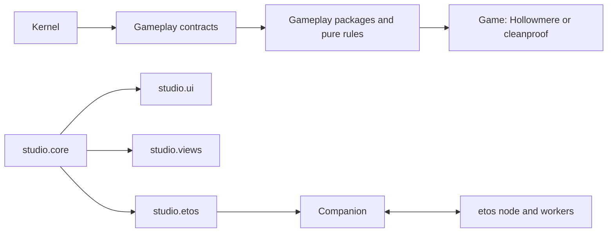

# GameCore Studio ownership plan

This is a final maintenance map as of P4.2d (2026-10-06). Owner names are roles, not new assignments to individuals. Boundaries follow architecture A–E and the integrator's exclusive-path policy; packet columns distinguish original delivery from later extensions. Baseline V1 components have no P0–P2 creator packet. Their creation commits are recorded where a more precise packet cannot be established. ([Architecture §2](02-architecture.md#2-ownership-boundaries), [Plan §1–§2](06-implementation-plan.md))

## Dependency direction and change policy

Arrows below mean “supplies the layer to the right”, not an asmdef reference in that direction. Gameplay depends downward on the kernel/contracts; Studio UI/views/etos consume core. The companion and etos communicate over the pinned protocol. Gameplay runtime must not reference Studio, and the kernel must not name gameplay. ([Architecture §2–§4](02-architecture.md), [package rules](../operator/packages.md))

The policy labels used in the inventories are defined here. Tests/checkers in the inventories are the required review lane or linked historical suite, not a claim that P4.3 ran them. ([Plan §3](06-implementation-plan.md#3-integration-checks-run-by-fable-per-merge), [Verification rules](07-verification-matrix.md))

| Policy | Change boundary | Review / compatibility obligation | Source |
|---|---|---|---|
| K | Kernel and qualification | Protocol/lifecycle/authority changes require an explicit architectural decision and integrator review; P0.4/P1.2 record bounded SADRs. Run affected pure/Unity tests and integrated V1 gates. Never casually edit normative 00 semantics. | [SADR-010–015](02-architecture.md), [Plan non-goals](06-implementation-plan.md#4-non-goals-of-every-packet) |
| G | Gameplay library | Content changes require a re-bake and deterministic output check. Identity, schema, recipe or catalog changes need explicit save-compatibility review; recipe revisions are exact and only slots migrate. New cross-package seams need one owning packet. | [P1.1 decisions](packets/P1.1-entities-world-compile.md#decisions), [P1.2 §3](packets/P1.2-save-restore.md#3-api-for-downstream-packets), [Plan](06-implementation-plan.md) |
| S | Studio | Shared JSON/tool/diagnostic shape changes update the authoring contract first, schemas and both client/companion readers. Respect A–D boundaries and journal/retained-artifact compatibility. Changes to product decisions need an SADR. | [Authoring introduction](03-authoring-contracts.md), [Architecture §2, §8](02-architecture.md) |
| I | Infrastructure | Preserve host isolation, key separation, git transfer and slot protocol. Update pin/digests/vendor together; etos extensions need an evidenced gap and decision under SADR-005. Scripts must not silently convert skipped or failed work to pass. | [P0.1](packets/P0.1-host-etos.md), [P0.5 vendoring](packets/P0.5-companion.md), [P2.4 decisions](packets/P2.4-staging-lane.md#decisions) |
| A | Game content | Game owns boot wiring, codecs, UI/assets and build scenes. Re-bake affected catalogs/manifests; preserve stable ids and declare save incompatibility. Ordinary content must not require kernel edits. | [P1.5 GameBoot](packets/P1.5-ui-audio.md#gameboot-the-real-boot), [SR-7.3](01-gap-assessment.md#7-application-bootstrap-and-independent-game-projects) |
| D | Documentation/evidence | Source-link behavior and preserve blocked/partial distinctions. Only P4.2 updates verification status; integrator owns shared 01–07/README cross-references. Historical evidence is not rewritten as current proof. | [Verification rules](07-verification-matrix.md), [Plan ownership](06-implementation-plan.md) |

## Package inventory

Every tracked package manifest, including qualification fixtures and the mechanism sample, is listed below. Package links expose the concrete declaration; API links point to the delivering packet where one exists. All local GameCore package changes also pass metadata, C# and meta review under the [package contract](../operator/packages.md). The role for a V1 gameplay fixture is gameplay even though it participates in kernel qualification. ([Operator package groups](../operator/packages.md#3-engine-facing-packages))

| Package | Owner role | Creator / API source | Tests and checks | Policy |
|---|---|---|---|---|
| [com.gamecore.composition](../../Packages/com.gamecore.composition) | kernel | Pre-Studio; creation `77b42f21`; [V1 package surface](../../docs/operator/packages.md) | V1 dotnet / validation EditMode + PlayMode; reproduce gate; metadata/C# | K |
| [com.gamecore.content.compiler](../../Packages/com.gamecore.content.compiler) | kernel | Pre-Studio; creation `300a0eef`; [V1 package surface](../../docs/operator/packages.md) | V1 dotnet / validation EditMode + PlayMode; reproduce gate; metadata/C# | K |
| [com.gamecore.contracts](../../Packages/com.gamecore.contracts) | kernel | Pre-Studio; creation `300a0eef`; [V1 package surface](../../docs/operator/packages.md) | V1 dotnet / validation EditMode + PlayMode; reproduce gate; metadata/C# | K |
| [com.gamecore.derivation](../../Packages/com.gamecore.derivation) | kernel | Pre-Studio; creation `9f717d79`; [V1 package surface](../../docs/operator/packages.md) | V1 dotnet / validation EditMode + PlayMode; reproduce gate; metadata/C# | K |
| [com.gamecore.fault-qualification](../../Packages/com.gamecore.fault-qualification) | kernel | Pre-Studio; creation `0b88f7a0`; [V1 package surface](../../docs/operator/packages.md) | V1 dotnet / validation EditMode + PlayMode; reproduce gate; metadata/C# | K |
| [com.gamecore.gameplay.audio](../../Packages/com.gamecore.gameplay.audio) | gameplay | [P1.5 API](packets/P1.5-ui-audio.md#api) | Rules.Gameplay dotnet; Hollowmere P1_5 EditMode / PlayMode (see packet); metadata/C# | G |
| [com.gamecore.gameplay.cards](../../Packages/com.gamecore.gameplay.cards) | gameplay | Pre-Studio; creation `384723c9`; [V1 package surface](../../docs/operator/packages.md) | V1 dotnet / validation EditMode + PlayMode; reproduce gate; metadata/C# | G |
| [com.gamecore.gameplay.compile](../../Packages/com.gamecore.gameplay.compile) | gameplay | [P1.1 API](packets/P1.1-entities-world-compile.md#api) | Rules.Gameplay dotnet; Hollowmere P1_1 EditMode / PlayMode (see packet); metadata/C# | G |
| [com.gamecore.gameplay.contracts](../../Packages/com.gamecore.gameplay.contracts) | gameplay | [P1.1 API](packets/P1.1-entities-world-compile.md#api) | Rules.Gameplay dotnet; Hollowmere P1_1 EditMode / PlayMode (see packet); metadata/C# | G |
| [com.gamecore.gameplay.dialogue](../../Packages/com.gamecore.gameplay.dialogue) | gameplay | [P1.4 API](packets/P1.4-dialogue-quest-logic-inventory.md#api-for-p15-p31-p32) | Rules.Gameplay dotnet; Hollowmere P1_4 EditMode / PlayMode (see packet); metadata/C# | G |
| [com.gamecore.gameplay.entities](../../Packages/com.gamecore.gameplay.entities) | gameplay | [P1.1 API](packets/P1.1-entities-world-compile.md#api) | Rules.Gameplay dotnet; Hollowmere P1_1 EditMode / PlayMode (see packet); metadata/C# | G |
| [com.gamecore.gameplay.integration](../../Packages/com.gamecore.gameplay.integration) | gameplay | Pre-Studio; creation `8d28e1f9`; [V1 package surface](../../docs/operator/packages.md) | V1 dotnet / validation EditMode + PlayMode; reproduce gate; metadata/C# | G |
| [com.gamecore.gameplay.interaction](../../Packages/com.gamecore.gameplay.interaction) | gameplay | [P1.3 Delivered / seams](packets/P1.3-player-npc-interaction.md#delivered) | Rules.Gameplay dotnet; Hollowmere P1_3 EditMode / PlayMode (see packet); metadata/C# | G |
| [com.gamecore.gameplay.inventory](../../Packages/com.gamecore.gameplay.inventory) | gameplay | [P1.4 API](packets/P1.4-dialogue-quest-logic-inventory.md#api-for-p15-p31-p32) | Rules.Gameplay dotnet; Hollowmere P1_4 EditMode / PlayMode (see packet); metadata/C# | G |
| [com.gamecore.gameplay.logic](../../Packages/com.gamecore.gameplay.logic) | gameplay | [P1.4 API](packets/P1.4-dialogue-quest-logic-inventory.md#api-for-p15-p31-p32) | Rules.Gameplay dotnet; Hollowmere P1_4 EditMode / PlayMode (see packet); metadata/C# | G |
| [com.gamecore.gameplay.narrative](../../Packages/com.gamecore.gameplay.narrative) | gameplay | Pre-Studio; creation `48dfe183`; [V1 package surface](../../docs/operator/packages.md) | V1 dotnet / validation EditMode + PlayMode; reproduce gate; metadata/C# | G |
| [com.gamecore.gameplay.npc](../../Packages/com.gamecore.gameplay.npc) | gameplay | [P1.3 Delivered / seams](packets/P1.3-player-npc-interaction.md#delivered) | Rules.Gameplay dotnet; Hollowmere P1_3 EditMode / PlayMode (see packet); metadata/C# | G |
| [com.gamecore.gameplay.player](../../Packages/com.gamecore.gameplay.player) | gameplay | [P1.3 Delivered / seams](packets/P1.3-player-npc-interaction.md#delivered) | Rules.Gameplay dotnet; Hollowmere P1_3 EditMode / PlayMode (see packet); metadata/C# | G |
| [com.gamecore.gameplay.quest](../../Packages/com.gamecore.gameplay.quest) | gameplay | [P1.4 API](packets/P1.4-dialogue-quest-logic-inventory.md#api-for-p15-p31-p32) | Rules.Gameplay dotnet; Hollowmere P1_4 EditMode / PlayMode (see packet); metadata/C# | G |
| [com.gamecore.gameplay.rewards](../../Packages/com.gamecore.gameplay.rewards) | gameplay | Pre-Studio; creation `5460fe1f`; [V1 package surface](../../docs/operator/packages.md) | V1 dotnet / validation EditMode + PlayMode; reproduce gate; metadata/C# | G |
| [com.gamecore.gameplay.save](../../Packages/com.gamecore.gameplay.save) | gameplay | [P1.2 §3 API](packets/P1.2-save-restore.md#3-api-for-downstream-packets) | Contracts/Execution dotnet; validation Persistence EditMode and regression PlayMode; no game persistence proof; metadata/C# | G |
| [com.gamecore.gameplay.traversal](../../Packages/com.gamecore.gameplay.traversal) | gameplay | Pre-Studio; creation `c30f5cc1`; [V1 package surface](../../docs/operator/packages.md) | V1 dotnet / validation EditMode + PlayMode; reproduce gate; metadata/C# | G |
| [com.gamecore.gameplay.ui](../../Packages/com.gamecore.gameplay.ui) | gameplay | [P1.5 API](packets/P1.5-ui-audio.md#api) | Rules.Gameplay dotnet; Hollowmere P1_5 EditMode / PlayMode (see packet); metadata/C# | G |
| [com.gamecore.gameplay.world](../../Packages/com.gamecore.gameplay.world) | gameplay | [P1.1 API](packets/P1.1-entities-world-compile.md#api) | Rules.Gameplay dotnet; Hollowmere P1_1 EditMode / PlayMode (see packet); metadata/C# | G |
| [com.gamecore.planning](../../Packages/com.gamecore.planning) | kernel | Pre-Studio; creation `7a0386fe`; [V1 package surface](../../docs/operator/packages.md) | V1 dotnet / validation EditMode + PlayMode; reproduce gate; metadata/C# | K |
| [com.gamecore.rules.cards](../../Packages/com.gamecore.rules.cards) | kernel | Pre-Studio; creation `42e4e876`; [V1 package surface](../../docs/operator/packages.md) | V1 dotnet / validation EditMode + PlayMode; reproduce gate; metadata/C# | K |
| [com.gamecore.rules.gameplay](../../Packages/com.gamecore.rules.gameplay) | gameplay | [P1.1 API](packets/P1.1-entities-world-compile.md#api) | GameCore.Rules.Gameplay.Tests; group additions P1.2–P1.5; metadata/C# | G |
| [com.gamecore.rules.narrative](../../Packages/com.gamecore.rules.narrative) | kernel | Pre-Studio; creation `48dfe183`; [V1 package surface](../../docs/operator/packages.md) | V1 dotnet / validation EditMode + PlayMode; reproduce gate; metadata/C# | K |
| [com.gamecore.rules.traversal](../../Packages/com.gamecore.rules.traversal) | kernel | Pre-Studio; creation `6b328606`; [V1 package surface](../../docs/operator/packages.md) | V1 dotnet / validation EditMode + PlayMode; reproduce gate; metadata/C# | K |
| [com.gamecore.studio.core](../../Packages/com.gamecore.studio.core) | studio | [P0.3 API summary](packets/P0.3-studio-model.md#api-summary-namespace-gamecorestudiomodel-assembly-gamecorestudiomodel-editor-only); [P1.6 API](packets/P1.6-studio-core-unity.md#api-namespace-gamecorestudioedit-unless-noted); [P2.4 admission](packets/P2.4-staging-lane.md#api-for-p21-studio-ui-p22-etos-client-p32-ai-workflows-p41-clean-proof) | Studio.Model dotnet; P1.6 EditMode; P2.4 admission tests; metadata/C# | S |
| [com.gamecore.studio.etos](../../Packages/com.gamecore.studio.etos) | studio | [P2.2 API](packets/P2.2-studio-etos-client.md#api) | Etos.Client dotnet; gateway EditMode; separately gated live tests; metadata/C# | S |
| [com.gamecore.studio.ui](../../Packages/com.gamecore.studio.ui) | studio | [P2.1 API](packets/P2.1-studio-ui.md#api-for-p23--p3x) | UI EditMode; P2.1 graphical evidence; metadata/C# | S |
| [com.gamecore.studio.views](../../Packages/com.gamecore.studio.views) | studio | [P2.3 API](packets/P2.3-studio-views.md#api-for-p21-studio-ui-p31-p32-plugins) | Views EditMode; P2.3 graphical evidence with stated blockers; metadata/C# | S |
| [com.gamecore.telemetry-qualification](../../Packages/com.gamecore.telemetry-qualification) | kernel | Pre-Studio; creation `1fd339c1`; [V1 package surface](../../docs/operator/packages.md) | V1 dotnet / validation EditMode + PlayMode; reproduce gate; metadata/C# | K |
| [com.gamecore.unity.adapters](../../Packages/com.gamecore.unity.adapters) | kernel | Pre-Studio; creation `18247ae5`; [V1 package surface](../../docs/operator/packages.md) | V1 dotnet / validation EditMode + PlayMode; reproduce gate; metadata/C# | K |
| [com.gamecore.unity.app](../../Packages/com.gamecore.unity.app) | kernel | [P0.4 §2 Public API](packets/P0.4-kernel-app.md#2-public-api-of-comgamecoreunityapp-for-p11--p12--p16); [P1.2 saves](packets/P1.2-save-restore.md#3-api-for-downstream-packets) | App/Persistence validation suites; P1.1 time driver, P1.2 saves; metadata/C# | K |
| [com.gamecore.unity.runtime](../../Packages/com.gamecore.unity.runtime) | kernel | Pre-Studio; creation `dc55f0e0`; [V1 package surface](../../docs/operator/packages.md) | V1 dotnet / validation EditMode + PlayMode; reproduce gate; metadata/C# | K |
| [com.hollowmere.mechanism.pressureplate](../../samples/mechanisms/pressure-plate/package) | game | [P2.4 API](packets/P2.4-staging-lane.md#api-for-p21-studio-ui-p22-etos-client-p32-ai-workflows-p41-clean-proof) | 15 rules + 26 EditMode + Hollowmere plate PlayMode; stage scan/checkers; metadata/C# | A/S |
| [com.gamecore.benchmarks](../../tests/GameCore.Benchmarks) | kernel | Pre-Studio; creation `5a896645`; [V1 package surface](../../docs/operator/packages.md) | V1 dotnet / validation EditMode + PlayMode; reproduce gate; metadata/C# | K |
| [com.gamecore.recovery](../../tests/GameCore.Recovery) | kernel | Pre-Studio; creation `25ad6562`; [V1 package surface](../../docs/operator/packages.md) | V1 dotnet / validation EditMode + PlayMode; reproduce gate; metadata/C# | K |
| [com.gamecore.reference-conformance](../../tests/GameCore.ReferenceConformance) | kernel | Pre-Studio; creation `e88ddb6f`; [V1 package surface](../../docs/operator/packages.md) | V1 dotnet / validation EditMode + PlayMode; reproduce gate; metadata/C# | K |
| [com.gamecore.replay](../../tests/GameCore.Replay) | kernel | Pre-Studio; creation `b8e9c1ce`; [V1 package surface](../../docs/operator/packages.md) | V1 dotnet / validation EditMode + PlayMode; reproduce gate; metadata/C# | K |

## Tool and script inventory

Every tracked `.sh`/`.py` under `tools/`, `studio/` (excluding vendored SDK internals), and the mechanism sample is enumerated. Each link is the CLI/API source. Baseline creation commits establish provenance where the P0–P2 notes do not assign an original packet; those packet names remain an open ownership item. For helpers without a standalone test, the enclosing gate/packet is the verification lane, not an invented self-test. ([Plan §2–§3](06-implementation-plan.md), [operator build procedure](../operator/build-and-run.md))

| Script / public CLI source | Owner role | Delivery / provenance | Verification lane | Policy |
|---|---|---|---|---|
| [samples/mechanisms/pressure-plate/make-candidate.py](../../samples/mechanisms/pressure-plate/make-candidate.py) | infra | [P2.4 Built / verification](packets/P2.4-staging-lane.md) | Stage unit/fake/real tests; checker self-test; W-MECH-01 | I/K |
| [samples/mechanisms/pressure-plate/make-catalog.py](../../samples/mechanisms/pressure-plate/make-catalog.py) | infra | [P2.4 Built / verification](packets/P2.4-staging-lane.md) | Stage unit/fake/real tests; checker self-test; W-MECH-01 | I/K |
| [studio/agent/vendor-etos-sdk.sh](../../studio/agent/vendor-etos-sdk.sh) | infra | [P0.5 Built / verification](packets/P0.5-companion.md) | Companion unit/fake tests; vendor byte parity | I/K |
| [studio/etos/install.sh](../../studio/etos/install.sh) | infra | [P0.1 Built / verification](packets/P0.1-host-etos.md) | install idempotency + verify.sh (live node) | I/K |
| [studio/etos/verify-agent/realtime_probe.py](../../studio/etos/verify-agent/realtime_probe.py) | infra | [P0.1 Built / verification](packets/P0.1-host-etos.md) | install idempotency + verify.sh (live node) | I/K |
| [studio/etos/verify.sh](../../studio/etos/verify.sh) | infra | [P0.1 Built / verification](packets/P0.1-host-etos.md) | install idempotency + verify.sh (live node) | I/K |
| [studio/stage/make-slot.py](../../studio/stage/make-slot.py) | infra | [P2.4 Built / verification](packets/P2.4-staging-lane.md) | Stage unit/fake/real tests; checker self-test; W-MECH-01 | I/K |
| [studio/stage/slot-checks.py](../../studio/stage/slot-checks.py) | infra | [P2.4 Built / verification](packets/P2.4-staging-lane.md) | Stage unit/fake/real tests; checker self-test; W-MECH-01 | I/K |
| [studio/stage/stage.sh](../../studio/stage/stage.sh) | infra | [P2.4 Built / verification](packets/P2.4-staging-lane.md) | Stage unit/fake/real tests; checker self-test; W-MECH-01 | I/K |
| [studio/stage/w-mech-01.sh](../../studio/stage/w-mech-01.sh) | infra | [P2.4 Built / verification](packets/P2.4-staging-lane.md) | Stage unit/fake/real tests; checker self-test; W-MECH-01 | I/K |
| [studio/tools/codex-packet.sh](../../studio/tools/codex-packet.sh) | infra | Creation `2a94a364`; packet not established | Header contract; no dedicated test evidenced | I |
| [studio/tools/dotnet-test.sh](../../studio/tools/dotnet-test.sh) | infra | [P0.2 Built / verification](packets/P0.2-projects-tooling.md) | P0.2 command results; checker self-tests where declared | I/K |
| [studio/tools/evidence-p2.1.sh](../../studio/tools/evidence-p2.1.sh) | infra | [P2.1 Built / verification](packets/P2.1-studio-ui.md) | P2.1 evidence README / capture result | I/K |
| [studio/tools/evidence-p2.3.sh](../../studio/tools/evidence-p2.3.sh) | infra | [P2.3 Built / verification](packets/P2.3-studio-views.md) | P2.3 evidence README; patched-tree caveat | I/K |
| [studio/tools/host-build-etos.sh](../../studio/tools/host-build-etos.sh) | infra | [P0.1 Built / verification](packets/P0.1-host-etos.md) | install idempotency + verify.sh (live node) | I/K |
| [studio/tools/host-build-images.sh](../../studio/tools/host-build-images.sh) | infra | [P0.1 Built / verification](packets/P0.1-host-etos.md) | install idempotency + verify.sh (live node) | I/K |
| [studio/tools/host-providers-env.sh](../../studio/tools/host-providers-env.sh) | infra | [P0.1 Built / verification](packets/P0.1-host-etos.md) | install idempotency + verify.sh (live node) | I/K |
| [studio/tools/host-sync-etos.sh](../../studio/tools/host-sync-etos.sh) | infra | [P0.1 Built / verification](packets/P0.1-host-etos.md) | install idempotency + verify.sh (live node) | I/K |
| [studio/tools/host-sync-studio.sh](../../studio/tools/host-sync-studio.sh) | infra | [P0.1 Built / verification](packets/P0.1-host-etos.md) | install idempotency + verify.sh (live node) | I/K |
| [studio/tools/live-etos-tests.sh](../../studio/tools/live-etos-tests.sh) | infra | [P2.2 Built / verification](packets/P2.2-studio-etos-client.md) | Live dotnet/Unity XML and redaction evidence | I/K |
| [studio/tools/sync-to-host.sh](../../studio/tools/sync-to-host.sh) | infra | [P0.2 Built / verification](packets/P0.2-projects-tooling.md) | P0.2 command results; checker self-tests where declared | I/K |
| [studio/tools/unity-batch.sh](../../studio/tools/unity-batch.sh) | infra | [P2.4 Built / verification](packets/P2.4-staging-lane.md) | Stage unit/fake/real tests; checker self-test; W-MECH-01 | I/K |
| [studio/tools/unity-compile.sh](../../studio/tools/unity-compile.sh) | infra | [P0.2 Built / verification](packets/P0.2-projects-tooling.md) | P0.2 command results; checker self-tests where declared | I/K |
| [tools/attribute_native_leaks.py](../../tools/attribute_native_leaks.py) | infra | Creation `8d3048f5`; packet not established | Enclosing V1 gate; inspect its source before selecting a standalone run | I/K |
| [tools/build_baseline_player.sh](../../tools/build_baseline_player.sh) | infra | Creation `09679dfd`; packet not established | Enclosing V1 gate; inspect its source before selecting a standalone run | I/K |
| [tools/check_budget_record.py](../../tools/check_budget_record.py) | infra | Creation `777d5a0b`; packet not established | Enclosing V1 gate; inspect its source before selecting a standalone run | I/K |
| [tools/check_contract_surface_parity.py](../../tools/check_contract_surface_parity.py) | infra | Creation `94b2aed8`; packet not established | Enclosing V1 gate; inspect its source before selecting a standalone run | I/K |
| [tools/check_game_core_csharp.py](../../tools/check_game_core_csharp.py) | infra | [P0.2 Built / verification](packets/P0.2-projects-tooling.md) (extends V1 tool) | P0.2 command results; checker self-tests where declared | I/K |
| [tools/check_gate_sources.py](../../tools/check_gate_sources.py) | infra | Creation `64c3e2a2`; packet not established | Enclosing V1 gate; inspect its source before selecting a standalone run | I/K |
| [tools/check_link_xml.py](../../tools/check_link_xml.py) | infra | Creation `09679dfd`; packet not established | Enclosing V1 gate; inspect its source before selecting a standalone run | I/K |
| [tools/check_operator_docs.py](../../tools/check_operator_docs.py) | infra | Creation `cfe228c4`; packet not established | Enclosing V1 gate; inspect its source before selecting a standalone run | I/K |
| [tools/check_package_metadata.py](../../tools/check_package_metadata.py) | infra | [P0.2 Built / verification](packets/P0.2-projects-tooling.md) (extends V1 tool) | P0.2 command results; checker self-tests where declared | I/K |
| [tools/check_player_fault_free.py](../../tools/check_player_fault_free.py) | infra | Creation `6bfeacf8`; packet not established | Enclosing V1 gate; inspect its source before selecting a standalone run | I/K |
| [tools/check_release_clone.py](../../tools/check_release_clone.py) | infra | Creation `64c3e2a2`; packet not established | Enclosing V1 gate; inspect its source before selecting a standalone run | I/K |
| [tools/check_release_fault_free.py](../../tools/check_release_fault_free.py) | infra | Creation `6bfeacf8`; packet not established | Enclosing V1 gate; inspect its source before selecting a standalone run | I/K |
| [tools/check_release_gate_free.py](../../tools/check_release_gate_free.py) | infra | Creation `63a6afcc`; packet not established | Enclosing V1 gate; inspect its source before selecting a standalone run | I/K |
| [tools/check_release_telemetry_free.py](../../tools/check_release_telemetry_free.py) | infra | Creation `b8e9c1ce`; packet not established | Enclosing V1 gate; inspect its source before selecting a standalone run | I/K |
| [tools/check_stage_slot.py](../../tools/check_stage_slot.py) | infra | [P2.4 Built / verification](packets/P2.4-staging-lane.md) | Stage unit/fake/real tests; checker self-test; W-MECH-01 | I/K |
| [tools/compare_registration_fingerprints.py](../../tools/compare_registration_fingerprints.py) | infra | Creation `09679dfd`; packet not established | Enclosing V1 gate; inspect its source before selecting a standalone run | I/K |
| [tools/conformance/build_compatibility.py](../../tools/conformance/build_compatibility.py) | infra | Creation `20c86d61`; packet not established | Enclosing V1 gate; inspect its source before selecting a standalone run | I/K |
| [tools/conformance/build_evidence_index.py](../../tools/conformance/build_evidence_index.py) | infra | Creation `20c86d61`; packet not established | Enclosing V1 gate; inspect its source before selecting a standalone run | I/K |
| [tools/conformance/evidence_map.py](../../tools/conformance/evidence_map.py) | infra | Creation `20c86d61`; packet not established | Enclosing V1 gate; inspect its source before selecting a standalone run | I/K |
| [tools/conformance/run_test_matrix.sh](../../tools/conformance/run_test_matrix.sh) | infra | Creation `20c86d61`; packet not established | Enclosing V1 gate; inspect its source before selecting a standalone run | I/K |
| [tools/conformance/summarize_suite_matrix.py](../../tools/conformance/summarize_suite_matrix.py) | infra | Creation `20c86d61`; packet not established | Enclosing V1 gate; inspect its source before selecting a standalone run | I/K |
| [tools/emit_baked_catalog_coverage.py](../../tools/emit_baked_catalog_coverage.py) | infra | Creation `09679dfd`; packet not established | Enclosing V1 gate; inspect its source before selecting a standalone run | I/K |
| [tools/emit_catalog_reachability.py](../../tools/emit_catalog_reachability.py) | infra | Creation `6399c0e9`; packet not established | Enclosing V1 gate; inspect its source before selecting a standalone run | I/K |
| [tools/emit_checkpoint_catalog.py](../../tools/emit_checkpoint_catalog.py) | infra | Creation `8f76717a`; packet not established | Enclosing V1 gate; inspect its source before selecting a standalone run | I/K |
| [tools/emit_failure_codes.py](../../tools/emit_failure_codes.py) | infra | Creation `cfe228c4`; packet not established | Enclosing V1 gate; inspect its source before selecting a standalone run | I/K |
| [tools/emit_generated_catalog.py](../../tools/emit_generated_catalog.py) | infra | Creation `4a8ca2f5`; packet not established | Enclosing V1 gate; inspect its source before selecting a standalone run | I/K |
| [tools/gc024_genre_audit.py](../../tools/gc024_genre_audit.py) | infra | Creation `20b4648b`; packet not established | Enclosing V1 gate; inspect its source before selecting a standalone run | I/K |
| [tools/make_unity_metas.py](../../tools/make_unity_metas.py) | infra | [P0.2 Built / verification](packets/P0.2-projects-tooling.md) (extends V1 tool) | P0.2 command results; checker self-tests where declared | I/K |
| [tools/regen_catalog_group.py](../../tools/regen_catalog_group.py) | infra | Creation `8e6ce4d9`; packet not established | Enclosing V1 gate; inspect its source before selecting a standalone run | I/K |
| [tools/release_readiness/build_release_readiness.py](../../tools/release_readiness/build_release_readiness.py) | infra | Creation `91a4aacb`; packet not established | Enclosing V1 gate; inspect its source before selecting a standalone run | I/K |
| [tools/release_readiness/check_revision_consistency.py](../../tools/release_readiness/check_revision_consistency.py) | infra | Creation `91a4aacb`; packet not established | Enclosing V1 gate; inspect its source before selecting a standalone run | I/K |
| [tools/release_readiness/readiness_data.py](../../tools/release_readiness/readiness_data.py) | infra | Creation `91a4aacb`; packet not established | Enclosing V1 gate; inspect its source before selecting a standalone run | I/K |
| [tools/reproduce.sh](../../tools/reproduce.sh) | infra | Creation `cfe228c4`; packet not established | Enclosing V1 gate; inspect its source before selecting a standalone run | I/K |
| [tools/run_benchmarks.sh](../../tools/run_benchmarks.sh) | infra | Creation `5a896645`; packet not established | Enclosing V1 gate; inspect its source before selecting a standalone run | I/K |
| [tools/run_conformance.sh](../../tools/run_conformance.sh) | infra | Creation `55ad102d`; packet not established | Enclosing V1 gate; inspect its source before selecting a standalone run | I/K |
| [tools/run_gc003_checks.sh](../../tools/run_gc003_checks.sh) | infra | Creation `d8758b33`; packet not established | Enclosing V1 gate; inspect its source before selecting a standalone run | I/K |
| [tools/run_gc008_gate.sh](../../tools/run_gc008_gate.sh) | infra | Creation `e6802808`; packet not established | Enclosing V1 gate; inspect its source before selecting a standalone run | I/K |
| [tools/run_gc010_gate.sh](../../tools/run_gc010_gate.sh) | infra | Creation `2d291870`; packet not established | Enclosing V1 gate; inspect its source before selecting a standalone run | I/K |
| [tools/run_gc014_checks.sh](../../tools/run_gc014_checks.sh) | infra | Creation `070f8ce9`; packet not established | Enclosing V1 gate; inspect its source before selecting a standalone run | I/K |
| [tools/run_gc017_gate.sh](../../tools/run_gc017_gate.sh) | infra | Creation `71c4a5db`; packet not established | Enclosing V1 gate; inspect its source before selecting a standalone run | I/K |
| [tools/run_gc020_gate.sh](../../tools/run_gc020_gate.sh) | infra | Creation `513c4541`; packet not established | Enclosing V1 gate; inspect its source before selecting a standalone run | I/K |
| [tools/run_gc022.sh](../../tools/run_gc022.sh) | infra | Creation `c0975f4e`; packet not established | Enclosing V1 gate; inspect its source before selecting a standalone run | I/K |
| [tools/run_gc023_gate.sh](../../tools/run_gc023_gate.sh) | infra | Creation `b8e9c1ce`; packet not established | Enclosing V1 gate; inspect its source before selecting a standalone run | I/K |
| [tools/run_gc025_gate.sh](../../tools/run_gc025_gate.sh) | infra | Creation `09679dfd`; packet not established | Enclosing V1 gate; inspect its source before selecting a standalone run | I/K |
| [tools/run_w0_checks.sh](../../tools/run_w0_checks.sh) | infra | Creation `b0330e06`; packet not established | Enclosing V1 gate; inspect its source before selecting a standalone run | I/K |
| [tools/run_w1_gate.sh](../../tools/run_w1_gate.sh) | infra | Creation `fb4b17a2`; packet not established | Enclosing V1 gate; inspect its source before selecting a standalone run | I/K |
| [tools/run_w2_gate.sh](../../tools/run_w2_gate.sh) | infra | Creation `9debe19c`; packet not established | Enclosing V1 gate; inspect its source before selecting a standalone run | I/K |
| [tools/run_w3_gate.sh](../../tools/run_w3_gate.sh) | infra | Creation `cfa19ec0`; packet not established | Enclosing V1 gate; inspect its source before selecting a standalone run | I/K |
| [tools/run_w4_gate.sh](../../tools/run_w4_gate.sh) | infra | Creation `ab068039`; packet not established | Enclosing V1 gate; inspect its source before selecting a standalone run | I/K |
| [tools/run_w4_profile_gate.sh](../../tools/run_w4_profile_gate.sh) | infra | Creation `8e6ce4d9`; packet not established | Enclosing V1 gate; inspect its source before selecting a standalone run | I/K |
| [tools/run_w5_gate.sh](../../tools/run_w5_gate.sh) | infra | Creation `289d9c1c`; packet not established | Enclosing V1 gate; inspect its source before selecting a standalone run | I/K |
| [tools/run_w6_gate.sh](../../tools/run_w6_gate.sh) | infra | Creation `63a6afcc`; packet not established | Enclosing V1 gate; inspect its source before selecting a standalone run | I/K |
| [tools/run_w7_gate.sh](../../tools/run_w7_gate.sh) | infra | Creation `777d5a0b`; packet not established | Enclosing V1 gate; inspect its source before selecting a standalone run | I/K |
| [tools/studio/emit_studio_schemas.py](../../tools/studio/emit_studio_schemas.py) | studio | [P0.3 Built / verification](packets/P0.3-studio-model.md) | Model schema-current test and --check | S |
| [tools/summarize_benchmarks.py](../../tools/summarize_benchmarks.py) | infra | Creation `5a896645`; packet not established | Enclosing V1 gate; inspect its source before selecting a standalone run | I/K |
| [tools/unity/build_probe.sh](../../tools/unity/build_probe.sh) | infra | Creation `647a8e93`; packet not established | Enclosing V1 gate; inspect its source before selecting a standalone run | I/K |
| [tools/unity/capture_crash_139.py](../../tools/unity/capture_crash_139.py) | infra | Creation `67f6a9ed`; packet not established | Enclosing V1 gate; inspect its source before selecting a standalone run | I/K |
| [tools/unity/prepare_gc017_release_project.py](../../tools/unity/prepare_gc017_release_project.py) | infra | Creation `90500bce`; packet not established | Enclosing V1 gate; inspect its source before selecting a standalone run | I/K |
| [tools/unity/probe_runs.sh](../../tools/unity/probe_runs.sh) | infra | Creation `9debe19c`; packet not established | Enclosing V1 gate; inspect its source before selecting a standalone run | I/K |
| [tools/unity/run_cards_probe.sh](../../tools/unity/run_cards_probe.sh) | infra | Creation `282531df`; packet not established | Enclosing V1 gate; inspect its source before selecting a standalone run | I/K |
| [tools/unity/run_catalog_coverage_probe.sh](../../tools/unity/run_catalog_coverage_probe.sh) | infra | Creation `09679dfd`; packet not established | Enclosing V1 gate; inspect its source before selecting a standalone run | I/K |
| [tools/unity/run_conformance_probe.sh](../../tools/unity/run_conformance_probe.sh) | infra | Creation `20b4648b`; packet not established | Enclosing V1 gate; inspect its source before selecting a standalone run | I/K |
| [tools/unity/run_gc013_probe.sh](../../tools/unity/run_gc013_probe.sh) | infra | Creation `79e91063`; packet not established | Enclosing V1 gate; inspect its source before selecting a standalone run | I/K |
| [tools/unity/run_gc017_faults_probe.sh](../../tools/unity/run_gc017_faults_probe.sh) | infra | Creation `71c4a5db`; packet not established | Enclosing V1 gate; inspect its source before selecting a standalone run | I/K |
| [tools/unity/run_gc018_probe.sh](../../tools/unity/run_gc018_probe.sh) | infra | Creation `f251c0e7`; packet not established | Enclosing V1 gate; inspect its source before selecting a standalone run | I/K |
| [tools/unity/run_gc019_probe.sh](../../tools/unity/run_gc019_probe.sh) | infra | Creation `f9d25e46`; packet not established | Enclosing V1 gate; inspect its source before selecting a standalone run | I/K |
| [tools/unity/run_gc021_probe.sh](../../tools/unity/run_gc021_probe.sh) | infra | Creation `5fb73f9e`; packet not established | Enclosing V1 gate; inspect its source before selecting a standalone run | I/K |
| [tools/unity/run_lifecycle_playmode_matrix.sh](../../tools/unity/run_lifecycle_playmode_matrix.sh) | infra | Creation `47799e63`; packet not established | Enclosing V1 gate; inspect its source before selecting a standalone run | I/K |
| [tools/unity/run_lifecycle_stress_probe.sh](../../tools/unity/run_lifecycle_stress_probe.sh) | infra | Creation `8d3048f5`; packet not established | Enclosing V1 gate; inspect its source before selecting a standalone run | I/K |
| [tools/unity/run_narrative_probe.sh](../../tools/unity/run_narrative_probe.sh) | infra | Creation `2d291870`; packet not established | Enclosing V1 gate; inspect its source before selecting a standalone run | I/K |
| [tools/unity/run_probe.sh](../../tools/unity/run_probe.sh) | infra | Creation `647a8e93`; packet not established | Enclosing V1 gate; inspect its source before selecting a standalone run | I/K |
| [tools/unity/run_recovery_probe.sh](../../tools/unity/run_recovery_probe.sh) | infra | Creation `63b21e75`; packet not established | Enclosing V1 gate; inspect its source before selecting a standalone run | I/K |
| [tools/unity/run_recovery_smoke_probe.sh](../../tools/unity/run_recovery_smoke_probe.sh) | infra | Creation `777d5a0b`; packet not established | Enclosing V1 gate; inspect its source before selecting a standalone run | I/K |
| [tools/unity/run_replay_probe.sh](../../tools/unity/run_replay_probe.sh) | infra | Creation `b8e9c1ce`; packet not established | Enclosing V1 gate; inspect its source before selecting a standalone run | I/K |
| [tools/unity/run_traversal_probe.sh](../../tools/unity/run_traversal_probe.sh) | infra | Creation `513c4541`; packet not established | Enclosing V1 gate; inspect its source before selecting a standalone run | I/K |
| [tools/unity/run_w1_gate_probe.sh](../../tools/unity/run_w1_gate_probe.sh) | infra | Creation `fb4b17a2`; packet not established | Enclosing V1 gate; inspect its source before selecting a standalone run | I/K |
| [tools/unity/run_w2_gate_probe.sh](../../tools/unity/run_w2_gate_probe.sh) | infra | Creation `9debe19c`; packet not established | Enclosing V1 gate; inspect its source before selecting a standalone run | I/K |
| [tools/unity/run_w3_gate_probe.sh](../../tools/unity/run_w3_gate_probe.sh) | infra | Creation `cfa19ec0`; packet not established | Enclosing V1 gate; inspect its source before selecting a standalone run | I/K |
| [tools/unity/run_w4_gate_probe.sh](../../tools/unity/run_w4_gate_probe.sh) | infra | Creation `ab068039`; packet not established | Enclosing V1 gate; inspect its source before selecting a standalone run | I/K |
| [tools/unity/run_w4_profile_probe.sh](../../tools/unity/run_w4_profile_probe.sh) | infra | Creation `8e6ce4d9`; packet not established | Enclosing V1 gate; inspect its source before selecting a standalone run | I/K |
| [tools/unity/run_w5_gate_probe.sh](../../tools/unity/run_w5_gate_probe.sh) | infra | Creation `289d9c1c`; packet not established | Enclosing V1 gate; inspect its source before selecting a standalone run | I/K |
| [tools/unity/run_w6_gate_probe.sh](../../tools/unity/run_w6_gate_probe.sh) | infra | Creation `63a6afcc`; packet not established | Enclosing V1 gate; inspect its source before selecting a standalone run | I/K |
| [tools/unity/run_w7_gate_probe.sh](../../tools/unity/run_w7_gate_probe.sh) | infra | Creation `777d5a0b`; packet not established | Enclosing V1 gate; inspect its source before selecting a standalone run | I/K |
| [tools/unity/run_world_probe.sh](../../tools/unity/run_world_probe.sh) | infra | Creation `83356813`; packet not established | Enclosing V1 gate; inspect its source before selecting a standalone run | I/K |
| [tools/unity/stress_crash_139.py](../../tools/unity/stress_crash_139.py) | infra | Creation `67f6a9ed`; packet not established | Enclosing V1 gate; inspect its source before selecting a standalone run | I/K |
| [tools/validate_game_core_docs.py](../../tools/validate_game_core_docs.py) | infra | Creation `d7732e26`; packet not established | Enclosing V1 gate; inspect its source before selecting a standalone run | I/K |
| [tools/verify_generated_catalog.py](../../tools/verify_generated_catalog.py) | infra | Creation `5d35bd72`; packet not established | Enclosing V1 gate; inspect its source before selecting a standalone run | I/K |
| [tools/w4_generic_profile_audit.py](../../tools/w4_generic_profile_audit.py) | infra | Creation `8e6ce4d9`; packet not established | Enclosing V1 gate; inspect its source before selecting a standalone run | I/K |

## Document inventory

This inventory covers every Markdown document under `docs/`, the six generated Studio schemas, and the final numbered set. Package/tool READMEs are owned with their directory in the inventories above; artifact READMEs belong to their producing packet and retain that historical revision. Document rows assign review responsibility and a validation lane, not ownership of facts outside the cited source. ([Plan shared-file rule](06-implementation-plan.md), [evidence convention](07-verification-matrix.md#1-evidence-conventions))

| Document / source | Owner role | Delivery / public contract | Check / policy |
|---|---|---|---|
| [docs/game-core/00-core-protocols.md](../../docs/game-core/00-core-protocols.md) | kernel | Pre-Studio; creation `d7732e26`; document is the public runbook/contract | validate_game_core_docs.py; K/D |
| [docs/game-core/01-architecture.md](../../docs/game-core/01-architecture.md) | kernel | Pre-Studio; creation `d7732e26`; document is the public runbook/contract | validate_game_core_docs.py; K/D |
| [docs/game-core/02-composition-and-propagation.md](../../docs/game-core/02-composition-and-propagation.md) | kernel | Pre-Studio; creation `d7732e26`; document is the public runbook/contract | validate_game_core_docs.py; K/D |
| [docs/game-core/03-runtime-and-execution.md](../../docs/game-core/03-runtime-and-execution.md) | kernel | Pre-Studio; creation `d7732e26`; document is the public runbook/contract | validate_game_core_docs.py; K/D |
| [docs/game-core/04-unity-integration.md](../../docs/game-core/04-unity-integration.md) | kernel | Pre-Studio; creation `d7732e26`; document is the public runbook/contract | validate_game_core_docs.py; K/D |
| [docs/game-core/05-contracts-and-data-model.md](../../docs/game-core/05-contracts-and-data-model.md) | kernel | Pre-Studio; creation `d7732e26`; document is the public runbook/contract | validate_game_core_docs.py; K/D |
| [docs/game-core/06-lifecycle-and-recovery.md](../../docs/game-core/06-lifecycle-and-recovery.md) | kernel | Pre-Studio; creation `d7732e26`; document is the public runbook/contract | validate_game_core_docs.py; K/D |
| [docs/game-core/07-reference-compositions.md](../../docs/game-core/07-reference-compositions.md) | kernel | Pre-Studio; creation `d7732e26`; document is the public runbook/contract | validate_game_core_docs.py; K/D |
| [docs/game-core/08-validation-and-performance.md](../../docs/game-core/08-validation-and-performance.md) | kernel | Pre-Studio; creation `d7732e26`; document is the public runbook/contract | validate_game_core_docs.py; K/D |
| [docs/game-core/09-implementation-guide.md](../../docs/game-core/09-implementation-guide.md) | kernel | Pre-Studio; creation `d7732e26`; document is the public runbook/contract | validate_game_core_docs.py; K/D |
| [docs/game-core/10-decisions-and-open-questions.md](../../docs/game-core/10-decisions-and-open-questions.md) | kernel | Pre-Studio; creation `d7732e26`; document is the public runbook/contract | validate_game_core_docs.py; K/D |
| [docs/game-core/README.md](../../docs/game-core/README.md) | kernel | Pre-Studio; creation `d7732e26`; document is the public runbook/contract | validate_game_core_docs.py; K/D |
| [docs/game-core/references/documentation-validation.md](../../docs/game-core/references/documentation-validation.md) | kernel | Pre-Studio; creation `d7732e26`; document is the public runbook/contract | validate_game_core_docs.py; K/D |
| [docs/game-core/references/unity-evidence.md](../../docs/game-core/references/unity-evidence.md) | kernel | Pre-Studio; creation `d7732e26`; document is the public runbook/contract | validate_game_core_docs.py; K/D |
| [docs/operator/README.md](../../docs/operator/README.md) | infra | Pre-Studio; creation `cfe228c4`; document is the public runbook/contract | check_operator_docs.py; emit_failure_codes.py --check for generated codes; I/D |
| [docs/operator/build-and-run.md](../../docs/operator/build-and-run.md) | infra | Pre-Studio; creation `cfe228c4`; document is the public runbook/contract | check_operator_docs.py; emit_failure_codes.py --check for generated codes; I/D |
| [docs/operator/catalog-generation.md](../../docs/operator/catalog-generation.md) | infra | Pre-Studio; creation `cfe228c4`; document is the public runbook/contract | check_operator_docs.py; emit_failure_codes.py --check for generated codes; I/D |
| [docs/operator/checkpoint-and-recovery.md](../../docs/operator/checkpoint-and-recovery.md) | infra | Pre-Studio; creation `cfe228c4`; document is the public runbook/contract | check_operator_docs.py; emit_failure_codes.py --check for generated codes; I/D |
| [docs/operator/deferred-scope.md](../../docs/operator/deferred-scope.md) | infra | Pre-Studio; creation `cfe228c4`; document is the public runbook/contract | check_operator_docs.py; emit_failure_codes.py --check for generated codes; I/D |
| [docs/operator/editor-hang.md](../../docs/operator/editor-hang.md) | infra | Pre-Studio; creation `cfe228c4`; document is the public runbook/contract | check_operator_docs.py; emit_failure_codes.py --check for generated codes; I/D |
| [docs/operator/failure-codes.md](../../docs/operator/failure-codes.md) | infra | Pre-Studio; creation `cfe228c4`; document is the public runbook/contract | check_operator_docs.py; emit_failure_codes.py --check for generated codes; I/D |
| [docs/operator/headless.md](../../docs/operator/headless.md) | infra | Pre-Studio; creation `cfe228c4`; document is the public runbook/contract | check_operator_docs.py; emit_failure_codes.py --check for generated codes; I/D |
| [docs/operator/packages.md](../../docs/operator/packages.md) | infra | Pre-Studio; creation `cfe228c4`; document is the public runbook/contract | check_operator_docs.py; emit_failure_codes.py --check for generated codes; I/D |
| [docs/operator/profile.md](../../docs/operator/profile.md) | infra | Pre-Studio; creation `cfe228c4`; document is the public runbook/contract | check_operator_docs.py; emit_failure_codes.py --check for generated codes; I/D |
| [docs/operator/unload-and-leaks.md](../../docs/operator/unload-and-leaks.md) | infra | Pre-Studio; creation `cfe228c4`; document is the public runbook/contract | check_operator_docs.py; emit_failure_codes.py --check for generated codes; I/D |
| [docs/studio/01-gap-assessment.md](../../docs/studio/01-gap-assessment.md) | studio | Integrator design / archive; creation `7a9c409a` | Source/link review; D |
| [docs/studio/02-architecture.md](../../docs/studio/02-architecture.md) | studio | Integrator design / archive; creation `7a9c409a` | Source/link review; D |
| [docs/studio/03-authoring-contracts.md](../../docs/studio/03-authoring-contracts.md) | studio | Integrator design / archive; creation `7a9c409a` | Source/link review; D |
| [docs/studio/04-etos-integration.md](../../docs/studio/04-etos-integration.md) | studio | Integrator design / archive; creation `7a9c409a` | Source/link review; D |
| [docs/studio/05-plugin-catalog.md](../../docs/studio/05-plugin-catalog.md) | studio | Integrator design / archive; creation `7a9c409a` | Source/link review; D |
| [docs/studio/06-implementation-plan.md](../../docs/studio/06-implementation-plan.md) | studio | Integrator design / archive; creation `7a9c409a` | Source/link review; D |
| [docs/studio/07-verification-matrix.md](../../docs/studio/07-verification-matrix.md) | studio | Integrator design / archive; creation `7a9c409a` | Source/link review; D |
| [docs/studio/08-creator-guide.md](../../docs/studio/08-creator-guide.md) | studio | P4.3-final; source-linked final guide | Source/link review; D |
| [docs/studio/09-plugin-developer-guide.md](../../docs/studio/09-plugin-developer-guide.md) | studio | P4.3-final; source-linked final guide | Source/link review; D |
| [docs/studio/10-install-build-run.md](../../docs/studio/10-install-build-run.md) | studio | P4.3-final; source-linked final guide | Source/link review; D |
| [docs/studio/11-ownership-plan.md](../../docs/studio/11-ownership-plan.md) | studio | P4.3-final; source-linked final guide | Source/link review; D |
| [docs/studio/12-completion-report.md](../../docs/studio/12-completion-report.md) | studio | P4.3-final; source-linked final guide | Source/link review; D |
| [docs/studio/README.md](../../docs/studio/README.md) | studio | Integrator design / archive; creation `7a9c409a` | Source/link review; D |
| [docs/studio/archive/2026-09-28-README.md](../../docs/studio/archive/2026-09-28-README.md) | studio | Integrator design / archive; creation `7a9c409a` | Source/link review; D |
| [docs/studio/archive/2026-09-28-open-problems.md](../../docs/studio/archive/2026-09-28-open-problems.md) | studio | Integrator design / archive; creation `7a9c409a` | Source/link review; D |
| [docs/studio/archive/2026-09-28-studio-design-draft.md](../../docs/studio/archive/2026-09-28-studio-design-draft.md) | studio | Integrator design / archive; creation `7a9c409a` | Source/link review; D |
| [docs/studio/packets/P0.1-host-etos.md](../../docs/studio/packets/P0.1-host-etos.md) | infra | P0.1 delivery record; API and verification sections | Source/link review; D |
| [docs/studio/packets/P0.2-projects-tooling.md](../../docs/studio/packets/P0.2-projects-tooling.md) | infra | P0.2 delivery record; API and verification sections | Source/link review; D |
| [docs/studio/packets/P0.3-studio-model.md](../../docs/studio/packets/P0.3-studio-model.md) | studio | P0.3 delivery record; API and verification sections | Source/link review; D |
| [docs/studio/packets/P0.4-kernel-app.md](../../docs/studio/packets/P0.4-kernel-app.md) | kernel | P0.4 delivery record; API and verification sections | Source/link review; D |
| [docs/studio/packets/P0.5-companion.md](../../docs/studio/packets/P0.5-companion.md) | studio | P0.5 delivery record; API and verification sections | Source/link review; D |
| [docs/studio/packets/P1.1-entities-world-compile.md](../../docs/studio/packets/P1.1-entities-world-compile.md) | gameplay | P1.1 delivery record; API and verification sections | Source/link review; D |
| [docs/studio/packets/P1.2-save-restore.md](../../docs/studio/packets/P1.2-save-restore.md) | kernel | P1.2 delivery record; API and verification sections | Source/link review; D |
| [docs/studio/packets/P1.3-player-npc-interaction.md](../../docs/studio/packets/P1.3-player-npc-interaction.md) | gameplay | P1.3 delivery record; API and verification sections | Source/link review; D |
| [docs/studio/packets/P1.4-dialogue-quest-logic-inventory.md](../../docs/studio/packets/P1.4-dialogue-quest-logic-inventory.md) | gameplay | P1.4 delivery record; API and verification sections | Source/link review; D |
| [docs/studio/packets/P1.5-ui-audio.md](../../docs/studio/packets/P1.5-ui-audio.md) | gameplay | P1.5 delivery record; API and verification sections | Source/link review; D |
| [docs/studio/packets/P1.6-studio-core-unity.md](../../docs/studio/packets/P1.6-studio-core-unity.md) | studio | P1.6 delivery record; API and verification sections | Source/link review; D |
| [docs/studio/packets/P2.1-studio-ui.md](../../docs/studio/packets/P2.1-studio-ui.md) | studio | P2.1 delivery record; API and verification sections | Source/link review; D |
| [docs/studio/packets/P2.2-studio-etos-client.md](../../docs/studio/packets/P2.2-studio-etos-client.md) | studio | P2.2 delivery record; API and verification sections | Source/link review; D |
| [docs/studio/packets/P2.3-studio-views.md](../../docs/studio/packets/P2.3-studio-views.md) | studio | P2.3 delivery record; API and verification sections | Source/link review; D |
| [docs/studio/packets/P2.4-staging-lane.md](../../docs/studio/packets/P2.4-staging-lane.md) | studio | P2.4 delivery record; API and verification sections | Source/link review; D |
| [docs/studio/schemas/authoring-ref.schema.json](../../docs/studio/schemas/authoring-ref.schema.json) | studio | [P0.3 API summary](packets/P0.3-studio-model.md) | emit_studio_schemas.py --check and Model schema tests; S/D |
| [docs/studio/schemas/change-set.schema.json](../../docs/studio/schemas/change-set.schema.json) | studio | [P0.3 API summary](packets/P0.3-studio-model.md) | emit_studio_schemas.py --check and Model schema tests; S/D |
| [docs/studio/schemas/diagnostic.schema.json](../../docs/studio/schemas/diagnostic.schema.json) | studio | [P0.3 API summary](packets/P0.3-studio-model.md) | emit_studio_schemas.py --check and Model schema tests; S/D |
| [docs/studio/schemas/selection-snapshot.schema.json](../../docs/studio/schemas/selection-snapshot.schema.json) | studio | [P0.3 API summary](packets/P0.3-studio-model.md) | emit_studio_schemas.py --check and Model schema tests; S/D |
| [docs/studio/schemas/semantic-index.schema.json](../../docs/studio/schemas/semantic-index.schema.json) | studio | [P0.3 API summary](packets/P0.3-studio-model.md) | emit_studio_schemas.py --check and Model schema tests; S/D |
| [docs/studio/schemas/tool-catalog.schema.json](../../docs/studio/schemas/tool-catalog.schema.json) | studio | [P0.3 API summary](packets/P0.3-studio-model.md) | emit_studio_schemas.py --check and Model schema tests; S/D |

## Host components and game boundaries

| Component / public surface | Owner role | Delivering packet / source | Tests and change policy |
|---|---|---|---|
| etos source pin, glibc/static CLI and binary lock | infra | [P0.1 §1](packets/P0.1-host-etos.md#1-built), [etos.lock](../../studio/etos/etos.lock) | Patched etos tests plus recorded host exceptions; I. Keep SDK vendor pin aligned. |
| user `etosd.service`, Studio node root, templates, API/broker/UI ports | infra | [P0.1 Host and §5](packets/P0.1-host-etos.md), [service template](../../studio/etos/etosd.service.tmpl) | Install twice/verify; I. Do not repurpose unrelated node state. |
| Provider environment file and app pairing file | infra | [P0.1 Host](packets/P0.1-host-etos.md#host-myubuntu-user-worlesenric), [SADR-018](02-architecture.md) | Redaction/pairing/authority tests; I. Credentials stay outside version control. |
| Worker container images / instructions / model | infra | [P0.1](packets/P0.1-host-etos.md), [P0.5 §1 and §4](packets/P0.5-companion.md), [images](../../studio/images/), [workers](../../studio/etos/agent/workers/) | Real candidate/cancel/restart tests and image identity; I/S. Model/image changes need new evidence. |
| Companion ledger, artifact store, proxy/HTTP/WS API, vendor SDK | studio | [P0.5 §1 and §4 API](packets/P0.5-companion.md), [agent](../../studio/agent/) | Unit/fake-node and gated real-node; S/I. Preserve idempotency, app scoping and recovery. |
| Microphone / PipeWire test source / display `:1` | infra | [P2.2 live evidence](packets/P2.2-studio-etos-client.md), [P2.1 evidence](packets/P2.1-studio-ui.md) | Voice transcript and graphical capture; I. Physical-microphone UX remains a separate claim. |
| Unity installation, licence, shared slots, Library caches | infra | [P0.2 host scripts](packets/P0.2-projects-tooling.md), [P2.4 runner](packets/P2.4-staging-lane.md) | Compile/test results, slot limiter and hang policy; I. Upgrades require stage warm-cache invalidation and new profile evidence. |
| Stage slots, archive scan, verdict artifacts, warm cache | studio | [P2.4 Built / API](packets/P2.4-staging-lane.md), [lane README](../../studio/stage/README.md) | Stage tests and W-MECH-01; S/I. Exact-byte verdict and explicit Admit. |
| Hollowmere project settings and manifests | game | [P0.2 setup](packets/P0.2-projects-tooling.md), later [P1.3](packets/P1.3-player-npc-interaction.md), [P1.5](packets/P1.5-ui-audio.md), [project](../../games/hollowmere/) | Metadata, game EditMode/PlayMode; A. Integrator serializes manifest/lock merges. |
| Hollowmere entities/regions/generated catalog | game | [P1.1 API / Verification](packets/P1.1-entities-world-compile.md), [world content](../../games/hollowmere/Assets/Hollowmere/World/) | Bake byte identity, loop tests; A/G. Regenerate affected outputs. |
| Player/NPC/interactable content and NavMesh | game | [P1.3 Delivered / Verified](packets/P1.3-player-npc-interaction.md) | P1.3 tests; A. Input Run/Animator/rig authorability remain open. |
| Narrative definitions, quests/items/rules and content manifest | game | [P1.4 API / Verification](packets/P1.4-dialogue-quest-logic-inventory.md) | Narrative rules, authoring and story tests; A/G. Capture outbox before claiming production save continuity. |
| Boot, UI/audio rig, definitions/UXML/theme/mixer/clips | game | [P1.5 GameBoot / API](packets/P1.5-ui-audio.md) | BootWiring/UI flow/audio tests; A. Add game codecs and reattach every restored session. |
| Generated image/WAV evidence assets | game | [P2.2 Built / Verified](packets/P2.2-studio-etos-client.md), [generated assets](../../games/hollowmere/Assets/Hollowmere/Generated/P2_2/) | Digest/import/live evidence; A/S. Preserve producer/digest provenance. |
| Graphical Linux player/build/run/capture lane | game | [P3.1](packets/P3.1-hollowmere-complete.md) and [P4.2d](packets/P4.2d-live-rerun.md) | W-GAME rows, V1 integrated gate; A/I. See the row-specific player qualification and VSync decision in 07. |
| cleanproof / new-project installer | game | Pending [P4.1](06-implementation-plan.md#wave-4-proof-verification-docs) | W-CLEAN-01/02 and W-DOC exercises; A/I. No hidden game setup or kernel edits. |
| Studio evidence / final report | studio | Producing packets; final owner [P4.2/P4.3](06-implementation-plan.md#wave-4-proof-verification-docs) | Row/revision evidence audit; D. Final coverage is [12](12-completion-report.md). |

## Exclusive paths template for future packets

The integrator's rule is one owner per shared mutation boundary. Each packet has its own branch/clone; it edits only listed paths, reports source/API/tests/open items and integrates in dependency order. Manifests, checker lists and shared docs belong to their named packet or integrator. Historical packet exceptions are documented, not blanket permission for future packets. The current host packet launcher supports the Linux-clone workflow in addition to the older Mac-worktree plan. ([Plan introduction and §1–§3](06-implementation-plan.md), [codex-packet.sh](../../studio/tools/codex-packet.sh))

| Template field | What a future packet must specify | Existing example / source |
|---|---|---|
| Packet / branch / base | Unique packet, dedicated clone, branch and integration base. | [codex-packet.sh header](../../studio/tools/codex-packet.sh) |
| Owner role | kernel, studio, gameplay, game or infra; name one owner of each shared API. | [Architecture boundaries](02-architecture.md#2-ownership-boundaries) |
| Exclusive writable paths | Full path list, plus explicitly approved shared call sites. Everything else is read-only to that packet. | [Plan packet table](06-implementation-plan.md#2-packets) |
| Dependencies | Required merged packets and contracts; wait for the actual seam instead of creating incompatible copies. | [P2.1 reconciliation](packets/P2.1-studio-ui.md#reconciliation-with-p22-what-changed) |
| Public API / policy | Owned symbols, JSON/schema changes, SADR need, re-bake and save compatibility. | [Authoring introduction](03-authoring-contracts.md), [P1.2 downstream API](packets/P1.2-save-restore.md#3-api-for-downstream-packets) |
| Verification | Exact focused commands, host instance budget, evidence paths and expected refusal cases. | [Plan §1 and §3](06-implementation-plan.md), [matrix conventions](07-verification-matrix.md#1-evidence-conventions) |
| Shared-file handoff | Tell integrator exactly which manifests/locks/catalogs/shared docs need changes and re-bake. | [P1.5 out-of-path list](packets/P1.5-ui-audio.md#files-outside-my-exclusive-paths-integrator) |
| Completion | Commit/push branch, PACKET.md with results and every unresolved item; integrated acceptance stays with integrator. | [Plan §1](06-implementation-plan.md#1-working-method), [codex-packet.sh](../../studio/tools/codex-packet.sh) |

The final documentation packet owns this reconciliation; historical attribution gaps remain explicit in [P4.3-final](packets/P4.3-final-docs.md). Operational commands are centralized in [10](10-install-build-run.md).

## Final handover additions

Roles remain maintenance responsibilities, not invented individual appointments. The original inventory is a baseline provenance ledger; additions below carry later packages and tools. All operational instructions now live in [10](10-install-build-run.md). ([06 §Merged packet provenance](06-implementation-plan.md#5-merged-packet-provenance))

| Surface | Owner role | Delivery / verification responsibility |
|---|---|---|
| com.gamecore.studio.gameplay | studio + gameplay | [ADAPT-SPLIT](packets/ADAPT-SPLIT.md); adapter closure, live commands and admission binding tests |
| games/hollowmere | game | [P3.1](packets/P3.1-hollowmere-complete.md), [P1.7c](packets/P1.7c-gameplay-runtime-followups.md); production bootstrap/save/admission and player |
| games/cleanproof, new-project.sh | game + infra | [P4.1](packets/P4.1-clean-proof.md); scaffold preservation, independent bake/build/quest/save and empty package diff |
| stage sandbox, analyzer, cache and license tooling | infra + studio | [P2.4 follow-ups](packets/P2.4-staging-lane.md); signed stage, semantic scan, offline confinement, no raw child logs |
| immutable companion release and project registration | infra | [P0.5 follow-ups](packets/P0.5-companion.md); checksum/hello, ownership and priced operation contracts |
| verify-all.sh and retained acceptance tools | verification | [P4.2](packets/P4.2-verification.md), [P4.2b](packets/P4.2b-live-acceptance.md), [P4.2c](packets/P4.2c-live-rows.md), [P4.2d](packets/P4.2d-live-rerun.md); immutable attempts, XML dispositions, paid reservations |
| 01–12, index, operator links | documentation + architect | [P4.3-final](packets/P4.3-final-docs.md); 57-item closure and source checks; architect decides VSync and service/actor form |
| R6 outcome addendum | integrator | Append actual result to [12](12-completion-report.md#addendum); preserve the P4.2d snapshot |
